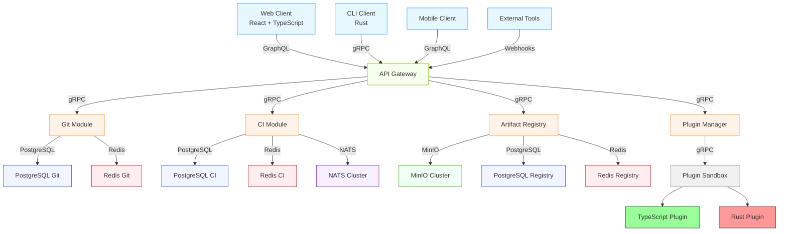

# 🏗️ Architecture Technique - Tardigrade-CI

**Version :** 1.0  
**Dernière mise à jour :** 2026-06-17  
**Statut :** Validé (Atelier technique - à confirmer le 20/06/2026)  
**Auteur :** Benzo (Product Owner) + Mistral Vibe (Architecte)

---

## 📋 Sommaire

1. [Principes Fondamentaux](#1-principes-fondamentaux)
2. [Stack Technique Validée](#2-stack-technique-validée)
3. [Architecture Globale](#3-architecture-globale)
4. [Diagrammes C4](#5-diagrammes-c4)
5. [Fichiers Détaillés](#6-fichiers-détaillés)

> **📌 Note :** Pour les détails complets de chaque section, voir les fichiers spécialisés dans le dossier `docs/`.

---

## 1️⃣ Principes Fondamentaux

### ✅ Philosophies du Projet

| Principe | Description | Impact |
|----------|-------------|--------|
| **Simplicité** | Limiter le nombre de technologies (1 langage backend, 1 DB) | ⬇️ Complexité, ⬆️ Maintenabilité |
| **Performance** | Rust pour les modules critiques (CI Workers) | ⬆️ Vitesse des builds |
| **Sécurité** | Rust + sandboxing plugins | ⬆️ Sécurité globale |
| **Modularité** | Architecture pluggable | ⬆️ Extensibilité |
| **Auto-hébergement** | Toutes les composantes auto-hébergeables | ⬆️ Souveraineté |
| **Open-Source** | 100% open-source (AGPL-3.0) | ⬆️ Adoption communauté |

### 🎯 Objectifs Non-Fonctionnels (SLO)

| Métrique | Cible MVP | Cible Production | Outil |
|----------|-----------|------------------|-------|
| Temps de réponse API (P95) | < 200ms | < 100ms | Prometheus |
| Temps de build CI (moyen) | < 5min | < 3min | Custom Metrics |
| Disponibilité | > 99.5% | > 99.9% | Prometheus + Grafana |
| Taux de succès pipelines | > 95% | > 98% | PostgreSQL |
| Latence événements (NATS) | < 10ms | < 5ms | Prometheus |

---

## 2️⃣ Stack Technique Validée

### 🏗️ **Backend (100% Rust)**
- **Framework Web:** Axum 0.7.x
- **Runtime Async:** Tokio 1.0.x
- **gRPC:** Tonic + Prost
- **GraphQL:** Async-GraphQL 6.0.x
- **ORM:** SQLx 0.7.x

### 🎨 **Frontend**
- **Framework:** React 18.x
- **Langage:** TypeScript 5.x
- **UI Library:** TailwindCSS 3.x + shadcn/ui
- **Build Tool:** Vite 5.x

### 🗃️ **Base de Données**
- **Primary DB:** PostgreSQL 15.x (instances dédiées par module)
- **Cache:** Redis 7.x
- **Timeseries:** TimescaleDB (extension PostgreSQL)

### 📡 **Messagerie**
- **Message Broker:** NATS 2.10.x + JetStream (persistance)
- **Client NATS:** async-nats 0.30.x

### 💾 **Stockage**
- **Artefacts:** MinIO (compatible S3)
- **Client MinIO:** minio-rs

### 🔌 **Plugin System**
- **Langages:** Rust + TypeScript (Node.js en container)
- **Sandboxing:** Containers Docker
- **Communication:** gRPC

### 🚢 **Déploiement**
- **Containerisation:** Docker
- **Orchestration:** Kubernetes
- **Infrastructure:** Terraform

### 🔍 **Monitoring**
- **Metrics:** Prometheus + Grafana
- **Logs:** Loki + Promtail
- **Tracing:** OpenTelemetry + Jaeger

---

## 3️⃣ Architecture Globale



**Légende :**
- **Bleu clair** : Clients
- **Vert clair** : API Gateway
- **Orange clair** : Modules Backend (100% Rust)
- **Bleu foncé** : PostgreSQL
- **Rouge clair** : Redis
- **Violet clair** : NATS
- **Vert très clair** : MinIO
- **Gris** : Sandbox Plugins
- **Vert** : Plugin TypeScript
- **Rouge** : Plugin Rust

---

## 4️⃣ Structure du Repository

```
tardigrade-ci/
├── docs/                          # Documentation complète
│   ├── ARCHITECTURE-DETAILED.md     # Architecture détaillée (C4)
│   ├── DATABASE-SCHEMA.md          # Schéma PostgreSQL complet
│   ├── API-SPECIFICATION.md        # Spécifications API (GraphQL + gRPC)
│   ├── SECURITY.md                 # Stratégie de sécurité
│   └── PLUGIN-DEVELOPMENT.md       # Guide développement plugins
│
├── crates/                        # Bibliothèques Rust partagées
│   ├── common/
│   │   ├── error.rs                # Types d'erreurs communs
│   │   ├── config.rs               # Configuration partagée
│   │   └── models.rs               # Modèles communs
│   ├── db/                         # Abstraction DB
│   │   ├── postgres.rs             # Connexion PostgreSQL
│   │   └── redis.rs                # Connexion Redis
│   ├── storage/                    # Abstraction Storage
│   │   ├── provider.rs             # Trait StorageProvider
│   │   ├── minio.rs                # Implémentation MinIO
│   │   └── local.rs                # Stockage local
│   └── proto/                      # Protobuf partagés
│
├── modules/
│   ├── git/                        # Git Module
│   │   ├── src/
│   │   │   ├── main.rs             # Point d'entrée
│   │   │   ├── lib.rs              # API publique
│   │   │   ├── models.rs           # Structs Git
│   │   │   ├── service.rs          # GitService
│   │   │   ├── handler.rs          # Handlers Axum
│   │   │   ├── routes.rs           # Routes
│   │   │   ├── grpc/               # gRPC
│   │   │   │   └── git.proto       # Définition Protobuf
│   │   │   └── graphql/            # Schéma GraphQL
│   │   ├── tests/
│   │   ├── migrations/              # Migrations DB
│   │   └── Dockerfile
│   │
│   ├── ci/                         # CI Module
│   ├── registry/                   # Artifact Registry
│   └── plugin/                     # Plugin System
│
├── api/                           # API Gateway
│   ├── src/
│   │   ├── main.rs                 # Serveur Axum
│   │   ├── graphql/               # Schéma GraphQL global
│   │   └── grpc/                  # Clients gRPC
│   └── Dockerfile
│
├── web/                           # Frontend
│   ├── src/
│   │   ├── components/
│   │   ├── pages/
│   │   └── lib/
│   └── Dockerfile
│
├── docker/
│   └── docker-compose.yml          # Dev local
│
├── k8s/                           # Kubernetes
│   ├── base/
│   └── overlays/
│
├── terraform/                     # Infrastructure
│
├── Cargo.toml                     # Workspace Cargo
├── rust-toolchain                  # Version Rust
├── README.md
└── LICENSE                        # AGPL-3.0
```

---

## 5️⃣ Diagrammes C4

### 🎯 Niveau 1 : Contexte (C4-L1)

```
┌─────────────────────┐     ┌─────────────────────┐     ┌─────────────────────┐
│   Développeur/       │     │   Admin SysOps      │     │   Outils Externes    │
│   DevOps            │     │                     │     │   (Jira, Slack)     │
└──────────┬──────────┘     └──────────┬──────────┘     └──────────┬──────────┘
           │                           │                           │
           └─────────────────────────────┬─────────────────────────┘
                                    ▼
┌─────────────────────────────────────────────────────────────┐
│                        TARDIGRADE-CI                             │
│  ┌─────────────┐  ┌─────────────┐  ┌─────────────────────┐    │
│  │  Git Module  │  │   CI Module  │  │  Artifact Registry   │    │
│  └─────────────┘  └─────────────┘  └─────────────────────┘    │
│  ┌─────────────────────────────────┐                          │
│  │         Plugin System            │                          │
│  └─────────────────────────────────┘                          │
└─────────────────────────┬───────────────────────────────────┘
                          │
    ┌─────────────────────▼─────────────────────┐
    ▼                                             ▼
┌─────────────┐                           ┌─────────────────────┐
│  Stockage   │                           │   Bases de données   │
│  (MinIO)    │                           │  (PostgreSQL/Redis)  │
└─────────────┘                           └─────────────────────┘
                          │
                          ▼
┌─────────────────────────────────────────────────────────────┐
│              Réseau / Cloud / On-Premise                      │
└─────────────────────────────────────────────────────────────┘
```

### 🎯 Niveau 2 : Conteneurs (C4-L2)

Voir [DETAILED-ARCHITECTURE.md](docs/ARCHITECTURE-DETAILED.md) pour les diagrammes complets.

---

## 6️⃣ Fichiers Détaillés

Pour les détails complets, consulter :

| Fichier | Description |
|---------|-------------|
| [TECHNOLOGY-STACK.md](TECHNOLOGY-STACK.md) | Stack technique complète avec justifications |
| [SPRINT-1-PLAN.md](SPRINT-1-PLAN.md) | Plan détaillé du Sprint 1 (Git Module) |
| [docs/DATABASE-SCHEMA.md](docs/DATABASE-SCHEMA.md) | Schéma PostgreSQL complet |
| [docs/API-SPECIFICATION.md](docs/API-SPECIFICATION.md) | Spécifications GraphQL + gRPC |
| [docs/SECURITY.md](docs/SECURITY.md) | Stratégie de sécurité détaillée |
| [docs/PLUGIN-DEVELOPMENT.md](docs/PLUGIN-DEVELOPMENT.md) | Guide pour développer des plugins |
| [docs/DEPLOYMENT.md](docs/DEPLOYMENT.md) | Guide de déploiement |
| [docs/RUST-GUIDE.md](docs/RUST-GUIDE.md) | Guide Rust pour devs Java |

---

## 🎯 Décisions Clés Validées

| Décision | Choix | Justification |
|----------|-------|---------------|
| **Backend** | 100% Rust | Simplicité, sécurité, performance |
| **Frontend** | TypeScript + React | Écosystème DevOps, productivité |
| **DB** | PostgreSQL (instances dédiées) | Polyvalence, isolation, coût réduit |
| **Messagerie** | NATS + JetStream | Latence ultra-faible, persistance, simplicité |
| **Stockage** | MinIO | Auto-hébergement, compatible S3 |
| **Plugins** | Rust + TypeScript | Ouverture communauté + performance |
| **Communication** | gRPC (interne) + GraphQL (publique) | Typage + flexibilité |
| **Développement** | IA + Supervision Humaine | Productivité, montée en compétence |

---

## 📞 Support & Communauté

- **Documentation :** [docs.tardigrade-ci.dev](https://docs.tardigrade-ci.dev) (À créer)
- **Code :** [github.com/tardigrade-ci/tardigrade](https://github.com/tardigrade-ci/tardigrade) (À créer)
- **Discord :** [discord.gg/tardigrade-ci](https://discord.gg/tardigrade-ci) (À créer)

---

**© 2026 Tardigrade-CI**  
*Une plateforme DevOps modulaire, open-source, conçue pour survivre à tous les environnements.*
