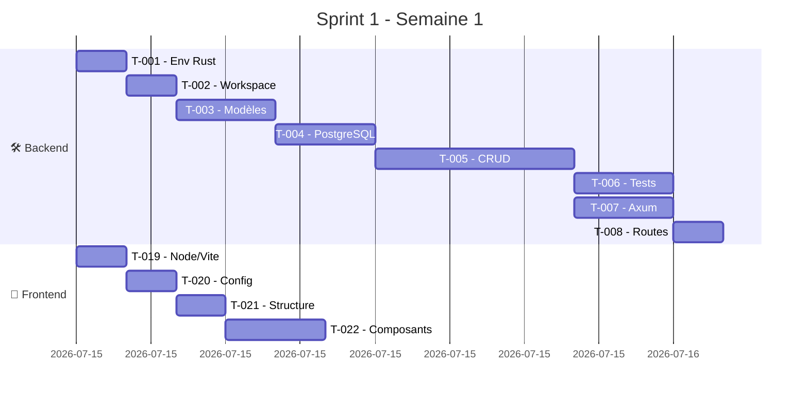
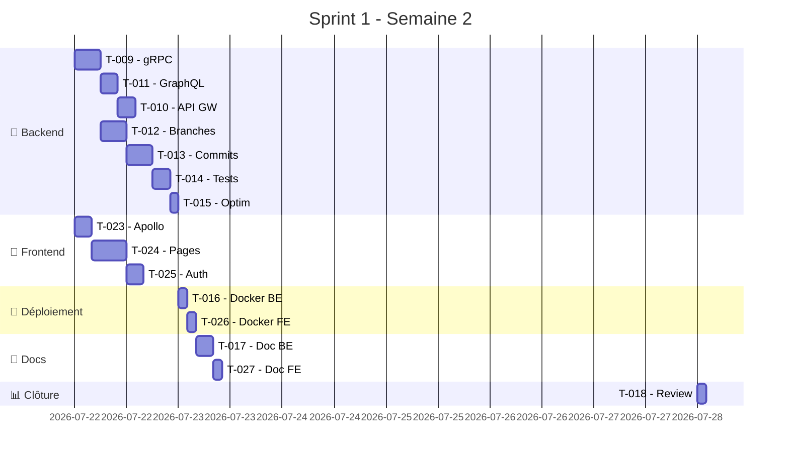
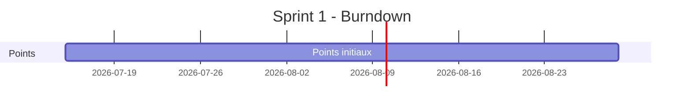

# 🚀 Sprint 1 - Git Module MVP + IHM

**Projet :** Tardigrade-CI  
**Durée :** 2 semaines (2026-07-15 → 2026-07-28)  
**Équipe :** Benzo (Dev Fullstack) + Agent IA (Génération Code Rust & TypeScript)  
**Objectif :** Livrer un **Git Module fonctionnel** en Rust avec les opérations CRUD de base **ET** une **IHM moderne** en React/TypeScript  
**Statut :** ⬜ À démarrer  
**Total Points :** 45 (Backend: 27 | Frontend: 13 | Intégration: 5)

---

## 🎯 Objectifs du Sprint

### ✅ Livrables Principaux

#### Backend (Rust - Axum + SQLx + PostgreSQL)
- [ ] Module Git avec CRUD repositories, branches, commits basiques
- [ ] API REST (Axum)
- [ ] API gRPC interne (Tonic)
- [ ] Intégration GraphQL pour le frontend
- [ ] Tests unitaires/integration (>80% couverture)
- [ ] Dockerfile backend

#### Frontend (React/TypeScript) ⭐ NOUVEAU
- [ ] Application IHM avec Dashboard, Création repo, Gestion branches
- [ ] Intégration GraphQL (Apollo Client)
- [ ] Design System (TailwindCSS)
- [ ] Tests frontend (>70% couverture)
- [ ] Dockerfile frontend

---

## 📊 Métriques de Succès

| Métrique | Cible | Outil | Type |
|----------|-------|-------|------|
| Fonctionnalités | 100% (US-001-003, US-006-009) | Backlog | Commun |
| Tests Backend | >80% | `cargo tarpaulin` | Backend |
| Tests Frontend | >70% | `vitest --coverage` | Frontend |
| Clippy Warnings | 0 | `cargo clippy -- -D warnings` | Backend |
| ESLint Warnings | 0 | `npm run lint` | Frontend |

---

## 📋 Backlog du Sprint

### 🎯 Épic : Git Module MVP + IHM

| ID | User Story | Priorité | Points | Statut | Affecté | Dépendances | Type |
|----|------------|----------|--------|--------|---------|--------------|------|
| **US-001** | Créer un repository Git | **High** | 5 | ⬜ To Do | Benzo + IA | Aucune | Backend |
| **US-002** | Cloner/pusher du code | **High** | 8 | ⬜ To Do | Benzo + IA | US-001 | Backend |
| **US-003** | Gérer les branches | **High** | 3 | ⬜ To Do | Benzo + IA | US-001 | Backend |
| **US-006** | Gérer les issues | **Medium** | 5 | ⬜ To Do | Benzo + IA | US-001 | Backend |
| **US-007** | 🆕 Dashboard des repositories | **High** | 5 | ⬜ To Do | Benzo + IA | US-001 | Frontend |
| **US-008** | 🆕 Créer repository via UI | **High** | 5 | ⬜ To Do | Benzo + IA | US-001 | Frontend |
| **US-009** | 🆕 Gérer branches via UI | **High** | 3 | ⬜ To Do | Benzo + IA | US-003 | Frontend |

> 💡 **Reports Sprint 2 :** US-004 (Pull Requests), US-005 (Commentaires PR) - Nécessitent UI complexe

---

### 📌 Tâches Techniques

#### 🔹 Semaine 1 (15-21 Juillet) - Fondations

| ID | Tâche | Type | Priorité | Est. | Affecté |
|----|-------|------|----------|-----|---------|
| **T-001** | Configurer env Rust | Backend | **High** | 2h | Benzo |
| **T-002** | Structure workspace Cargo | Backend | **High** | 2h | Benzo |
| **T-003** | Modèles de données | Backend | **High** | 4h | Benzo + IA |
| **T-004** | Connexion PostgreSQL | Backend | **High** | 4h | Benzo + IA |
| **T-005** | CRUD repositories | Backend | **High** | 8h | Benzo + IA |
| **T-019** | 🆕 Config Node.js + Vite + React | Frontend | **High** | 2h | Benzo |
| **T-020** | 🆕 Config TS + Tailwind + ESLint | Frontend | **High** | 2h | Benzo |
| **T-021** | 🆕 Structure projet frontend | Frontend | **High** | 2h | Benzo + IA |
| **T-006** | Tests unitaires | Backend | **High** | 4h | Benzo |
| **T-007** | Configurer Axum + handlers | Backend | **High** | 4h | Benzo + IA |
| **T-008** | Routes Axum | Backend | **High** | 2h | Benzo |
| **T-022** | 🆕 Composants UI communs | Frontend | **High** | 4h | Benzo + IA |

#### 🔹 Semaine 2 (22-28 Juillet) - Intégration + IHM

| ID | Tâche | Type | Priorité | Est. | Affecté |
|----|-------|------|----------|-----|---------|
| **T-009** | gRPC pour Git Module | Backend | **High** | 6h | Benzo + IA |
| **T-011** | Schéma GraphQL | Backend | **High** | 4h | Benzo + IA |
| **T-023** | 🆕 Config Apollo Client | Frontend | **High** | 4h | Benzo + IA |
| **T-010** | Intégration API Gateway | Backend | **High** | 4h | Benzo |
| **T-012** | Gestion branches | Backend | **High** | 6h | Benzo + IA |
| **T-024** | 🆕 Pages (Dashboard, Repos, Branches) | Frontend | **High** | 8h | Benzo + IA |
| **T-013** | Commits basiques | Backend | **Medium** | 6h | Benzo + IA |
| **T-025** | 🆕 Auth JWT frontend | Frontend | **High** | 4h | Benzo + IA |
| **T-014** | Tests d'intégration | Backend | **High** | 4h | Benzo |
| **T-015** | Optimisation | Backend | **Medium** | 2h | Benzo |
| **T-016** | Dockerfile backend | Backend | **High** | 2h | Benzo |
| **T-026** | 🆕 Dockerfile frontend | Frontend | **High** | 2h | Benzo |
| **T-017** | Documentation backend | Backend | **High** | 4h | Benzo |
| **T-027** | 🆕 Documentation frontend | Frontend | **Medium** | 2h | Benzo |
| **T-018** | Sprint Review | Commun | **High** | 2h | Équipe |

---

## 📅 Calendrier Détaillé

### 🗓️ Semaine 1 (15-21 Juillet)



### 🗓️ Semaine 2 (22-28 Juillet)



---

## 👥 Rôles & Responsabilités

| Rôle | Personnes | Responsabilités |
|------|-----------|-------------------|
| **Product Owner** | Benzo | Priorisation, validation fonctionnalités |
| **Tech Lead** | Benzo | Architecture backend+frontend, revue code |
| **IA Developer** | Mistral Vibe | Génération code Rust ET TypeScript |
| **QA** | Benzo | Tests backend+frontend, validation |

---

## 🛠️ Workflow de Développement

### Backend (Rust)
**1️⃣ Préparation:** User story → Branch `sprint-1/git-[id]` → TODO.md → Tests (TDD)
**2️⃣ Génération (IA):** Prompt standard → Code idiomatique → rustdoc → Tests
**3️⃣ Validation:** `cargo build` → `cargo clippy` → `cargo fmt` → `cargo test` → `cargo audit`
**4️⃣ Intégration:** Commit → Push → PR (description + screenshots) → Revue → Merge

### Frontend (React/TypeScript) ⭐
**1️⃣ Préparation:** Design system → Maquettes → States UI → Branch `sprint-1/git-ui-[id]` → Config outils
**2️⃣ Génération (IA):** Prompt frontend → Code TS/React → JSDoc → Tests Vitest
**3️⃣ Validation:** `npm run build` → `npm run lint` → `npm run test` → `tsc --noEmit`
**4️⃣ Intégration:** Commit → Push → PR (**screenshots obligatoires**) → Lien demo → Revue UX → Merge

---

## 📁 Structure des Fichiers

### Backend - `modules/git/`
```
modules/git/
├── Cargo.toml
├── src/
│   ├── main.rs, lib.rs, config.rs, error.rs, models.rs
│   ├── repository.rs (entity.rs, queries.rs)
│   ├── service.rs (mod.rs, tests.rs)
│   ├── handler.rs (mod.rs, repository.rs, tests.rs)
│   ├── routes.rs
│   ├── grpc/ (mod.rs, git.proto, server.rs)
│   └── graphql/ (mod.rs, schema.rs, resolvers.rs)
├── tests/ (unit/, integration/)
├── migrations/ (SQL files)
├── Dockerfile
└── README.md
```

### Frontend - `ui/git/` ⭐ NOUVEAU
```
ui/git/
├── package.json, tsconfig.json, vite.config.ts
├── tailwind.config.js, postcss.config.js
├── Dockerfile, nginx.conf
├── public/index.html
└── src/
    ├── main.tsx, App.tsx
    ├── routes/ (index.tsx, paths.ts)
    ├── components/
    │   ├── common/ (Button, Card, Input, Modal, Form, Toast, Badge, Loading)
    │   ├── layout/ (MainLayout, Header, Sidebar, Footer)
    │   └── git/ (RepositoryCard, RepositoryForm, BranchList)
    ├── pages/
    │   ├── Dashboard.tsx
    │   ├── Repository/ (List, Create, Detail)
    │   └── Branches/ (List, Create)
    ├── hooks/ (useRepositories, useBranches, useAuth)
    ├── graphql/ (queries.ts, mutations.ts)
    ├── services/ (gitService.ts, authService.ts)
    ├── types/ (git.ts, api.ts)
    ├── utils/ (formatters, validators)
    ├── stores/ (gitStore.ts)
    ├── styles/global.css
    └── tests/ (setup.ts, components/, pages/)
```

---

## 🎯 Définition des Types

### Backend (Rust) - Voir `modules/git/src/models.rs`
- `Repository` (id, name, description, is_private, owner_id, default_branch, timestamps)
- `Branch` (id, repository_id, name, commit_hash, created_at)
- `Commit` (id, repository_id, hash, message, author/committer info)
- `CreateRepositoryInput`, `CreateBranchInput`
- `PaginatedResponse<T>`

### Frontend (TypeScript) ⭐
```typescript
// ui/git/src/types/git.ts
export interface Repository {
  id: string; name: string; description: string | null;
  isPrivate: boolean; ownerId: string; defaultBranch: string;
  createdAt: string; updatedAt: string;
}
export interface Branch {
  id: string; repositoryId: string; name: string;
  commitHash: string; createdAt: string;
}
export interface CreateRepositoryInput {
  name: string; description?: string; isPrivate: boolean;
  defaultBranch?: string;
}
export interface PaginatedResponse<T> {
  data: T[]; page: number; pageSize: number;
  total: number; totalPages: number;
}
```

---

## ❌ Gestion des Erreurs (Backend)

```rust
// modules/git/src/error.rs
#[derive(Error, Debug)]
pub enum GitError {
    #[error("Database error: {0}")] Database(#[from] sqlx::Error),
    #[error("Repository not found")] RepositoryNotFound,
    #[error("Repository '{0}' already exists")] RepositoryAlreadyExists(String),
    #[error("Branch not found")] BranchNotFound,
    #[error("Branch '{0}' already exists")] BranchAlreadyExists(String),
    #[error("Permission denied")] PermissionDenied,
    #[error("Validation error: {0}")] ValidationError(String),
    #[error("Internal server error")] InternalError,
}
```

---

## 🗃️ Service Git (Backend)

```rust
// modules/git/src/service.rs
pub struct GitService { pool: PgPool }
impl GitService {
    pub fn new(pool: PgPool) -> Self { Self { pool } }
    pub async fn create_repository(&self, owner_id: Uuid, input: CreateRepositoryInput) -> Result<Repository, GitError> {}
    pub async fn get_repository(&self, id: Uuid) -> Result<Option<Repository>, GitError> {}
    pub async fn list_repositories(&self, owner_id: Option<Uuid>, page: i32, page_size: i32) -> Result<PaginatedResponse<Repository>, GitError> {}
    pub async fn delete_repository(&self, id: Uuid, owner_id: Uuid) -> Result<(), GitError> {}
    pub async fn create_branch(&self, repository_id: Uuid, input: CreateBranchInput) -> Result<Branch, GitError> {}
    pub async fn list_branches(&self, repository_id: Uuid, page: i32, page_size: i32) -> Result<PaginatedResponse<Branch>, GitError> {}
}
```

---

## 🌐 Handlers & Routes (Backend)

```rust
// modules/git/src/handler/repository.rs
pub async fn create_repository(State(service): State<GitService>, owner_id: Uuid, Json(input): Json<CreateRepositoryInput>) -> Result<Json<Repository>, GitError>
pub async fn get_repository(State(service): State<GitService>, Path(id): Path<Uuid>) -> Result<Json<Repository>, GitError>
pub async fn list_repositories(State(service): State<GitService>, owner_id: Option<Uuid>, Query(pag): Query<PaginationQuery>) -> Result<Json<PaginatedResponse<Repository>>, GitError>
pub async fn delete_repository(State(service): State<GitService>, Path(id): Path<Uuid>, owner_id: Uuid) -> Result<Json<()>, GitError>
pub async fn create_branch(State(service): State<GitService>, Path(repo_id): Path<Uuid>, Json(input): Json<CreateBranchInput>) -> Result<Json<Branch>, GitError>
pub async fn list_branches(State(service): State<GitService>, Path(repo_id): Path<Uuid>, Query(pag): Query<PaginationQuery>) -> Result<Json<PaginatedResponse<Branch>>, GitError>

// modules/git/src/routes.rs
pub fn create_router(pool: PgPool) -> Router {
    let service = GitService::new(pool);
    Router::new().nest("/repositories", repository_router(service))
}
```

---

## 📡 Frontend Implementation ⭐ NOUVEAU

---

### Requêtes GraphQL

```typescript
// ui/git/src/graphql/queries.ts
import { gql } from '@apollo/client';
export const GET_REPOSITORY = gql`
  query GetRepository($id: ID!) {
    repository(id: $id) {
      id name description isPrivate ownerId defaultBranch createdAt updatedAt
    }
  }
`;
export const LIST_REPOSITORIES = gql`
  query ListRepositories($ownerId: ID, $page: Int=1, $pageSize: Int=20) {
    repositories(ownerId: $ownerId, page: $page, pageSize: $pageSize) {
      data { id name description isPrivate ownerId defaultBranch createdAt updatedAt }
      page pageSize total totalPages
    }
  }
`;
export const LIST_BRANCHES = gql`
  query ListBranches($repositoryId: ID!, $page: Int=1, $pageSize: Int=20) {
    branches(repositoryId: $repositoryId, page: $page, pageSize: $pageSize) {
      data { id repositoryId name commitHash createdAt }
      page pageSize total totalPages
    }
  }
`;

// ui/git/src/graphql/mutations.ts
export const CREATE_REPOSITORY = gql`
  mutation CreateRepository($input: CreateRepositoryInput!) {
    createRepository(input: $input) {
      id name description isPrivate ownerId defaultBranch createdAt updatedAt
    }
  }
`;
export const DELETE_REPOSITORY = gql`
  mutation DeleteRepository($id: ID!) { deleteRepository(id: $id) }
`;
export const CREATE_BRANCH = gql`
  mutation CreateBranch($repositoryId: ID!, $input: CreateBranchInput!) {
    createBranch(repositoryId: $repositoryId, input: $input) {
      id repositoryId name commitHash createdAt
    }
  }
`;
```

---

### Custom Hooks

```typescript
// ui/git/src/hooks/useRepositories.ts
import { useQuery, useMutation, useQueryClient } from '@apollo/client';
import { LIST_REPOSITORIES, GET_REPOSITORY, CREATE_REPOSITORY, DELETE_REPOSITORY } from '../graphql/queries';

export const useRepositories = (ownerId?: string, page: number = 1, pageSize: number = 20) => {
  const { data, loading, error, refetch } = useQuery(LIST_REPOSITORIES, {
    variables: { ownerId, page, pageSize },
    fetchPolicy: 'cache-and-network'
  });
  return { repositories: data?.repositories, loading, error, refetch };
};

export const useRepository = (id: string) => {
  const { data, loading, error, refetch } = useQuery(GET_REPOSITORY, {
    variables: { id }, skip: !id
  });
  return { repository: data?.repository, loading, error, refetch };
};

export const useCreateRepository = () => {
  const queryClient = useQueryClient();
  const [createRepository, { loading, error }] = useMutation(CREATE_REPOSITORY, {
    onSuccess: () => queryClient.invalidateQueries({ queryKey: ['repositories'] })
  });
  return { createRepository, loading, error };
};

export const useDeleteRepository = () => {
  const queryClient = useQueryClient();
  const [deleteRepository, { loading, error }] = useMutation(DELETE_REPOSITORY, {
    onSuccess: (_, { id }) => {
      queryClient.invalidateQueries({ queryKey: ['repositories'] });
      queryClient.invalidateQueries({ queryKey: ['repository', id] });
    }
  });
  return { deleteRepository, loading, error };
};
```

---

### Service Apollo Client

```typescript
// ui/git/src/services/gitService.ts
import { ApolloClient, InMemoryCache, HttpLink, setContext } from '@apollo/client';
import { onError } from '@apollo/client/link/error';
import { RetryLink } from '@apollo/client/link/retry';
import { Toast } from '../components/common/Toast';

const GRAPHQL_ENDPOINT = import.meta.env.VITE_GRAPHQL_ENDPOINT || 'http://localhost:3001/graphql';

export const createApolloClient = (token?: string) => {
  const httpLink = new HttpLink({ uri: GRAPHQL_ENDPOINT });
  const authLink = setContext((_, { headers }) => ({
    headers: { ...headers, authorization: token ? `Bearer ${token}` : '' }
  }));
  const errorLink = onError(({ graphQLErrors, networkError }) => {
    graphQLErrors?.forEach(({ message }) => {
      console.error(`[GraphQL error]: ${message}`);
      Toast.error(`Erreur: ${message}`);
    });
    if (networkError) {
      console.error(`[Network error]: ${networkError}`);
      Toast.error('Erreur réseau');
    }
  });
  const retryLink = new RetryLink({
    delay: { initial: 300, max: Infinity, jitter: true },
    attempts: { max: 5, retryIf: (e) => !!e }
  });
  return new ApolloClient({
    link: errorLink.concat(retryLink.concat(authLink.concat(httpLink))),
    cache: new InMemoryCache()
  });
};

let apolloClient: ApolloClient<any> | null = null;
export const getApolloClient = (token?: string) => {
  if (!apolloClient) apolloClient = createApolloClient(token);
  return apolloClient;
};
export const resetApolloClient = () => { apolloClient = null; };
```

---

### Composant RepositoryCard

```typescript
// ui/git/src/components/git/RepositoryCard.tsx
import React from 'react';
import { Repository } from '../../types/git';
import { Card, Badge, Button } from '../common';
import { useNavigate } from 'react-router-dom';
import { PATHS } from '../../routes/paths';
import { formatDate } from '../../utils/formatters';

interface RepositoryCardProps { repository: Repository; onDelete?: (id: string) => void; }

export const RepositoryCard: React.FC<RepositoryCardProps> = ({ repository, onDelete }) => {
  const navigate = useNavigate();
  const handleViewClick = () => navigate(PATHS.repository.detail(repository.id));
  const handleDeleteClick = (e: React.MouseEvent) => { e.stopPropagation(); onDelete?.(repository.id); };
  return (
    <Card className="hover:shadow-lg transition-shadow duration-200 cursor-pointer" onClick={handleViewClick}>
      <Card.Header>
        <div className="flex justify-between items-start">
          <div className="flex-1">
            <h3 className="text-lg font-semibold text-gray-900 truncate">{repository.name}</h3>
            {repository.description && <p className="text-sm text-gray-500 mt-1 line-clamp-2">{repository.description}</p>}
          </div>
          <Badge variant={repository.isPrivate ? 'default' : 'success'}>{repository.isPrivate ? 'Privé' : 'Public'}</Badge>
        </div>
      </Card.Header>
      <Card.Content className="mt-4">
        <span className="text-sm text-gray-500">Branche: {repository.defaultBranch}</span>
      </Card.Content>
      <Card.Footer className="mt-4">
        <div className="flex justify-between items-center">
          <span className="text-xs text-gray-400">Créé le {formatDate(repository.createdAt)}</span>
          <div className="flex gap-2">
            <Button variant="outline" size="sm" onClick={handleViewClick}>Voir</Button>
            {onDelete && <Button variant="destructive" size="sm" onClick={handleDeleteClick}>Supprimer</Button>}
          </div>
        </div>
      </Card.Footer>
    </Card>
  );
};
```

---

### Page Dashboard

```typescript
// ui/git/src/pages/Dashboard.tsx
import React, { useState } from 'react';
import { useRepositories, useDeleteRepository } from '../hooks';
import { RepositoryCard, Button, Loading, ErrorMessage } from '../components';
import { PATHS } from '../routes/paths';
import { useNavigate } from 'react-router-dom';
import { Plus } from 'lucide-react';

export const Dashboard: React.FC = () => {
  const navigate = useNavigate();
  const [page, setPage] = useState(1);
  const pageSize = 12;
  const { repositories, loading, error, refetch } = useRepositories(undefined, page, pageSize);
  const { deleteRepository: deleteRepo } = useDeleteRepository();
  
  const handleCreateClick = () => navigate(PATHS.repository.create);
  const handleDelete = async (id: string) => {
    if (window.confirm('Supprimer ce repository ?')) {
      try { await deleteRepo({ variables: { id } }); refetch(); }
      catch (err) { console.error('Failed:', err); }
    }
  };
  
  if (loading && !repositories) return <Loading fullPage />;
  if (error) return <ErrorMessage error={error} onRetry={refetch} />;
  
  return (
    <div className="container mx-auto px-4 py-8">
      <div className="flex justify-between items-center mb-8">
        <div>
          <h1 className="text-3xl font-bold text-gray-900">Mes Repositories</h1>
          <p className="text-gray-500">{repositories?.total || 0} repository{repositories?.total !== 1 ? 'ies' : ''}</p>
        </div>
        <Button onClick={handleCreateClick}><Plus className="mr-2 h-4 w-4" />Nouveau Repository</Button>
      </div>
      
      {repositories?.data.length === 0 ? (
        <div className="text-center py-16">
          <h2 className="text-xl font-semibold text-gray-900">Aucun repository trouvé</h2>
          <p className="text-gray-500 mt-2">Créez votre premier repository.</p>
          <Button onClick={handleCreateClick} className="mt-4"><Plus className="mr-2" />Créer</Button>
        </div>
      ) : (
        <>
          <div className="grid grid-cols-1 md:grid-cols-2 lg:grid-cols-3 xl:grid-cols-4 gap-6">
            {repositories.data.map(repo => (
              <RepositoryCard key={repo.id} repository={repo} onDelete={handleDelete} />
            ))}
          </div>
          {repositories.totalPages > 1 && (
            <div className="flex justify-center mt-8 gap-2">
              <Button variant="outline" disabled={page === 1} onClick={() => setPage(page - 1)}>Précédent</Button>
              <span className="px-4 py-2 text-sm">Page {page} / {repositories.totalPages}</span>
              <Button variant="outline" disabled={page === repositories.totalPages} onClick={() => setPage(page + 1)}>Suivant</Button>
            </div>
          )}
        </>
      )}
    </div>
  );
};
```

---

### Page CreateRepository

```typescript
// ui/git/src/pages/Repository/Create.tsx
import React from 'react';
import { useForm } from 'react-hook-form';
import { zodResolver } from '@hookform/resolvers/zod';
import * as z from 'zod';
import { useNavigate } from 'react-router-dom';
import { PATHS } from '../../routes/paths';
import { useCreateRepository } from '../../hooks';
import { Button, Input, Textarea, Form, FormField, FormItem, FormLabel, FormControl, FormMessage, Loading, Toast } from '../../components/common';
import { Checkbox } from '../../components/common/Checkbox';

const createRepositorySchema = z.object({
  name: z.string().min(1, 'Obligatoire').max(100).regex(/^[a-zA-Z0-9-_.]+$/, 'Caractères invalides'),
  description: z.string().max(500, 'Max 500 caractères').optional(),
  isPrivate: z.boolean().default(false),
  defaultBranch: z.string().min(1, 'Obligatoire').default('main'),
});

export const CreateRepository: React.FC = () => {
  const navigate = useNavigate();
  const [createRepository, { loading }] = useCreateRepository();
  const form = useForm({ 
    resolver: zodResolver(createRepositorySchema), 
    defaultValues: { name: '', description: '', isPrivate: false, defaultBranch: 'main' } 
  });
  
  const onSubmit = async (data: any) => {
    try {
      await createRepository({ variables: { 
        input: { 
          name: data.name, 
          description: data.description || undefined, 
          isPrivate: data.isPrivate, 
          defaultBranch: data.defaultBranch 
        } 
      } });
      Toast.success('Repository créé !');
      navigate(PATHS.repository.list);
    } catch (err) { console.error('Failed:', err); Toast.error('Échec création'); }
  };
  
  return (
    <div className="container mx-auto px-4 py-8 max-w-2xl">
      <div className="mb-8">
        <h1 className="text-3xl font-bold text-gray-900">Créer un Repository</h1>
        <p className="text-gray-500 mt-1">Créez un nouveau repository pour votre code.</p>
      </div>
      <Form {...form}>
        <form onSubmit={form.handleSubmit(onSubmit)} className="space-y-6">
          <FormField control={form.control} name="name" render={({ field }) => (
            <FormItem><FormLabel>Nom *</FormLabel><FormControl><Input placeholder="mon-projet" {...field} /></FormControl><FormMessage /></FormItem>
          )} />
          <FormField control={form.control} name="description" render={({ field }) => (
            <FormItem><FormLabel>Description</FormLabel><FormControl><Textarea placeholder="Description..." rows={3} {...field} /></FormControl><FormMessage /></FormItem>
          )} />
          <FormField control={form.control} name="defaultBranch" render={({ field }) => (
            <FormItem><FormLabel>Branche par défaut</FormLabel><FormControl><Input placeholder="main" {...field} /></FormControl><FormMessage /></FormItem>
          )} />
          <FormField control={form.control} name="isPrivate" render={({ field }) => (
            <FormItem className="flex flex-row items-start space-x-3 space-y-0">
              <FormControl><Checkbox checked={field.value} onCheckedChange={field.onChange} /></FormControl>
              <div className="space-y-1"><FormLabel>Repository privé</FormLabel><p className="text-sm text-gray-500">Visible uniquement par vous et collaborateurs autorisés.</p></div>
            </FormItem>
          )} />
          <div className="flex gap-4">
            <Button type="button" variant="outline" onClick={() => navigate(PATHS.repository.list)}>Annuler</Button>
            <Button type="submit" disabled={loading}>{loading ? <Loading spinner /> : 'Créer le Repository'}</Button>
          </div>
        </form>
      </Form>
    </div>
  );
};
```

---

### Routes & Paths

```typescript
// ui/git/src/routes/paths.ts
export const PATHS = {
  home: '/',
  repository: {
    list: '/repositories',
    create: '/repositories/create',
    detail: (id: string) => `/repositories/${id}`,
    branches: (id: string) => `/repositories/${id}/branches`,
    branchesCreate: (id: string) => `/repositories/${id}/branches/create`,
  },
};

// ui/git/src/routes/index.tsx
import { createBrowserRouter, RouterProvider } from 'react-router-dom';
import { MainLayout } from '../components/layout/MainLayout';
import { Dashboard } from '../pages/Dashboard';
import { RepositoryList } from '../pages/Repository/List';
import { RepositoryCreate } from '../pages/Repository/Create';
import { RepositoryDetail } from '../pages/Repository/Detail';
import { BranchList } from '../pages/Branches/List';
import { PATHS } from './paths';

const router = createBrowserRouter([
  { path: PATHS.home, element: <MainLayout />, children: [
    { index: true, element: <Dashboard /> },
    { path: PATHS.repository.list, element: <RepositoryList /> },
    { path: PATHS.repository.create, element: <RepositoryCreate /> },
    { path: PATHS.repository.detail(':id'), element: <RepositoryDetail />, children: [
      { index: true, element: <RepositoryDetail /> },
      { path: PATHS.repository.branches(':repositoryId'), element: <BranchList /> },
    ]},
  ]},
  { path: '*', element: <div>404 - Page non trouvée</div> },
]);
export const AppRouter = () => <RouterProvider router={router} />;
```

---

## 📦 Dockerfiles & Configuration

### Backend Dockerfile

```dockerfile
# modules/git/Dockerfile
FROM rust:1.70-slim AS builder
RUN apt-get update && apt-get install -y pkg-config libssl-dev && rm -rf /var/lib/apt/lists/*
WORKDIR /usr/src/tardigrade-git
COPY . .
RUN cargo build --release

FROM debian:bullseye-slim
RUN apt-get update && apt-get install -y libssl1.1 ca-certificates && rm -rf /var/lib/apt/lists/*
COPY --from=builder /usr/src/tardigrade-git/target/release/tardigrade-git /usr/local/bin/
RUN useradd -m tardigrade && chown -R tardigrade:tardigrade /usr/local/bin/tardigrade-git
USER tardigrade
EXPOSE 3001
HEALTHCHECK --interval=30s --timeout=3s --start-period=5s --retries=3 CMD curl -f http://localhost:3001/health || exit 1
ENTRYPOINT ["/usr/local/bin/tardigrade-git"]
```

### Frontend Dockerfile ⭐ NOUVEAU

```dockerfile
# ui/git/Dockerfile
FROM node:18-alpine AS builder
WORKDIR /app
COPY package*.json ./
COPY pnpm-lock.yaml ./
RUN corepack enable && corepack prepare pnpm@latest --activate
RUN pnpm install --frozen-lockfile
COPY . .
RUN pnpm run build

FROM nginx:alpine
COPY nginx.conf /etc/nginx/conf.d/default.conf
COPY --from=builder /app/dist /usr/share/nginx/html
EXPOSE 80
HEALTHCHECK --interval=30s --timeout=3s --start-period=5s --retries=3 CMD wget --no-verbose --tries=1 --spider http://localhost/ || exit 1
CMD ["nginx", "-g", "daemon off;"]
```

### Nginx Config ⭐ NOUVEAU

```nginx
# ui/git/nginx.conf
server {
    listen 80; server_name localhost;
    root /usr/share/nginx/html; index index.html;
    location / { try_files $uri $uri/ /index.html; }
    error_page 404 /index.html;
    add_header X-Frame-Options "SAMEORIGIN";
    add_header X-Content-Type-Options "nosniff";
    add_header X-XSS-Protection "1; mode=block";
    gzip on; gzip_types text/plain text/css application/json application/javascript;
    location ~* \.(js|css|png|jpg|jpeg|gif|ico|svg|woff|woff2|ttf|eot)$ {
        expires 1y; add_header Cache-Control "public, immutable";
    }
}
```

### package.json (Frontend) ⭐ NOUVEAU

```json
{
  "name": "tardigrade-git-ui",
  "version": "0.1.0",
  "type": "module",
  "scripts": {
    "dev": "vite",
    "build": "tsc && vite build",
    "preview": "vite preview",
    "lint": "eslint src --ext ts,tsx --max-warnings 0",
    "lint:fix": "eslint src --ext ts,tsx --fix",
    "format": "prettier --write src",
    "test": "vitest",
    "test:ui": "vitest --ui",
    "test:coverage": "vitest --coverage"
  },
  "dependencies": {
    "@apollo/client": "^3.8.8",
    "@hookform/resolvers": "^3.3.4",
    "graphql": "^16.8.1",
    "lucide-react": "^0.294.0",
    "react": "^18.2.0",
    "react-dom": "^18.2.0",
    "react-hook-form": "^7.49.2",
    "react-hot-toast": "^2.4.1",
    "react-router-dom": "^6.21.0",
    "zod": "^3.22.4",
    "zustand": "^4.4.7"
  },
  "devDependencies": {
    "@testing-library/jest-dom": "^6.1.5",
    "@testing-library/react": "^14.1.2",
    "@types/react": "^18.2.43",
    "@types/react-dom": "^18.2.17",
    "@typescript-eslint/eslint-plugin": "^6.13.2",
    "@typescript-eslint/parser": "^6.13.2",
    "@vitejs/plugin-react": "^4.2.1",
    "autoprefixer": "^10.4.16",
    "eslint": "^8.55.0",
    "eslint-plugin-react-hooks": "^4.6.0",
    "eslint-plugin-react-refresh": "^0.4.5",
    "jsdom": "^23.0.1",
    "postcss": "^8.4.32",
    "prettier": "^3.1.1",
    "prettier-plugin-tailwindcss": "^0.5.7",
    "tailwindcss": "^3.3.6",
    "typescript": "^5.3.3",
    "vite": "^5.0.8",
    "vitest": "^1.1.0"
  }
}
```

---

## 📝 Documentation

### Backend README

Voir [modules/git/README.md](modules/git/README.md) pour:
- Fonctionnalités backend
- Configuration (PostgreSQL, Redis, NATS)
- Déploiement (Docker, Kubernetes)
- Tests (cargo test, tarpaulin)
- Architecture

### Frontend README ⭐ NOUVEAU

Voir [ui/git/README.md](ui/git/README.md) pour:
- Fonctionnalités frontend
- Configuration (Vite, TypeScript, Tailwind)
- Déploiement (Docker + Nginx)
- Tests (Vitest)
- Design System (couleurs, typographie, spacing)

---

## 📊 Suivi du Sprint

### 📈 Burndown Chart



**Total Points :** 45 (Backend: 27 | Frontend: 13 | Intégration: 5)

---

### 📋 Journal Quotidien

| Date | Points Restants | Backend | Frontend | Blocages | Notes |
|------|------------------|---------|----------|----------|-------|
| 2026-07-15 | 45 | T-001, T-002, T-019, T-020 | T-021, T-022 | Aucun | Début sprint |
| 2026-07-16 | 40 | T-003, T-004 | | | Setup |
| 2026-07-17 | 35 | T-005 | | | CRUD |
| 2026-07-18 | 30 | T-006, T-007 | | | Tests + Handlers |
| 2026-07-19 | 25 | T-008 | T-023 | | Routes + Apollo |
| 2026-07-20 | 20 | | T-024 | | Pages |
| 2026-07-21 | 15 | | T-025 | | Auth |
| 2026-07-22 | 12 | T-009, T-011 | | | gRPC + GraphQL |
| 2026-07-23 | 8 | T-010, T-012 | | | Intégration |
| 2026-07-24 | 5 | T-013 | | | Commits |
| 2026-07-25 | 3 | T-014 | | | Tests |
| 2026-07-26 | 2 | T-015, T-016, T-026 | | | Docker |
| 2026-07-27 | 1 | T-017, T-027 | | | Documentation |
| 2026-07-28 | 0 | T-018 | | | Clôture |

---

## ✅ Critères de Réussite du Sprint

### Backend
- [ ] US-001 à US-003, US-006 implémentées
- [ ] Tests >80% couverture (`cargo tarpaulin`)
- [ ] 0 Clippy warnings (`cargo clippy -- -D warnings`)
- [ ] Dockerfile fonctionnel
- [ ] Intégration API Gateway (GraphQL)
- [ ] Performance : Temps de réponse < 100ms (P95)

### Frontend ⭐ NOUVEAU
- [ ] US-007 à US-009 implémentées
- [ ] Application React fonctionnelle
- [ ] Intégration GraphQL (Apollo Client)
- [ ] Design cohérent (TailwindCSS + Design System)
- [ ] Responsive Design (Mobile/Tablet/Desktop)
- [ ] Tests >70% couverture (`vitest --coverage`)
- [ ] 0 ESLint warnings (`npm run lint`)
- [ ] Dockerfile fonctionnel
- [ ] Documentation (README)

### Commun
- [ ] Backend et Frontend communiquent via GraphQL
- [ ] Authentification JWT fonctionnelle
- [ ] Sprint Review : Démo complète (backend + frontend)
- [ ] Rétrospective : Leçons apprises documentées

---

## 🎯 Prochaines Étapes (Sprint 2)

- [ ] **Pull Requests** (US-004, US-005 - reportées du Sprint 1)
- [ ] **Issues avancées** (US-006 étendue)
- [ ] **CI Module MVP** (Orchestrateur + Workers)
- [ ] **Intégration Git ↔ CI** (Triggers sur push)
- [ ] **Artifact Registry** (Stockage basique)
- [ ] **Plugin System** (Squelette)
- [ ] **Améliorations IHM** :
  - Dark mode
  - Recherche de repositories
  - Filtrage avancé
  - Webhooks UI
  - Collaborateurs UI

---

## 🔥 Recommandations pour Réussir

### Pour Benzo
1. **Prioriser le backend** en début de sprint (J1-J3)
2. **Paralléliser avec le frontend** à partir de J4 (quand GraphQL est prêt)
3. **Utiliser l'IA pour générer** les composants React répétitifs
4. **Valider rapidement les designs** avec des maquettes simples
5. **Faire des revues de code fréquentes**

### Pour l'IA
1. **Générer du code TypeScript/React idiomatique**
2. **Respecter le design system** défini
3. **Inclure les tests** avec Vitest
4. **Optimiser les performances** (code splitting, memoization)
5. **Proposer des solutions UX** (states, accessibilité)

### Planning Conseillé
```
Lundi 15/07 : Setup complet (Backend + Frontend)
Mardi 16/07 : Backend (Modèles + DB + CRUD)
Mercredi 17/07 : Backend (Tests + API HTTP)
Jeudi 18/07 : Frontend (Composants + Apollo)
Vendredi 19/07 : Frontend (Pages principales)
Samedi 20/07 : Backend (gRPC + GraphQL)
Dimanche 21/07 : Intégration Backend/Frontend
Lundi 22/07 : Backend (Branches + Commits)
Mardi 23/07 : Frontend (Auth + Pages avancées)
Mercredi 24/07 : Tests + Optimisation
Jeudi 25/07 : Docker + Documentation
Vendredi 26/07 : Revue finale
Samedi 27/07 : Corrections + Préparation demo
Dimanche 28/07 : Sprint Review + Rétrospective
```

---

**📌 Sprint 1 - Git Module MVP + IHM | Total: 45 points | 15 Juillet - 28 Juillet 2026 | Backend: 27pts | Frontend: 13pts | Intégration: 5pts**
```
```
```
```
