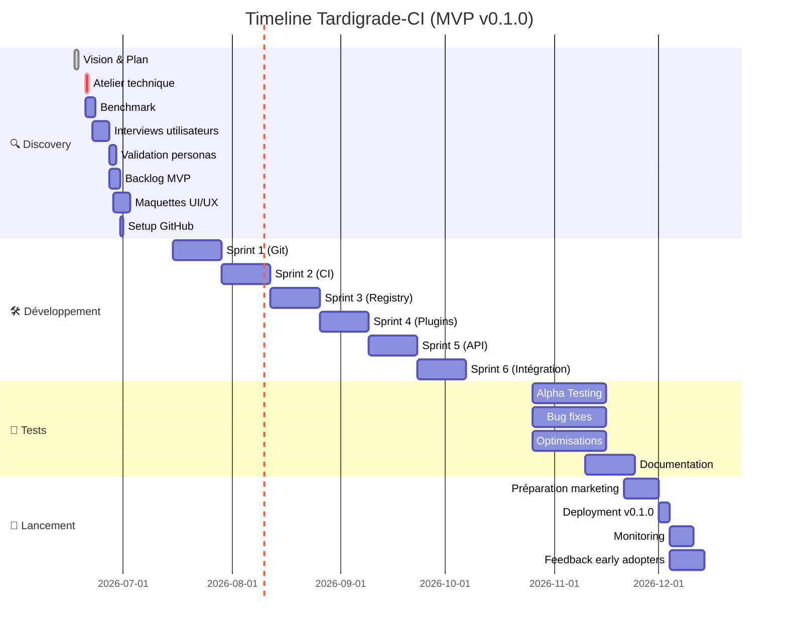
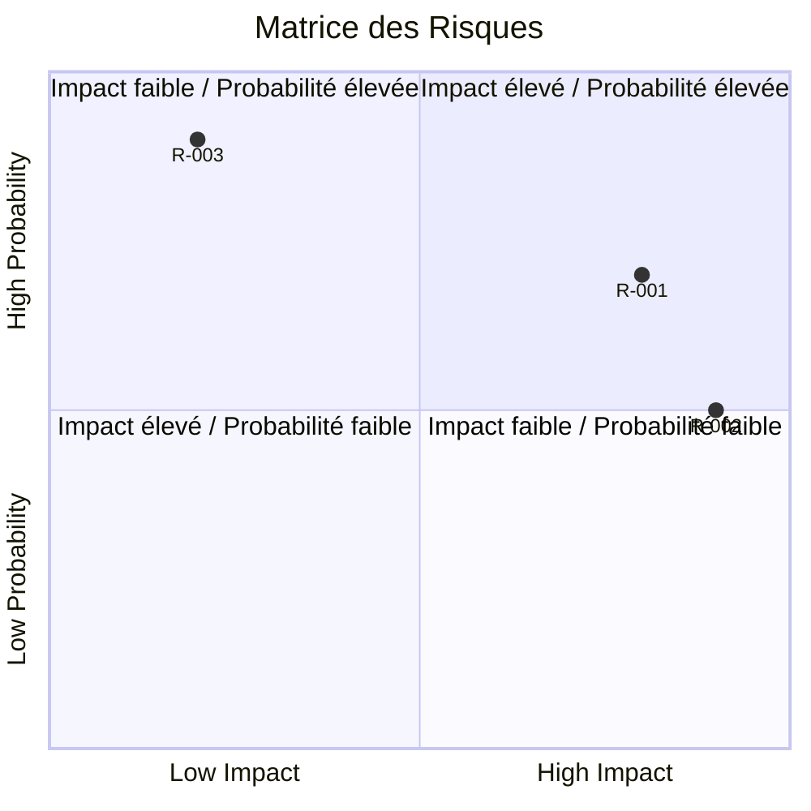

# Plan de Préparation de Projet - Rôle: Product Owner

**Date de création:** 2026-06-17  
**Statut:** En préparation  
**Responsable:** Benzo (avec accompagnement PO)  

---

## 📋 Sommaire
1. [Contexte et Vision](#1-contexte-et-vision)
2. [Objectifs Stratégiques](#2-objectifs-stratégiques)
3. [Analyse Marché & Utilisateurs](#3-analyse-marché--utilisateurs)
4. [Périmètre du Projet](#4-périmètre-du-projet)
5. [Roadmap & Planning](#5-roadmap--planning)
6. [Backlog Produit](#6-backlog-produit)
7. [Exigences Techniques](#7-exigences-techniques)
8. [Risques & Dépendances](#8-risques--dépendances)
9. [Budget & Ressources](#9-budget--ressources)
10. [Métriques de Succès](#10-métriques-de-succès)
11. [Communication & Gouvernance](#11-communication--gouvernance)
12. [Prochaines Étapes](#12-prochaines-étapes)

---

## 1. Contexte et Vision

### 1.1 Description du Projet
- **Nom du projet:** Tardigrade-CI
- **Type de projet:** Plateforme Web Modulaire
- **Domaine:** DevOps / Développement Logiciel / CI/CD
- **Problème résolu:** Les équipes DevOps manquent de plateformes modulaires, scalables et extensibles pour intégrer leurs outils préférés (git, CI, stockage de binaires) sans dépendre d'une solution monolithique propriétaire.
- **Solution proposée:** Une plateforme web open-source et modulaire dans l'esprit GitHub/GitLab, combinant gestionnaire de code source (git), intégration continue (CI), et entrepôt de binaires multi-technologies, conçue pour être étendue avec d'autres outils du marché.

### 1.2 Vision Produit
> "Tardigrade-CI vise à libérer les équipes DevOps des silos technologiques en offrant une plateforme **100% modulaire**, où chaque composant (git, CI, stockage) peut être activé, désactivé ou remplacé sans verrouillage. Inspiré par la résilience du tardigrade, notre plateforme est conçue pour survivre à tous les environnements : cloud, on-premise, ou hybride. Notre ambition est de devenir le standard open-source pour les workflows DevOps personnalisables."

### 1.3 Valeur Ajoutée
- Pour les utilisateurs finaux (DevOps/Devs):
  - **Liberté technologique** : Choix des outils (git, CI, stockage) sans vendor lock-in
  - **Extensibilité infinie** : Intégration facile avec des outils tiers (ex: Jira, Slack, monitors)
  - **Scalabilité transparente** : Architecture modulaire qui scale horizontalement
  - **Réduction des coûts** : Évite de payer pour des fonctionnalités inutiles (vs. GitHub/GitLab Enterprise)
  - **Souveraineté des données** : Auto-hébergement possible (on-premise/cloud privé)

- Pour le porteur du projet:
  - **Positionnement unique** : Alternative open-source aux géants propriétaires (GitHub, GitLab, Bitbucket)
  - **Écosystème contribuable** : Modèle open-core possible (version communauté + entreprise)
  - **Monétisation** : Services premium (support, plugins certifiés, hébergement managé)

---

## 2. Objectifs Stratégiques

### 2.1 Objectifs Principaux (SMART)
| ID | Objectif | Mesurable | Atteignable | Réaliste | Temporel | Priorité |
|----|----------|-----------|-------------|----------|-----------|----------|
| O1 | Lancer le MVP avec les 3 modules de base (Git, CI, Artifact Registry) en production | Oui (checklist fonctionnalités) | Oui | Oui | Q4 2026 | **High** |
| O2 | Atteindre 500 utilisateurs actifs (auto-hébergés ou cloud) | Oui (metrics) | Oui | Oui | 6 mois après lancement | **High** |
| O3 | Supporter l'intégration avec 5 outils externes (Jira, Slack, etc.) via plugins | Oui (nombre de plugins) | Oui | Oui | Q1 2027 | **Medium** |
| O4 | Obtenir 100 étoiles sur GitHub (reconnaissance communauté) | Oui (GitHub stars) | Oui | Oui | 3 mois après open-source | **Medium** |
| O5 | Générer 5K€/mois de revenus (via support/hebergement) | Oui (CA mensuel) | À valider | À valider | 12 mois après lancement | **Low** |

### 2.2 KPIs Clés
- **Acquisition:** Nombre d'instances déployées, étoiles GitHub, téléchargements Docker
- **Activation:** Taux de déploiement réussi (< 5 min), temps pour exécuter le 1er pipeline CI
- **Rétention:** Taux de réutilisation après 30 jours, nombre de repositories actifs/mois
- **Revenu:** MRR (via services premium), nombre de clients hébergement managé
- **Engagement:** Nombre de plugins installés par utilisateur, nombre de commits/pushs par jour
- **Technique:** Temps de build moyen, taux de succès des pipelines CI, uptime (>99.5%)

---

## 3. Analyse Marché & Utilisateurs

### 3.1 Analyse Marché
- **Taille du marché (TAM/SAM/SOM):**
  - **TAM:** ~50M de développeurs professionnels (source: Stack Overflow 2023) + équipes DevOps
  - **SAM:** ~10M d'utilisateurs de plateformes Git auto-hébergées (GitLab CE, Gitea, etc.)
  - **SOM:** 100K utilisateurs dans les 2 premières années (objectif réaliste pour un projet open-source)

- **Concurrence directe:**
  | Concurrent | Points forts | Points faibles | **Notre différenciation** |
  |------------|--------------|----------------|------------------|
  | **GitHub** | Écosystème énorme, intégrations, marché | Fermé (SaaS uniquement), coût élevé pour les équipes | **100% open-source + auto-hébergement + modularité** |
  | **GitLab** | Tout-en-un (DevOps platform), auto-hébergement | Monolithique, lourd, complexe à étendre | **Architecture modulaire + légère + pluggable** |
  | **Gitea** | Léger, simple, open-source | Fonctionnalités CI/CD très basiques | **CI/CD avancé + artifact registry intégré** |
  | **Harbor** | Régistry de conteneurs enterprise | Uniquement du registry, pas de git/ci | **Solution tout-en-un modulaire** |
  | **Jenkins** | Extensible, plugins, historique | UI vieillissante, complexe à maintenir | **Expérience moderne + intégré nativement** |

- **Tendances marché:**
  1. **Montée de l'auto-hébergement** (souveraineté des données, coûts, RGPD)
  2. **Demande croissante pour des outils modulaires** (éviter le vendor lock-in)
  3. **Adoption massive du Rust** dans les outils DevOps (pour la sécurité/performance)
  4. **Croissance des workflows multi-langages** (polyglot perspectives)
  5. **Besoin d'intégration avec les outils existants** (pas de migration complète)

### 3.2 Personas Utilisateurs

#### Persona 1: **Alex, DevOps Engineer (30 ans, Berlin)**
- **Démographie:** 30 ans, homme, Europe, salaire: 70K€/an, 5 ans d'expérience
- **Besoins/Pains:**
  - **Problem 1:** GitLab est trop lourd pour ses besoins simples
  - **Problem 2:** GitHub ne permet pas l'auto-hébergement
  - **Problem 3:** Difficile d'intégrer ses outils préférés (ex: son propre registry Nexus)
- **Objectifs:**
  - Avoir une solution légère et modulaire
  - Garder le contrôle sur ses données (on-premise)
  - Pouvoir étendre facilement la plateforme
- **Comportements:**
  - Utilise Docker/Kubernetes quotidiennement
  - Préfère les outils open-source
  - Aime bidouiller et contribuer à des projets OSS
- **Outils actuels:** GitLab CE (auto-hébergé), Jenkins, Harbor, Ansible
- **Citations:** *"Je veux une plateforme qui fait ce dont j'ai besoin, pas ce que GitLab pense que je devrais vouloir."*

#### Persona 2: **Sarah, Lead Developer (28 ans, Paris - Startup Tech)**
- **Démographie:** 28 ans, femme, France, salaire: 65K€/an, équipe de 10 devs
- **Besoins/Pains:**
  - **Problem 1:** Les coûts de GitHub Enterprise explosent avec la croissance
  - **Problem 2:** Manque de flexibilité pour intégrer leurs outils internes
  - **Problem 3:** Temps perdu à configurer des intégrations entre outils
- **Objectifs:**
  - Réduire les coûts d'outillage
  - Centraliser les workflows sans verrouillage
  - Automatiser au maximum le CI/CD
- **Comportements:**
  - Préfère les solutions SaaS mais ouvertes à l'auto-hébergement
  - Aime les interfaces modernes et intuitives
  - Recherche des outils avec une bonne documentation
- **Outils actuels:** GitHub (SaaS), CircleCI, AWS ECR, Slack
- **Citations:** *"On a besoin de quelque chose qui scale avec nous, sans qu'on doive tout reconfigurer dans 6 mois."*

#### Persona 3: **Mark, CTO (40 ans, Londres - Scale-up)**
- **Démographie:** 40 ans, homme, UK, salaire: 120K€/an, équipe de 50+ devs
- **Besoins/Pains:**
  - **Problem 1:** Sécurité et conformité (RGPD, SOC2)
  - **Problem 2:** Nécessité de supporter des workflows complexes multi-équipes
  - **Problem 3:** Migration douloureuse depuis les outils existants
- **Objectifs:**
  - Solution sécurisée et auditable
  - Intégration progressive (pas de big bang)
  - Réduction de la dette technique liée aux outils
- **Comportements:**
  - Privilégie la stabilité à la nouveauté
  - Veut du support professionnel disponible
  - Sensible au TCO (Total Cost of Ownership)
- **Outils actuels:** GitLab Premium, ArgoCD, Vault, Datadog
- **Citations:** *"On ne changera pas d'outil du jour au lendemain, mais on est ouverts à une migration progressive si la valeur est là."

### 3.3 User Journey Map (Persona: Alex - DevOps Engineer)


**Points de friction identifiés:**
1. **Installation complexe** → Solution: Docker Compose 1-command deploy + Helm chart pour K8s
2. **Configuration initiale du CI** → Solution: Templates de pipelines par langage + assistant CLI
3. **Intégration avec outils existants** → Solution: Documentation étape-par-step + webhooks standards
4. **Migration depuis GitLab/GitHub** → Solution: Outil de migration automatique (repos + CI config)

**Moments clés (Aha! Moments):**
- ⭐ Premier pipeline CI qui s'exécute avec succès
- ⭐ Déploiement d'un artefact qui est automatiquement versionné
- ⭐ Désactivation d'un module (ex: Git) et remplacement par un outil externe sans downtime

---

## 4. Périmètre du Projet

### 4.1 In Scope (MVP)
- **Gestionnaire de code source (Git)** - Repository Git auto-hébergé avec gestion des branches, PR, issues basiques
- **Intégration Continue (CI)** - Pipeline de build/test basique (YAML-based) avec support multi-langages (Rust, Go, Python, JS/TS)
- **Entrepôt de binaires** - Stockage et versionnage des artefacts (binaires, containers, packages) avec support multi-format (Docker, npm, cargo, etc.)
- **API REST/GraphQL** - Pour l'intégration avec d'autres outils et l'extensibilité
- **Plugin System** - Architecture modulaire permettant d'ajouter/supprimer des composants

### 4.2 Out of Scope (V2+)
- **Gestion avancée des permissions (RBAC)** - Priorité à la simplicité pour le MVP, RBAC complet en V2
- **UI avancée (Dashboard, Analytics)** - Focus sur l'API et le CLI pour le MVP
- **Support multi-region/geo-redundancy** - Scalabilité horizontale d'abord, puis geo-redundancy
- **Marketplace de plugins** - Écosystème de plugins communautaires en post-MVP
- **Intégrations natives avec SaaS tiers** (Jira, Slack) - Via webhooks/API pour le MVP

### 4.3 Diagramme de Contexte (C4 Level 1)
```
┌─────────────────────┐     ┌─────────────────────┐
│   Développeur/       │     │   Admin SysOps      │
│   DevOps            │     │                     │
└──────────┬──────────┘     └──────────┬──────────┘
           │                           │
           └─────────────┬─────────────┘
                         ▼
┌─────────────────────────────────────────┐
│               TARDIGRADE-CI               │
│  ┌─────────────┐  ┌─────────────┐        │
│  │  Git Module  │  │   CI Module  │        │
│  └─────────────┘  └─────────────┘        │
│  ┌─────────────────────────────────┐    │
│  │       Artifact Registry          │    │
│  └─────────────────────────────────┘    │
│  ┌─────────────────────────────────┐    │
│  │         Plugin System            │    │
│  └─────────────────────────────────┘    │
└─────────────┬──────────────────────────┘
              │
    ┌─────────┴─────────┐
    ▼                   ▼
┌─────────────┐   ┌─────────────────────┐
│  Stockage   │   │   Bases de données   │
│  (S3-like)  │   │  (PostgreSQL/Redis)  │
└─────────────┘   └─────────────────────┘
              │
              ▼
┌─────────────────────────────────────────┐
│           Réseau / Cloud / On-Premise      │
└─────────────────────────────────────────┘
```

**Légende :**
- **Modules principaux** : Git, CI, Artifact Registry ( pluggables)
- **Plugin System** : Permet d'ajouter des fonctionnalités (ex: monitoring, notifications)
- **Stockage** : Abstraction pour supporter S3, MinIO, ou filesystem local
- **Déploiement flexible** : Cloud (AWS/GCP), on-premise, ou hybride

---

## 5. Roadmap & Planning

### 5.1 Phases du Projet

#### 🔍 **Phase 1: Discovery & Conception (Semaines 1-4 | 2026-06-17 → 2026-07-14)**
- [x] **Vision & Objectifs** (✅ Fait - ce document)
- [ ] Atelier de cadrage technique (2026-06-20)
- [ ] Benchmark concurrentiel (2026-06-22)
- [ ] Interviews utilisateurs (2026-06-25)
- [ ] Validation des personas (2026-06-27)
- [ ] Affinage du backlog MVP (2026-06-29)
- [ ] Maquettes UI/UX (2026-07-01)
- [ ] Modèle de données validé (2026-06-28)
- [ ] Setup projet open-source (2026-06-30)
- **Livrable:** Dossier de conception complet + Repository GitHub public

#### 🛠️ **Phase 2: Développement MVP (Semaines 5-16 | 2026-07-15 → 2026-10-25)**
- **Sprint 1 (2 semaines):** Git Module MVP (US-001 à US-006)
- **Sprint 2 (2 semaines):** CI Module - Pipelines basiques (US-007 à US-010)
- **Sprint 3 (2 semaines):** Artifact Registry MVP (US-011 à US-014)
- **Sprint 4 (2 semaines):** Plugin System basique (US-015 à US-017)
- **Sprint 5 (2 semaines):** API REST + Webhooks (US-018 à US-019)
- **Sprint 6 (2 semaines):** Intégration & Tests end-to-end
- **Livrable:** MVP fonctionnel (Git + CI + Registry + Plugins) en staging

#### 🧪 **Phase 3: Tests & Améliorations (Semaines 17-20 | 2026-10-26 → 2026-11-20)**
- [ ] Tests utilisateurs avec early adopters (20-50 personnes)
- [ ] Correction des bugs critiques
- [ ] Optimisations de performance
- [ ] Documentation complète (guides, tutorials)
- [ ] Setup monitoring (Prometheus + Grafana)
- **Livrable:** MVP prêt pour la production + docs utilisateur

#### 🚀 **Phase 4: Lancement (Semaines 21-24 | 2026-11-21 → 2026-12-15)**
- [ ] Préparation marketing (site web, annonces)
- [ ] Deployment en production (version 0.1.0)
- [ ] Monitoring post-lancement + SRE
- [ ] Collection de feedbacks early adopters
- [ ] Planification V2 (roadmap publique)
- **Livrable:** **Tardigrade-CI v0.1.0** en production + 500 utilisateurs actifs

**⏳ Timeline Total:** ~6 mois (Juillet → Décembre 2026)

### 5.2 Timeline Visuelle


**Légende :**
- `done` = Terminé ✅
- `crit` = Critique (à faire ASAP)
- Bleu = En cours | Gris = À venir | Vert = Terminé

### 5.3 Dépendances Externes
| Dépendance | Type | Date limite | Responsable | Statut |
|------------|------|-------------|-------------|--------|
| [API externe] | Technique | [Date] | [Nom] | ⏳/✅/❌ |
| [Validation juridique] | Légale | [Date] | [Nom] | ⏳/✅/❌ |

---

## 6. Backlog Produit

### 6.1 Épics & User Stories (Priorisées)

#### Épic 1: **MVP Core - Git Module**
**Objectif:** Fournir un gestionnaire de code source Git fonctionnel et auto-hébergé

| ID | User Story | Priorité | Points | Statut | Sprint |
|----|------------|----------|--------|--------|--------|
| US-001 | En tant que développeur, je veux créer un repository Git afin de stocker mon code source | **High** | 5 | To Do | 1 |
| US-002 | En tant que développeur, je veux cloner/pusher du code afin de collaborer avec mon équipe | **High** | 8 | To Do | 1 |
| US-003 | En tant que mainteneur, je veux gérer les branches (create/delete/protect) afin de contrôler les contributions | **High** | 3 | To Do | 1 |
| US-004 | En tant que développeur, je veux créer des Pull Requests afin de proposer des changements | **High** | 8 | To Do | 2 |
| US-005 | En tant que reviewer, je veux commenter et approver des PR afin de maintenir la qualité | **Medium** | 5 | To Do | 2 |
| US-006 | En tant que mainteneur, je veux gérer les issues afin de suivre les bugs et features | **Medium** | 5 | To Do | 2 |

#### Épic 2: **MVP Core - CI Module**
**Objectif:** Implémenter un système d'intégration continue basique avec pipelines YAML

| ID | User Story | Priorité | Points | Statut | Sprint |
|----|------------|----------|--------|--------|--------|
| US-007 | En tant que DevOps, je veux définir un pipeline CI via un fichier YAML afin d'automatiser mes builds | **High** | 13 | To Do | 2 |
| US-008 | En tant que développeur, je veux que mon pipeline s'exécute automatiquement sur chaque push afin d'avoir un feedback rapide | **High** | 8 | To Do | 2 |
| US-009 | En tant que DevOps, je veux voir les logs de mes builds afin de déboguer les échecs | **High** | 5 | To Do | 3 |
| US-010 | En tant que DevOps, je veux stocker des artefacts de build afin de les déployer | **Medium** | 8 | To Do | 3 |

#### Épic 3: **MVP Core - Artifact Registry**
**Objectif:** Permettre le stockage et le versionnage des binaires/containers

| ID | User Story | Priorité | Points | Statut | Sprint |
|----|------------|----------|--------|--------|--------|
| US-011 | En tant que DevOps, je veux pusher une image Docker afin de la stocker | **High** | 8 | To Do | 3 |
| US-012 | En tant que développeur, je veux pull une image Docker afin de la déployer | **High** | 5 | To Do | 3 |
| US-013 | En tant que DevOps, je veux versionner mes artefacts afin de les gérer | **Medium** | 5 | To Do | 4 |
| US-014 | En tant que DevOps, je veux supprimer des anciennes versions afin de gérer l'espace | **Low** | 3 | To Do | 4 |

#### Épic 4: **Plugin System (MVP)**
**Objectif:** Permettre l'extensibilité de base de la plateforme

| ID | User Story | Priorité | Points | Statut | Sprint |
|----|------------|----------|--------|--------|--------|
| US-015 | En tant que développeur, je veux activer/désactiver des modules afin de personnaliser ma plateforme | **High** | 8 | To Do | 3 |
| US-016 | En tant que DevOps, je veux ajouter un plugin custom afin d'étendre les fonctionnalités | **Medium** | 13 | To Do | 4 |
| US-017 | En tant qu'admin, je veux gérer les permissions des plugins afin de sécuriser le système | **Medium** | 5 | To Do | 4 |

#### Épic 5: **API & Integrations**
**Objectif:** Permettre l'intégration avec d'autres outils

| ID | User Story | Priorité | Points | Statut | Sprint |
|----|------------|----------|--------|--------|--------|
| US-018 | En tant que développeur, je veux utiliser une API REST afin d'automatiser des tâches | **High** | 13 | To Do | 4 |
| US-019 | En tant que DevOps, je veux recevoir des webhooks afin d'intégrer avec Slack/Jira | **Medium** | 8 | To Do | 5 |

**Note:** Les points sont estimés en story points (échelle Fibonacci: 1, 2, 3, 5, 8, 13).

### 6.2 Critères d'Acceptation (par US)

**US-001:**
- [ ] Critère 1
- [ ] Critère 2
- [ ] Critère 3

**US-002:**
- [ ] Critère 1
- [ ] Critère 2

### 6.3 Definition of Ready (DoR)
- [ ] User Story clairement définie avec valeur business
- [ ] Critères d'acceptation documentés
- [ ] Dépendances identifiées et résolues
- [ ] Estimation marquée
- [ ] Priorité définie

### 6.4 Definition of Done (DoD)
- [ ] Code review et merge sur main
- [ ] Tests unitaires/integration passés
- [ ] Documentation mise à jour
- [ ] Déploiement en staging
- [ ] Validation PO
- [ ] Monitoring en place

---

## 7. Exigences Techniques

### 7.1 Stack Technique
| Composant | Technologie | Version | Justification |
|-----------|-------------|---------|---------------|
| **Frontend** | React (TypeScript) + TailwindCSS | 18.x | Choix populaire dans la communauté DevOps, bon écosystème |
| **Backend** | Rust (Axum/Actix) + Go | 1.70+ / 1.21+ | Performance, sécurité mémoire (Rust), simplicité (Go) pour les microservices |
| **Base de données** | PostgreSQL (principal) + Redis (cache) | 15.x / 7.x | Fiabilité, support JSON, ACID compliance |
| **Stockage objets** | MinIO (S3-compatible) | Latest | Auto-hébergement possible, compatible avec les outils existants |
| **Message Broker** | NATS ou Kafka | Latest | Pour les événements asynchrones (ex: triggers CI) |
| **Containerisation** | Docker + Kubernetes | Latest | Standard de l'industrie pour le déploiement |
| **CI/CD (bootstrap)** | GitHub Actions (initial) | - | Pour développer Tardigrade-CI lui-même |
| **Infrastructure** | Terraform + Ansible | Latest | Infrastructure as Code pour la reproductibilité |

**Note :** Le choix de Rust/Go permet d'offrir des performances élevées pour les opérations CI (builds rapides) et une faible empreinte mémoire.

### 7.2 Exigences Non-Fonctionnelles
- **Performance:**
  - Temps de réponse API < **100ms** (95th percentile)
  - Temps de build CI < **5min** pour un projet standard (Go/Rust)
  - Taux de disponibilité > **99.9%** (pour l'hébergement managé)
- **Sécurité:**
  - **Chiffrement** : TLS 1.3 pour toutes les communications, chiffrement au repos (AES-256)
  - **Authentification** : OAuth2/OIDC + SSH keys + Personal Access Tokens
  - **Isolation** : Containers éphémères pour les builds CI (pas de données persistantes)
  - **Audit** : Logs complets des actions sensibles (admin, déploiements)
- **Scalabilité:**
  - Supporter **10 000 repositories** par instance (objectif MVP)
  - Architecture **microservices** avec communication asynchrone (message broker)
  - Auto-scaling horizontal pour les workers CI
- **Accessibilité:**
  - Conformité **WCAG 2.1 AA** pour l'UI
  - Support **Anglais + Français** (prioritaires), puis Espagnol/Allemand
  - CLI accessible (compatibilité screen readers)

### 7.3 Contraintes Techniques
- [Contrainte 1]
- [Contrainte 2]

---

## 8. Risques & Dépendances

### 8.1 Registre des Risques
| ID | Risque | Probabilité | Impact | Mitigation | Propriétaire | Statut |
|----|--------|-------------|--------|------------|-------------|--------|
| R-001 | **Complexité de l'architecture modulaire** | Moyenne | Élevé | Proof of Concept précoce sur le plugin system, design reviews réguliers | Tech Lead | ⚠️ |
| R-002 | **Concurrence des géants (GitHub, GitLab)** | Haute | Élevé | Focus sur la modularité/extensibilité (leur point faible), intégration avec leur écosystème | PO | ⚠️ |
| R-003 | **Performance des builds CI à l'échelle** | Moyenne | Critique | Benchmarking régulier, optimisation Rust pour les workers CI | DevOps Lead | ⚠️ |
| R-004 | **Sécurité des plugins tiers** | Moyenne | Élevé | Sandboxing des plugins, système de permissions strict, audit des plugins communautaires | Security Lead | ⚠️ |
| R-005 | **Adoption par la communauté open-source** | Faible | Élevé | Documentation exemplaire, tutorials, community support actif | PO | ⚠️ |
| R-006 | **Dépendance à des composants open-source** | Moyenne | Moyen | Veille technologique, contributions upstream, plans de fallback | Tech Lead | ✅ |

### 8.2 Matrice des Risques


---

## 9. Budget & Ressources

### 9.1 Budget Estimé (MVP - 6 mois)
| Poste | Coût (€) | Détails |
|-------|----------|---------|
| **Développement** | **120 000€ - 180 000€** | 3-4 devs fullstack @ 700-800€/j * 150j |
| **DevOps/Architecture** | **40 000€ - 60 000€** | 1-2 DevOps/Architectes @ 800€/j * 150j |
| **Design UX/UI** | **20 000€ - 30 000€** | 1 designer @ 600€/j * 120j (50% allocation) |
| **Community Management** | **15 000€ - 25 000€** | 1 community manager @ 500€/j * 120j |
| **Infrastructure (Dev/Test)** | **5 000€ - 10 000€** | Cloud (AWS/GCP) + outils (GitHub Teams, etc.) |
| **Outils & Licences** | **2 000€ - 5 000€** | Figma, Linear, Canny, etc. |
| **Marketing (Lancement)** | **10 000€ - 20 000€** | Site web, docs, annonces, goodies |
| **Légal (Open-Source)** | **5 000€ - 10 000€** | Audit licence, termes d'utilisation |
| **Contingence (10%)** | **20 000€ - 35 000€** | Buffer pour imprévus |
| **Total** | **~240 000€ - 380 000€** | **Budget MVP estimé** |

**Notes :**
- Coûts basés sur des freelances/contrats en Europe (taux journalier moyen)
- **Option éco :** Réduire à 2 devs + 1 DevOps en part-time → ~150K€
- **Option premium :** Équipe dédiée (5+ personnes) → ~500K€
- **Open-source advantage :** Coûts réduits grâce aux contributions communautaires (à partir de V2)

### 9.2 Ressources Humaines (Équipe Core MVP)
| Rôle | Nombre | Allocation | Coût (6 mois) | Compétences Requises |
|------|--------|-----------|---------------|------------------------|
| **Product Owner** | 1 | 100% | 45 000€ - 60 000€ | DevOps, CI/CD, Open-Source |
| **Tech Lead** | 1 | 100% | 70 000€ - 90 000€ | Rust/Go, Architecture modulaire |
| **DevOps Engineer** | 1 | 100% | 60 000€ - 80 000€ | Kubernetes, CI/CD, Infrastructure |
| **Backend Developer (Rust/Go)** | 2 | 100% | 100 000€ - 140 000€ | Rust, Go, PostgreSQL |
| **Frontend Developer** | 1 | 100% | 50 000€ - 70 000€ | React, TypeScript, Tailwind |
| **Designer UX/UI** | 1 | 50% | 20 000€ - 30 000€ | Figma, DevOps UX |
| **Community Manager** | 1 | 50% | 15 000€ - 25 000€ | Open-Source, DevRel |
| **QA Engineer** | 1 | 50% | 20 000€ - 30 000€ | Tests E2E, SRE |
| **Total** | **8-9** | | **~240 000€ - 380 000€** | |

**Organigramme :**
```
Product Owner (Benzo)
├── Tech Lead
│   ├── Backend Dev 1 (Rust)
│   ├── Backend Dev 2 (Go)
│   └── Frontend Dev
├── DevOps Engineer
│   └── QA Engineer (part-time)
├── Designer UX/UI
└── Community Manager
```

**Recrutement Prioritaire :**
1. Tech Lead (immédiat)
2. DevOps Engineer (semaine 1)
3. Backend Developers (semaines 1-2)
4. Frontend Developer (semaine 2)

### 9.3 Calendrier des Ressources
```mermaid
resourceDiagram
    title Allocation des Ressources
    resource PO
        allocate 100% from 2026-06-17 to 2026-09-30
    resource Dev1
        allocate 100% from 2026-07-01 to 2026-09-30
    resource Designer
        allocate 50% from 2026-06-20 to 2026-08-15
```

---

## 10. Métriques de Succès

### 10.1 Métriques Produit (MVP)
| Métrique | Cible (6 mois) | Cible (12 mois) | Fréquence | Responsable | Outil |
|----------|---------------|-----------------|-----------|-------------|-------|
| **Instances déployées** | 500 | 2 000 | Hebdo | PO | Prometheus |
| **MAU (Monthly Active Users)** | 1 000 | 5 000 | Mensuelle | PO | PostHog |
| **Repositories actifs** | 2 000 | 10 000 | Mensuelle | PO | DB |
| **Taux de rétention D30** | >70% | >80% | Mensuelle | PO | PostHog |
| **Pipelines CI exécutés/jour** | 5 000 | 20 000 | Quotidienne | DevOps | DB |
| **Temps de build moyen** | <5min | <3min | Quotidienne | DevOps | Prometheus |
| **Taux de succès pipelines** | >95% | >98% | Quotidienne | DevOps | DB |
| **Étoiles GitHub** | 500 | 2 000 | Hebdo | CM | GitHub API |
| **NPS (Net Promoter Score)** | >40 | >60 | Trimestrielle | PO | Survey |
| **MRR (via services)** | 5K€ | 20K€ | Mensuelle | Finance | Stripe |

**Sources de données :**
- Métriques techniques: Prometheus + Grafana
- Métriques produit: PostHog (open-source analytics)
- Métriques communauté: GitHub Insights + Discord stats

### 10.2 Métriques Techniques (SLOs)
| Métrique | Cible (MVP) | Cible (Production) | Outil | Alertes |
|----------|-------------|-------------------|-------|---------|
| **Uptime (Service)** | >99.5% | >99.9% | Prometheus + Grafana | PagerDuty |
| **Temps de réponse API (P95)** | <200ms | <100ms | Prometheus | Slack |
| **Temps de réponse API (P99)** | <500ms | <200ms | Prometheus | Slack |
| **Taux d'erreur (5xx)** | <0.5% | <0.1% | Prometheus | PagerDuty |
| **Latence build CI (moyenne)** | <10min | <5min | Custom metrics | Slack |
| **Throughput (req/s)** | 100 | 1 000 | Prometheus | - |
| **Taille DB** | <10GB | <100GB | PostgreSQL | - |
| **Stockage artefacts** | <1TB | <10TB | MinIO | - |

**SLOs (Service Level Objectives) :**
- **Disponibilité :** 99.9% sur 30 jours glissants
- **Performance :** 95% des requêtes < 200ms
- **Fiabilité :** < 1 erreur critique/semaine

**Error Budget :** Si disponibilité < 99.9%, gel des nouvelles features jusqu'à résolution.

### 10.3 Tableaux de Bord

#### 📊 **1. Dashboard Technique (Internal - SRE)**
- **Outil:** Grafana + Prometheus
- **Contenu:**
  - Statut des services (Git/CI/Registry)
  - Métriques de performance (latence, throughput)
  - Santé infrastructure (CPU, RAM, disque)
  - Alertes actives
- **Accès:** Équipe technique + PO
- **Fréquence:** Temps réel + revue quotidienne

#### 📈 **2. Dashboard Produit (Public - Communauté)**
- **Outil:** Grafana (public) + GitHub Insights
- **Contenu:**
  - Nombre d'instances déployées
  - Étoiles GitHub / Forks / Contributeurs
  - Pipelines CI exécutés (anonymisés)
  - Temps de build moyen par langage
- **URL:** `metrics.tardigrade-ci.dev`
- **Fréquence:** Temps réel

#### 🎯 **3. Dashboard Business (Internal - Management)**
- **Outil:** Metabase + Stripe
- **Contenu:**
  - MAU / Repositories actifs
  - Taux de rétention / Churn
  - Revenus (MRR/ARR)
  - Coût d'acquisition (CAC)
  - Coût infrastructure vs revenus
- **Accès:** PO + Sponsor + Finance
- **Fréquence:** Hebdomadaire + mensuelle

**Revue des métriques:**
- **Quotidienne:** Dashboard technique (SRE)
- **Hebdomadaire:** Dashboard produit (PO + Équipe)
- **Mensuelle:** Dashboard business (Steering Committee)

---

## 11. Communication & Gouvernance

### 11.1 Parties Prenantes
| Rôle | Nom | Contact | Fréquence Communication | Influence |
|------|-----|---------|--------------------------|-----------|
| **Product Owner** | Benzo | benzo@tardigrade-ci.dev | Quotidienne | **Élevée** |
| **Tech Lead** | [À nommer] | tech@tardigrade-ci.dev | Quotidienne | **Élevée** |
| **DevOps Lead** | [À nommer] | devops@tardigrade-ci.dev | Quotidienne | **Élevée** |
| **Architecte** | [À nommer] | architect@tardigrade-ci.dev | Hebdomadaire | **Élevée** |
| **Designer UX** | [À nommer] | design@tardigrade-ci.dev | Hebdomadaire | **Moyenne** |
| **Community Manager** | [À nommer] | community@tardigrade-ci.dev | Hebdomadaire | **Moyenne** |
| **Early Adopters** (20-50) | [Liste] | [Discord/Slack] | Hebdomadaire | **Moyenne** |
| **Investisseurs** (si applicable) | [À nommer] | [email] | Mensuelle | **Élevée** |
| **Conseil Juridique** | [À nommer] | legal@tardigrade-ci.dev | Ponctuelle | **Faible** |

**Note :** Les rôles marqués "À nommer" doivent être pourvus dans les **2 prochaines semaines**.

### 11.2 Réunions Clés
| Réunion | Fréquence | Participants | Objectif | Durée |
|---------|-----------|--------------|----------|-------|
| **Daily Standup** | Quotidienne (9:30 AM) | Équipe Dev + PO + Tech Lead | Sync opérationnel, blocages | 15 min |
| **Sprint Planning** | Début de sprint (2 semaines) | Équipe + PO + Tech Lead | Priorisation du backlog | 1h |
| **Sprint Review** | Fin de sprint | Équipe + PO + Sponsor + Early Adopters | Démo des fonctionnalités | 1h30 |
| **Sprint Retrospective** | Fin de sprint | Équipe + PO | Amélioration continue | 1h |
| **Architecture Review** | Hebdomadaire | Tech Lead + Architecte + DevOps | Validation des choix techniques | 1h |
| **Product Sync** | Hebdomadaire (Mercredi) | PO + Tech Lead + Designer | Alignement produit/technique | 30 min |
| **Steering Committee** | Mensuelle | Sponsor + PO + Tech Lead | Validation stratégique & budget | 2h |
| **Community Call** | Mensuelle | PO + Community Manager + Early Adopters | Feedback utilisateurs | 1h |

**Canaux :**
- **Standups/Urgent :** Slack #tardigrade-dev
- **Tech :** Discord (voice pour les discussions complexes)
- **Documentation :** GitHub Wiki + site web

### 11.3 Canaux de Communication
- **🚨 Urgent :** Slack #tardigrade-urgent + Discord @mentions
- **💬 Technique :** Discord #dev (voice/text) + Slack #tardigrade-dev
- **📝 Documentation :** GitHub Wiki (public) + Notion (interne)
- **📊 Suivi :** GitHub Projects (pour le backlog public) + Linear (pour l'équipe interne)
- **🎤 Communauté :** Discord #community + GitHub Discussions
- **📢 Annonces :** Twitter @TardigradeCI + Blog (Medium/Dev.to)
- **📧 Officiel :** contact@tardigrade-ci.dev

**Outils collaboratifs :**
- **Code :** GitHub (public) + GitLab (mirror interne si besoin)
- **Design :** Figma (maquettes + design system)
- **Monitoring :** Grafana (dashboard public pour les stats communauté)
- **Feedback :** Canny.io (roadmap publique + votes de features)

---

## 12. Prochaines Étapes

### 12.1 Actions Immédiates (0-7 jours)
- [ ] **Atelier de cadrage technique** avec l'équipe core
  - Objectif: Valider l'architecture modulaire et la stack technique (Rust/Go)
  - Participants: Benzo (PO), Tech Lead, 1-2 DevOps, 1 Architecte
  - Date proposée: **2026-06-20**
- [ ] **Benchmark concurrentiel approfondi**
  - Responsable: PO (Benzo)
  - Focus: Comparaison des architectures (GitLab vs Gitea vs Harbor)
  - Date limite: **2026-06-22**
- [ ] **Interviews utilisateurs** (5-10 personnes)
  - Responsable: PO + Designer UX
  - Cibles: 3 DevOps (Alex-like), 3 Lead Devs (Sarah-like), 2 CTOs (Mark-like)
  - Date limite: **2026-06-25**
- [ ] **Création du repository GitHub** pour Tardigrade-CI
  - Responsable: Tech Lead
  - Inclure: README, CONTRIBUTING.md, Roadmap, License (AGPL ou MIT)
  - Date limite: **2026-06-19**
- [ ] **Setup de l'environnement de développement**
  - Responsable: DevOps Lead
  - Docker Compose pour dev local + CI avec GitHub Actions
  - Date limite: **2026-06-22**

### 12.2 Actions Court Terme (1-4 semaines)
- [ ] **Finaliser les personas** avec les insights des interviews
  - Responsable: PO
  - Date limite: **2026-06-27**
- [ ] **Affiner le backlog MVP** (Sprints 1-3)
  - Responsable: PO + Tech Lead
  - Inclure: Estimation des US, dépendances, critères d'acceptation détaillés
  - Date limite: **2026-06-29**
- [ ] **Valider la stack technique** (Rust/Go/PostgreSQL)
  - Responsable: Tech Lead
  - Décision: Proof of Concept sur le module Git en Rust
  - Date limite: **2026-06-26**
- [ ] **Créer les maquettes basiques** (UI Wireframes)
  - Responsable: Designer UX
  - Outils: Figma/Excalidraw
  - Focus: Dashboard principal, vue repository, vue CI pipeline
  - Date limite: **2026-07-01**
- [ ] **Définir le modèle de données**
  - Responsable: Tech Lead + DevOps
  - Inclure: Schéma PostgreSQL, modèles pour Git/CI/Registry
  - Date limite: **2026-06-28**
- [ ] **Setup du projet open-source**
  - Responsable: Community Manager (ou PO)
  - Inclure: Code of Conduct, Governance, Roadmap publique
  - Date limite: **2026-06-30**

### 12.3 Actions Long Terme (1-3 mois)
- [ ] **Lancer le développement Sprint 1** (Git Module)
  - Responsable: Tech Lead
  - Objectif: MVP du module Git fonctionnel (US-001 à US-006)
  - Date limite: **2026-07-15**
- [ ] **Développer le CI Module (Sprint 2-3)**
  - Responsable: Équipe DevOps
  - Objectif: Pipelines YAML basiques + workers CI
  - Date limite: **2026-08-15**
- [ ] **Intégrer l'Artifact Registry (Sprint 4)**
  - Responsable: Dev Backend
  - Objectif: Stockage multi-format (Docker, npm, cargo)
  - Date limite: **2026-08-30**
- [ ] **Mettre en place les outils de monitoring**
  - Responsable: DevOps Lead
  - Outils: Prometheus + Grafana pour les métriques techniques
  - Date limite: **2026-07-20**
- [ ] **Préparer la stratégie de lancement**
  - Responsable: PO + Marketing
  - Inclure: Site web, documentation, tutorials, annonces (Hacker News, Reddit r/devops)
  - Date limite: **2026-09-01**
- [ ] **Alpha Test avec early adopters**
  - Responsable: QA + PO
  - Cibles: 20-50 utilisateurs tests (communauté DevOps)
  - Date limite: **2026-09-15**

### 12.4 Décisions en Attente
| Décision | Description | Responsable | Date limite |
|----------|-------------|-------------|-------------|
| [Décision 1] | [Description] | [Nom] | [Date] |
| [Décision 2] | [Description] | [Nom] | [Date] |

---

## 📌 Annexes

### A. Glossaire (Spécifique DevOps)
| Terme | Définition |
|-------|------------|
| **MVP** | Minimum Viable Product |
| **CI** | Continuous Integration (Intégration Continue) |
| **CD** | Continuous Delivery/Deployment |
| **Artifact Registry** | Système de stockage et versionnage des binaires/containers |
| **Plugin System** | Architecture permettant d'ajouter des fonctionnalités modulaires |
| **Worker CI** | Processus éphémère qui exécute les pipelines de build/test |
| **S3-compatible** | Standard de stockage d'objets (ex: MinIO, AWS S3) |
| **OIDC** | OpenID Connect (protocole d'authentification) |
| **KPI** | Key Performance Indicator |
| **MAU** | Monthly Active Users |
| **TCO** | Total Cost of Ownership |
| **SRE** | Site Reliability Engineering |

### B. Références Techniques
- **Inspirations architecture :**
  - [Gitea](https://gitea.io/) (Git léger)
  - [Woodpecker CI](https://woodpecker-ci.org/) (CI modulaire)
  - [Harbor](https://goharbor.io/) (Registry de conteneurs)
  - [Forgejo](https://forgejo.org/) (Fork de Gitea)
- **Standards :**
  - OpenContainer Initiative (OCI) pour les conteneurs
  - Git LFS pour les gros fichiers
  - Webhooks standards (GitHub-style)

### B. Documents de Référence
- [Lien vers le dossier de conception]
- [Lien vers les maquettes Figma]
- [Lien vers la documentation technique]
- [Lien vers le repository Git]

### C. Template User Story
```
En tant que [rôle/persona]
Je veux [action/fonctionnalité]
Afin de [bénéfice/valeur]

**Critères d'acceptation:**
- [Critère 1]
- [Critère 2]

**Dépendances:** [Liste]
**Notes:** [Notes supplémentaires]
```

---

## ✅ Checklist de Validation

- [ ] Vision produit clairement définie et validée
- [ ] Objectifs SMART documentés
- [ ] Personas et user journeys complétés
- [ ] Périmètre MVP validé
- [ ] Backlog priorisé (au moins 2 sprints)
- [ ] Stack technique validée
- [ ] Risques identifiés avec plans de mitigation
- [ ] Budget estimé et validé
- [ ] Équipe projet identifiée
- [ ] Canaux de communication mis en place
- [ ] Outils de suivi configurés (Jira, etc.)

---

**Statut global:** ⏳ En préparation  
**Prochaine revue:** [Date]  
**Approbation PO:** [Nom + Date]

---

*Ce document est évolutif et doit être mis à jour régulièrement tout au long du projet.*
