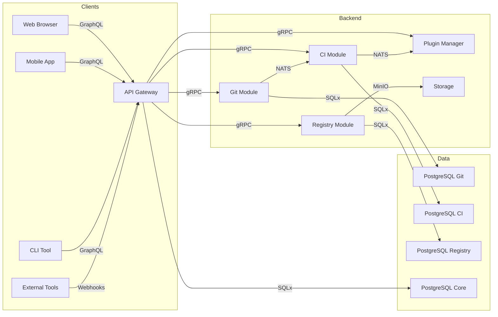

# 📡 Spécifications API - Tardigrade-CI

**Version :** 1.0  
**Dernière mise à jour :** 2026-06-17  
**Statut :** À valider (Atelier technique 20/06/2026)  

---

## 📋 Sommaire

1. [Aperçu Global](#1-apercu-global)
2. [API GraphQL (Publique)](#2-api-graphql)
3. [API gRPC (Interne)](#3-api-grpc)
4. [REST API (Optionnelle)](#4-rest-api)
5. [Exemples d'Utilisation](#5-exemples-dutilisation)
6. [Bonnes Pratiques](#6-bonnes-pratiques)

---

## 1️⃣ Aperçu Global

### 🎯 Stratégie d'API

| Type | Protocole | Utilisation | Public/Privé | Port |
|------|-----------|-------------|--------------|------|
| **API Publique** | GraphQL | Clients externes (Web, Mobile, CLI) | Public | 3000 |
| **API Interne** | gRPC | Communication inter-modules | Privé (K8s) | 50051+ |
| **Health Checks** | HTTP | Monitoring | Privé | 3000 |
| **Metrics** | HTTP | Prometheus | Privé | 9090 |

### 🔄 Flux de Communication



---

## 2️⃣ API GraphQL (Publique)

### 🎯 Endpoints

| Environnement | URL | WebSocket |
|---------------|-----|-----------|
| **Production** | `https://api.tardigrade-ci.dev/graphql` | `wss://api.tardigrade-ci.dev/graphql` |
| **Staging** | `https://staging.api.tardigrade-ci.dev/graphql` | `wss://staging.api.tardigrade-ci.dev/graphql` |
| **Dev Local** | `http://localhost:3000/graphql` | `ws://localhost:3000/graphql` |

### 📜 Schéma Complet

```graphql
# ============================================
# TYPES SCALAIRES
# ============================================

scalar UUID
scalar DateTime
scalar JSON

# ============================================
# ENUMS
# ============================================

enum RepositoryVisibility {
  PUBLIC
  PRIVATE
}

enum PipelineStatus {
  PENDING
  PREPARING
  RUNNING
  SUCCESS
  FAILED
  CANCELLED
  SKIPPED
}

enum PipelineConclusion {
  SUCCESS
  FAILURE
  NEUTRAL
  CANCELLED
  SKIPPED
  TIMED_OUT
}

enum ArtefactType {
  DOCKER
  NPM
  CARGO
  MAVEN
  PYPI
  GENERIC
}

enum ArtefactFormat {
  CONTAINER
  PACKAGE
  BINARY
  SOURCE
  ARCHIVE
}

enum PermissionLevel {
  READ
  WRITE
  ADMIN
}

enum EventType {
  # Git Events
  GIT_PUSH
  GIT_PULL_REQUEST_OPENED
  GIT_PULL_REQUEST_CLOSED
  GIT_PULL_REQUEST_MERGED
  GIT_BRANCH_CREATED
  GIT_BRANCH_DELETED
  GIT_TAG_CREATED
  GIT_TAG_DELETED
  
  # CI Events
  CI_PIPELINE_STARTED
  CI_PIPELINE_COMPLETED
  CI_STEP_STARTED
  CI_STEP_COMPLETED
  
  # Registry Events
  REGISTRY_ARTEFACT_PUSHED
  REGISTRY_ARTEFACT_DELETED
  
  # Plugin Events
  PLUGIN_INSTALLED
  PLUGIN_UNINSTALLED
}

# ============================================
# INPUT TYPES
# ============================================

input PaginationInput {
  page: Int = 1
  pageSize: Int = 20
}

input CreateRepositoryInput {
  name: String!
  description: String
  visibility: RepositoryVisibility = PUBLIC
}

input UpdateRepositoryInput {
  name: String
  description: String
  visibility: RepositoryVisibility
  defaultBranch: String
}

input CreateBranchInput {
  name: String!
  sourceBranch: String
}

input CreatePullRequestInput {
  title: String!
  description: String
  sourceBranch: String!
  targetBranch: String!
  assigneeId: UUID
}

input CreatePipelineInput {
  branch: String!
  ymlContent: String
  ymlPath: String = ".tardigrade-ci.yml"
}

input UploadArtefactInput {
  name: String!
  version: String!
  path: String!
  content: Upload!
  artefactType: ArtefactType!
}

input InstallPluginInput {
  name: String!
  version: String
  sourceUrl: String!
  config: JSON
}

# ============================================
# OUTPUT TYPES
# ============================================

# --- Utilisateurs ---

type User {
  id: UUID!
  username: String!
  email: String!
  fullName: String
  avatarUrl: String
  isActive: Boolean!
  isAdmin: Boolean!
  createdAt: DateTime!
  updatedAt: DateTime!
  lastLoginAt: DateTime
  
  # Connexions
  repositories: [Repository!]!
  pipelines: [Pipeline!]!
  plugins: [Plugin!]!
}

# --- Repository ---

type Repository {
  id: UUID!
  name: String!
  description: String
  visibility: RepositoryVisibility!
  isFork: Boolean!
  forkedFrom: Repository
  
  # Propriétaire
  owner: User!
  
  # Statistiques
  size: Int!
  starsCount: Int!
  forksCount: Int!
  openIssuesCount: Int!
  openPullRequestsCount: Int!
  
  # Branche par défaut
  defaultBranch: Branch
  
  # Timestamps
  createdAt: DateTime!
  updatedAt: DateTime!
  
  # Connexions
  branches: [Branch!]!
  commits: [Commit!]!
  pullRequests: [PullRequest!]!
  issues: [Issue!]!
  pipelines: [Pipeline!]!
  webhooks: [Webhook!]!
  milestones: [Milestone!]!
  environments: [Environment!]!
  permissions: [RepositoryPermission!]!
}

type Branch {
  id: UUID!
  name: String!
  commit: Commit
  isProtected: Boolean!
  protectionRule: JSON
  repository: Repository!
  createdAt: DateTime!
}

type Commit {
  id: UUID!
  hash: String!
  message: String!
  author: GitUser!
  committer: GitUser!
  treeHash: String!
  parentHashes: [String!]!
  stats: JSON
  repository: Repository!
  createdAt: DateTime!
}

type GitUser {
  name: String!
  email: String!
  date: DateTime!
}

type PullRequest {
  id: UUID!
  number: Int!
  title: String!
  description: String
  status: String!
  state: String!
  isMergeable: Boolean!
  
  # Branches
  sourceBranch: Branch!
  targetBranch: Branch!
  
  # Utilisateurs
  author: User!
  assignee: User
  mergedBy: User
  
  # Timestamps
  createdAt: DateTime!
  updatedAt: DateTime!
  mergedAt: DateTime
  closedAt: DateTime
  
  # Connexions
  repository: Repository!
  reviews: [PullRequestReview!]!
  comments: [PullRequestComment!]!
  commits: [Commit!]!
}

type PullRequestReview {
  id: UUID!
  state: String!
  body: String
  pullRequest: PullRequest!
  reviewer: User!
  commit: Commit
  createdAt: DateTime!
  updatedAt: DateTime!
}

type PullRequestComment {
  id: UUID!
  body: String!
  pullRequest: PullRequest!
  user: User!
  commit: Commit
  filePath: String
  lineNumber: Int
  isResolved: Boolean!
  parentComment: PullRequestComment
  createdAt: DateTime!
  updatedAt: DateTime!
}

type Issue {
  id: UUID!
  number: Int!
  title: String!
  description: String
  status: String!
  state: String!
  priority: String!
  issueType: String!
  
  # Utilisateurs
  author: User!
  assignee: User
  closedBy: User
  
  # Labels & Milestone
  labels: [String!]!
  milestone: Milestone
  linkedPullRequest: PullRequest
  
  # Timestamps
  createdAt: DateTime!
  updatedAt: DateTime!
  closedAt: DateTime
  
  # Connexions
  repository: Repository!
  comments: [IssueComment!]!
}

type IssueComment {
  id: UUID!
  body: String!
  issue: Issue!
  user: User!
  createdAt: DateTime!
  updatedAt: DateTime!
}

type Milestone {
  id: UUID!
  title: String!
  description: String
  state: String!
  dueDate: DateTime
  repository: Repository!
  createdAt: DateTime!
  updatedAt: DateTime!
  closedAt: DateTime
  
  # Connexions
  issues: [Issue!]!
  pullRequests: [PullRequest!]!
}

type Webhook {
  id: UUID!
  url: String!
  events: [String!]!
  secret: String
  isActive: Boolean!
  repository: Repository!
  createdAt: DateTime!
  updatedAt: DateTime!
  
  # Connexions
  deliveries: [WebhookDelivery!]!
}

type WebhookDelivery {
  id: UUID!
  eventType: EventType!
  payload: JSON!
  responseStatus: Int
  responseBody: String
  attempts: Int!
  isDelivered: Boolean!
  webhook: Webhook!
  createdAt: DateTime!
  deliveredAt: DateTime
}

# --- CI ---

type Pipeline {
  id: UUID!
  number: Int!
  status: PipelineStatus!
  conclusion: PipelineConclusion
  
  # Références
  repository: Repository!
  commit: Commit
  branch: Branch
  triggerUser: User
  
  # Configuration
  ymlContent: String!
  ymlPath: String!
  triggerType: String!
  
  # Timing
  startedAt: DateTime
  completedAt: DateTime
  durationMs: Int
  queuedDurationMs: Int
  
  # Workspace
  workspacePath: String
  runNumber: Int!
  
  # Timestamps
  createdAt: DateTime!
  updatedAt: DateTime!
  
  # Connexions
  steps: [PipelineStep!]!
  artefacts: [PipelineArtefact!]!
  logs: [PipelineLog!]!
  deployments: [Deployment!]!
}

type PipelineStep {
  id: UUID!
  number: Int!
  name: String!
  stepType: String!
  
  # Configuration
  runCommand: String
  uses: String
  withConfig: JSON
  envVars: JSON
  workingDirectory: String
  timeoutMinutes: Int
  continueOnError: Boolean!
  
  # Status
  status: PipelineStatus!
  conclusion: PipelineConclusion
  exitCode: Int
  
  # Timing
  startedAt: DateTime
  completedAt: DateTime
  durationMs: Int
  
  # Output
  output: String
  
  # Connexions
  pipeline: Pipeline!
  artefacts: [PipelineArtefact!]!
  logs: [PipelineLog!]!
  runnerJob: RunnerJob
  
  createdAt: DateTime!
}

type PipelineArtefact {
  id: UUID!
  name: String!
  path: String!
  
  # Stockage
  storagePath: String!
  sizeBytes: Int!
  contentType: String
  checksum: String!
  
  # Metadata
  isKeepForever: Boolean!
  expirationDate: DateTime
  metadata: JSON
  
  # Connexions
  pipeline: Pipeline!
  step: PipelineStep
  
  createdAt: DateTime!
  accessedAt: DateTime
}

type PipelineLog {
  id: UUID!
  level: String!
  message: String!
  metadata: JSON
  
  # Connexions
  pipeline: Pipeline!
  step: PipelineStep
  
  timestamp: DateTime!
}

type Runner {
  id: UUID!
  name: String!
  status: String!
  os: String!
  architecture: String!
  labels: [String!]!
  
  # Ressources
  cpuCores: Int!
  memoryMb: Int!
  diskGb: Int!
  
  # Connexion
  lastHeartbeatAt: DateTime
  version: String!
  description: String
  
  # Timestamps
  createdAt: DateTime!
  updatedAt: DateTime!
  
  # Connexions
  jobs: [RunnerJob!]!
}

type RunnerJob {
  id: UUID!
  status: String!
  
  # Connexions
  runner: Runner!
  step: PipelineStep!
  
  # Timing
  queuedAt: DateTime!
  startedAt: DateTime
  completedAt: DateTime
  
  # Execution
  containerId: String
  exitCode: Int
}

type Environment {
  id: UUID!
  name: String!
  description: String
  deploymentUrl: String
  
  # Connexions
  repository: Repository!
  deployments: [Deployment!]!
  
  createdAt: DateTime!
  updatedAt: DateTime!
}

type Deployment {
  id: UUID!
  status: String!
  
  # Connexions
  pipeline: Pipeline!
  environment: Environment!
  
  # Metadata
  sha: String
  ref: String
  
  # Timing
  startedAt: DateTime
  completedAt: DateTime
  
  createdAt: DateTime!
}

# --- Artifact Registry ---

type Artefact {
  id: UUID!
  name: String!
  version: String!
  artefactType: ArtefactType!
  format: ArtefactFormat!
  
  # Propriétaire
  repository: Repository
  pipeline: Pipeline
  user: User
  
  # Stockage
  path: String!
  storagePath: String!
  storageBucket: String!
  sizeBytes: Int!
  contentType: String
  checksum: String!
  compression: String
  
  # Versioning
  isLatest: Boolean!
  isPrerelease: Boolean!
  semverMetadata: JSON
  
  # Security
  isPublic: Boolean!
  vulnerabilityScanStatus: String
  vulnerabilityScanReport: JSON
  
  # Metadata
  metadata: JSON
  
  # Timestamps
  createdAt: DateTime!
  updatedAt: DateTime!
  accessedAt: DateTime
  
  # Connexions
  tags: [ArtefactTag!]!
  versions: [ArtefactVersion!]!
  dependencies: [ArtefactDependency!]!
  statistics: [ArtefactStatistic!]!
}

type ArtefactTag {
  id: UUID!
  tag: String!
  message: String
  
  # Connexions
  artefact: Artefact!
  createdBy: User
  
  createdAt: DateTime!
}

type ArtefactVersion {
  id: UUID!
  artefactName: String!
  version: String!
  changelog: String
  
  # Connexions
  artefact: Artefact!
  publishedBy: User
  
  createdAt: DateTime!
}

type ArtefactDependency {
  id: UUID!
  name: String!
  versionRequirement: String!
  dependencyType: String!
  
  # Connexions
  artefact: Artefact!
}

type ArtefactStatistic {
  id: UUID!
  downloadCount: Int!
  starCount: Int!
  
  # Connexions
  artefact: Artefact!
  
  date: DateTime!
}

# --- Plugins ---

type Plugin {
  id: UUID!
  name: String!
  version: String!
  description: String
  author: String
  pluginType: String!
  
  # Configuration
  isEnabled: Boolean!
  isOfficial: Boolean!
  sourceUrl: String
  checksum: String
  configSchema: JSON
  
  # Timestamps
  createdAt: DateTime!
  updatedAt: DateTime!
  
  # Connexions
  configurations: [PluginConfiguration!]!
}

type PluginConfiguration {
  id: UUID!
  config: JSON!
  isEnabled: Boolean!
  
  # Connexions
  plugin: Plugin!
  repository: Repository
  
  createdAt: DateTime!
  updatedAt: DateTime!
}

# --- Repository Permissions ---

type RepositoryPermission {
  permission: PermissionLevel!
  user: User!
  repository: Repository!
  grantedAt: DateTime!
  grantedBy: User!
}

# --- Paginated Responses ---

type PaginatedResponse<T> {
  data: [T!]!
  page: Int!
  pageSize: Int!
  total: Int!
  totalPages: Int!
}

# ============================================
# QUERIES
# ============================================

type Query {
  # --- System ---
  
  # Utilisateur actuel
  currentUser: User
  
  # Users
  user(id: UUID!): User
  users(pagination: PaginationInput, search: String): PaginatedResponse<User>!
  
  # Permissions
  permissions: [String!]!
  
  # --- Git ---
  
  # Repositories
  repository(id: UUID!): Repository
  repositories(pagination: PaginationInput, ownerId: UUID): PaginatedResponse<Repository>!
  repositoryByName(owner: String!, name: String!): Repository
  
  # Branches
  branch(id: UUID!): Branch
  branches(repositoryId: UUID!, pagination: PaginationInput): PaginatedResponse<Branch>!
  branchByName(repositoryId: UUID!, name: String!): Branch
  
  # Commits
  commit(id: UUID!): Commit
  commits(repositoryId: UUID!, branch: String, pagination: PaginationInput): PaginatedResponse<Commit>!
  commitByHash(repositoryId: UUID!, hash: String!): Commit
  
  # Pull Requests
  pullRequest(id: UUID!): PullRequest
  pullRequests(repositoryId: UUID!, pagination: PaginationInput, status: String): PaginatedResponse<PullRequest>!
  pullRequestByNumber(repositoryId: UUID!, number: Int!): PullRequest
  
  # Issues
  issue(id: UUID!): Issue
  issues(repositoryId: UUID!, pagination: PaginationInput, status: String): PaginatedResponse<Issue>!
  issueByNumber(repositoryId: UUID!, number: Int!): Issue
  
  # Milestones
  milestone(id: UUID!): Milestone
  milestones(repositoryId: UUID!, pagination: PaginationInput): PaginatedResponse<Milestone>!
  
  # Webhooks
  webhook(id: UUID!): Webhook
  webhooks(repositoryId: UUID!, pagination: PaginationInput): PaginatedResponse<Webhook>!
  
  # Environments
  environment(id: UUID!): Environment
  environments(repositoryId: UUID!, pagination: PaginationInput): PaginatedResponse<Environment>!
  
  # --- CI ---
  
  # Pipelines
  pipeline(id: UUID!): Pipeline
  pipelines(repositoryId: UUID!, pagination: PaginationInput, status: String): PaginatedResponse<Pipeline>!
  pipelinesByCommit(commitId: UUID!, pagination: PaginationInput): PaginatedResponse<Pipeline>!
  latestPipeline(repositoryId: UUID!, branch: String): Pipeline
  
  # Pipeline Steps
  pipelineStep(id: UUID!): PipelineStep
  pipelineSteps(pipelineId: UUID!, pagination: PaginationInput): PaginatedResponse<PipelineStep>!
  
  # Pipeline Artefacts
  pipelineArtefact(id: UUID!): PipelineArtefact
  pipelineArtefacts(pipelineId: UUID!, pagination: PaginationInput): PaginatedResponse<PipelineArtefact>!
  
  # Pipeline Logs
  pipelineLogs(pipelineId: UUID!, stepId: UUID, pagination: PaginationInput, level: String): PaginatedResponse<PipelineLog>!
  
  # Runners
  runner(id: UUID!): Runner
  runners(pagination: PaginationInput, status: String): PaginatedResponse<Runner>!
  
  # Runner Jobs
  runnerJob(id: UUID!): RunnerJob
  runnerJobs(runnerId: UUID!, pagination: PaginationInput): PaginatedResponse<RunnerJob>!
  
  # Deployments
  deployment(id: UUID!): Deployment
  deployments(environmentId: UUID!, pagination: PaginationInput): PaginatedResponse<Deployment>!
  latestDeployment(environmentId: UUID!): Deployment
  
  # --- Artifact Registry ---
  
  # Artefacts
  artefact(id: UUID!): Artefact
  artefacts(pagination: PaginationInput, repositoryId: UUID, artefactType: ArtefactType): PaginatedResponse<Artefact>!
  artefactByName(name: String!, version: String): Artefact
  
  # Artefact Tags
  artefactTags(artefactId: UUID!, pagination: PaginationInput): PaginatedResponse<ArtefactTag>!
  
  # Artefact Versions
  artefactVersions(artefactName: String!, pagination: PaginationInput): PaginatedResponse<ArtefactVersion>!
  
  # Artefact Dependencies
  artefactDependencies(artefactId: UUID!): [ArtefactDependency!]!
  
  # Artefact Statistics
  artefactStatistics(artefactId: UUID!, days: Int = 30): [ArtefactStatistic!]!
  
  # --- Plugins ---
  
  # Plugins
  plugin(id: UUID!): Plugin
  plugins(pagination: PaginationInput, isOfficial: Boolean): PaginatedResponse<Plugin>!
  
  # Plugin Configurations
  pluginConfigurations(repositoryId: UUID!, pagination: PaginationInput): PaginatedResponse<PluginConfiguration>!
}

# ============================================
# MUTATIONS
# ============================================

type Mutation {
  # --- Auth ---
  
  # Login
  login(email: String!, password: String!): AuthPayload!
  
  # Logout
  logout: Boolean!
  
  # Register
  register(username: String!, email: String!, password: String!, fullName: String): AuthPayload!
  
  # Refresh Token
  refreshToken(refreshToken: String!): AuthPayload!
  
  # --- Users ---
  
  # Update Profile
  updateProfile(fullName: String, avatarUrl: String): User!
  
  # Change Password
  changePassword(currentPassword: String!, newPassword: String!): Boolean!
  
  # --- Git ---
  
  # Repositories
  createRepository(input: CreateRepositoryInput!): Repository!
  updateRepository(id: UUID!, input: UpdateRepositoryInput!): Repository!
  deleteRepository(id: UUID!): Boolean!
  forkRepository(id: UUID!, name: String): Repository!
  
  # Branches
  createBranch(repositoryId: UUID!, input: CreateBranchInput!): Branch!
  deleteBranch(id: UUID!): Boolean!
  
  # Commits
  # (Les commits sont créés via Git push, pas via API)
  
  # Pull Requests
  createPullRequest(repositoryId: UUID!, input: CreatePullRequestInput!): PullRequest!
  updatePullRequest(id: UUID!, title: String, description: String, assigneeId: UUID): PullRequest!
  mergePullRequest(id: UUID!, mergeCommitMessage: String): PullRequest!
  closePullRequest(id: UUID!, comment: String): PullRequest!
  
  # Pull Request Reviews
  createPullRequestReview(pullRequestId: UUID!, state: String!, body: String): PullRequestReview!
  updatePullRequestReview(id: UUID!, state: String, body: String): PullRequestReview!
  deletePullRequestReview(id: UUID!): Boolean!
  
  # Pull Request Comments
  createPullRequestComment(pullRequestId: UUID!, body: String!, commitId: UUID, filePath: String, lineNumber: Int, parentCommentId: UUID): PullRequestComment!
  updatePullRequestComment(id: UUID!, body: String!): PullRequestComment!
  deletePullRequestComment(id: UUID!): Boolean!
  resolvePullRequestComment(id: UUID!, isResolved: Boolean!): PullRequestComment!
  
  # Issues
  createIssue(repositoryId: UUID!, title: String!, description: String, assigneeId: UUID, labels: [String!], priority: String, issueType: String): Issue!
  updateIssue(id: UUID!, title: String, description: String, assigneeId: UUID, labels: [String!], priority: String, state: String): Issue!
  closeIssue(id: UUID!, comment: String): Issue!
  
  # Issue Comments
  createIssueComment(issueId: UUID!, body: String!): IssueComment!
  updateIssueComment(id: UUID!, body: String!): IssueComment!
  deleteIssueComment(id: UUID!): Boolean!
  
  # Milestones
  createMilestone(repositoryId: UUID!, title: String!, description: String, dueDate: DateTime): Milestone!
  updateMilestone(id: UUID!, title: String, description: String, state: String, dueDate: DateTime): Milestone!
  closeMilestone(id: UUID!): Milestone!
  
  # Webhooks
  createWebhook(repositoryId: UUID!, url: String!, events: [String!]!, secret: String): Webhook!
  updateWebhook(id: UUID!, url: String, events: [String!], secret: String, isActive: Boolean): Webhook!
  deleteWebhook(id: UUID!): Boolean!
  
  # Environments
  createEnvironment(repositoryId: UUID!, name: String!, description: String, deploymentUrl: String): Environment!
  updateEnvironment(id: UUID!, name: String, description: String, deploymentUrl: String): Environment!
  deleteEnvironment(id: UUID!): Boolean!
  
  # --- CI ---
  
  # Pipelines
  createPipeline(repositoryId: UUID!, input: CreatePipelineInput!): Pipeline!
  cancelPipeline(id: UUID!): Pipeline!
  reRunPipeline(id: UUID!): Pipeline!
  
  # Deployments
  createDeployment(pipelineId: UUID!, environmentId: UUID!): Deployment!
  
  # --- Artifact Registry ---
  
  # Artefacts
  uploadArtefact(input: UploadArtefactInput!): Artefact!
  deleteArtefact(id: UUID!): Boolean!
  
  # Artefact Tags
  createArtefactTag(artefactId: UUID!, tag: String!, message: String): ArtefactTag!
  deleteArtefactTag(id: UUID!): Boolean!
  
  # Artefact Versions
  createArtefactVersion(artefactName: String!, version: String!, changelog: String): ArtefactVersion!
  
  # --- Plugins ---
  
  # Plugins
  installPlugin(input: InstallPluginInput!): Plugin!
  uninstallPlugin(id: UUID!): Boolean!
  enablePlugin(id: UUID!): Boolean!
  disablePlugin(id: UUID!): Boolean!
  updatePluginConfig(id: UUID!, config: JSON!): PluginConfiguration!
  
  # --- Repository Permissions ---
  
  # Permissions
  addRepositoryPermission(repositoryId: UUID!, userId: UUID!, permission: PermissionLevel!): RepositoryPermission!
  updateRepositoryPermission(repositoryId: UUID!, userId: UUID!, permission: PermissionLevel!): RepositoryPermission!
  removeRepositoryPermission(repositoryId: UUID!, userId: UUID!): Boolean!
}

# ============================================
# SUBSCRIPTIONS (Temps Réel)
# ============================================

type Subscription {
  # Git Events
  repositoryCreated(ownerId: UUID): Repository!
    @aws_subscribe(mutations: ["createRepository"])
  repositoryUpdated(ownerId: UUID): Repository!
    @aws_subscribe(mutations: ["updateRepository"])
  repositoryDeleted(ownerId: UUID): UUID!
    @aws_subscribe(mutations: ["deleteRepository"])
  
  # Branch Events
  branchCreated(repositoryId: UUID): Branch!
    @aws_subscribe(mutations: ["createBranch"])
  branchDeleted(repositoryId: UUID): UUID!
    @aws_subscribe(mutations: ["deleteBranch"])
  
  # Pull Request Events
  pullRequestCreated(repositoryId: UUID): PullRequest!
    @aws_subscribe(mutations: ["createPullRequest"])
  pullRequestUpdated(repositoryId: UUID): PullRequest!
    @aws_subscribe(mutations: ["updatePullRequest", "mergePullRequest", "closePullRequest"])
  
  # Issue Events
  issueCreated(repositoryId: UUID): Issue!
    @aws_subscribe(mutations: ["createIssue"])
  issueUpdated(repositoryId: UUID): Issue!
    @aws_subscribe(mutations: ["updateIssue", "closeIssue"])
  
  # CI Events
  pipelineCreated(repositoryId: UUID): Pipeline!
    @aws_subscribe(mutations: ["createPipeline"])
  pipelineUpdated(repositoryId: UUID): Pipeline!
    @aws_subscribe(mutations: ["cancelPipeline", "reRunPipeline"])
  pipelineStatusChanged(repositoryId: UUID): Pipeline!
  
  # Artefact Events
  artefactUploaded(repositoryId: UUID): Artefact!
    @aws_subscribe(mutations: ["uploadArtefact"])
  artefactDeleted(repositoryId: UUID): UUID!
    @aws_subscribe(mutations: ["deleteArtefact"])
  
  # Deployment Events
  deploymentCreated(environmentId: UUID): Deployment!
    @aws_subscribe(mutations: ["createDeployment"])
  deploymentUpdated(environmentId: UUID): Deployment!
}

# ============================================
# AUTH TYPES
# ============================================

type AuthPayload {
  user: User!
  accessToken: String!
  refreshToken: String!
  expiresIn: Int!
}

# ============================================
# DIRECTIVES
# ============================================

directive @aws_cognito_user_pools on OBJECT | FIELD_DEFINITION

directive @aws_api_key on OBJECT | FIELD_DEFINITION

directive @aws_iam on OBJECT | FIELD_DEFINITION

directive @aws_subscribe(mutations: [String!]!) on FIELD_DEFINITION

directive @aws_auth(cognitoGroups: [String!]) on OBJECT | FIELD_DEFINITION
```

---

## 3️⃣ API gRPC (Interne)

### 🎯 Principle de Communication Inter-Modules

Tous les modules communiquent entre eux via **gRPC** (Protocol Buffers). Cela permet :
- **Typage fort** : Compilation des contrats d'interface
- **Performance** : Sérialisation binaire efficace
- **Compatibilité** : Génération de code dans plusieurs langages
- **Évolutivité** : Ajout facile de nouveaux services

### 📁 Structure des Protobuf

```
proto/
├── tardigrade/
│   ├── v1/
│   │   ├── git.proto           # Git Module
│   │   ├── ci.proto            # CI Module
│   │   ├── registry.proto      # Artifact Registry
│   │   ├── plugin.proto        # Plugin System
│   │   └── auth.proto          # Authentification
│   └── health.proto            # Health Checks (commun)
└── google/
    └── protobuf/
        └── empty.proto          # Messages vides
```

### 📜 git.proto

```protobuf
syntax = "proto3";

package tardigrade.git.v1;

option rust_package = "tardigrade.git.v1";
option go_package = "github.com/tardigrade-ci/tardigrade/proto/gen/go/tardigrade/git/v1";

// ============================================
// MESSAGES
// ============================================

message Repository {
  string id = 1;
  string name = 2;
  string description = 3;
  bool is_private = 4;
  string owner_id = 5;
  string default_branch = 6;
  int64 size = 7;
  int32 stars_count = 8;
  int32 forks_count = 9;
  bool is_fork = 10;
  string forked_from = 11;
  int64 created_at = 12;
  int64 updated_at = 13;
}

message CreateRepositoryRequest {
  string name = 1;
  string description = 2;
  bool is_private = 3;
  string owner_id = 4;
  string default_branch = 5;
}

message GetRepositoryRequest {
  string id = 1;
}

message ListRepositoriesRequest {
  string owner_id = 1;
  int32 page = 2;
  int32 page_size = 3;
}

message ListRepositoriesResponse {
  repeated Repository repositories = 1;
  int32 page = 2;
  int32 page_size = 3;
  int64 total = 4;
  int64 total_pages = 5;
}

message UpdateRepositoryRequest {
  string id = 1;
  string name = 2;
  string description = 3;
  bool is_private = 4;
  string default_branch = 5;
}

message DeleteRepositoryRequest {
  string id = 1;
  string owner_id = 2;
}

message Branch {
  string id = 1;
  string repository_id = 2;
  string name = 3;
  string commit_hash = 4;
  bool is_protected = 5;
  bytes protection_rule = 6;
  int64 created_at = 7;
  int64 updated_at = 8;
}

message CreateBranchRequest {
  string repository_id = 1;
  string name = 2;
  string source_branch = 3;
}

message GetBranchRequest {
  string id = 1;
}

message ListBranchesRequest {
  string repository_id = 1;
  int32 page = 2;
  int32 page_size = 3;
}

message ListBranchesResponse {
  repeated Branch branches = 1;
  int32 page = 2;
  int32 page_size = 3;
  int64 total = 4;
  int64 total_pages = 5;
}

message DeleteBranchRequest {
  string id = 1;
}

message Commit {
  string id = 1;
  string repository_id = 2;
  string hash = 3;
  string message = 4;
  string author_name = 5;
  string author_email = 6;
  int64 author_date = 7;
  string committer_name = 8;
  string committer_email = 9;
  int64 committer_date = 10;
  string tree_hash = 11;
  repeated string parent_hashes = 12;
  bytes stats = 13;
  int64 created_at = 14;
}

message GetCommitRequest {
  string id = 1;
  string hash = 2;
}

message ListCommitsRequest {
  string repository_id = 1;
  string branch = 2;
  int32 page = 3;
  int32 page_size = 4;
}

message ListCommitsResponse {
  repeated Commit commits = 1;
  int32 page = 2;
  int32 page_size = 3;
  int64 total = 4;
  int64 total_pages = 5;
}

// ============================================
// SERVICES
// ============================================

service GitService {
  // Repository operations
  rpc CreateRepository (CreateRepositoryRequest) returns (Repository);
  rpc GetRepository (GetRepositoryRequest) returns (Repository);
  rpc ListRepositories (ListRepositoriesRequest) returns (ListRepositoriesResponse);
  rpc UpdateRepository (UpdateRepositoryRequest) returns (Repository);
  rpc DeleteRepository (DeleteRepositoryRequest) returns (google.protobuf.Empty);
  
  // Branch operations
  rpc CreateBranch (CreateBranchRequest) returns (Branch);
  rpc GetBranch (GetBranchRequest) returns (Branch);
  rpc ListBranches (ListBranchesRequest) returns (ListBranchesResponse);
  rpc DeleteBranch (DeleteBranchRequest) returns (google.protobuf.Empty);
  
  // Commit operations
  rpc GetCommit (GetCommitRequest) returns (Commit);
  rpc ListCommits (ListCommitsRequest) returns (ListCommitsResponse);
  
  // Health check
  rpc HealthCheck (google.protobuf.Empty) returns (google.protobuf.Empty);
}
```

### 📜 ci.proto

```protobuf
syntax = "proto3";

package tardigrade.ci.v1;

option rust_package = "tardigrade.ci.v1";

// ============================================
// MESSAGES
// ============================================

message Pipeline {
  string id = 1;
  string repository_id = 2;
  string commit_id = 3;
  string branch_name = 4;
  string trigger_type = 5;
  string trigger_user_id = 6;
  string yml_content = 7;
  string yml_path = 8;
  string status = 9;
  string conclusion = 10;
  int64 started_at = 11;
  int64 completed_at = 12;
  int64 duration_ms = 13;
  int64 queued_duration_ms = 14;
  string workspace_path = 15;
  int32 run_number = 16;
  int64 created_at = 17;
  int64 updated_at = 18;
}

message PipelineStep {
  string id = 1;
  string pipeline_id = 2;
  string name = 3;
  string step_type = 4;
  int32 step_number = 5;
  string run_command = 6;
  string uses = 7;
  bytes with_config = 8;
  bytes env_vars = 9;
  string working_directory = 10;
  int32 timeout_minutes = 11;
  bool continue_on_error = 12;
  string status = 13;
  string conclusion = 14;
  int32 exit_code = 15;
  int64 started_at = 16;
  int64 completed_at = 17;
  int64 duration_ms = 18;
  string output = 19;
  int64 created_at = 20;
}

message PipelineArtefact {
  string id = 1;
  string pipeline_id = 2;
  string step_id = 3;
  string name = 4;
  string path = 5;
  string storage_path = 6;
  int64 size_bytes = 7;
  string content_type = 8;
  string checksum = 9;
  bool is_keep_forever = 10;
  int64 expiration_date = 11;
  bytes metadata = 12;
  int64 created_at = 13;
  int64 accessed_at = 14;
}

message PipelineLog {
  string id = 1;
  string pipeline_id = 2;
  string step_id = 3;
  string level = 4;
  string message = 5;
  bytes metadata = 6;
  int64 timestamp = 7;
}

message Runner {
  string id = 1;
  string name = 2;
  string status = 3;
  string os = 4;
  string architecture = 5;
  repeated string labels = 6;
  int32 cpu_cores = 7;
  int32 memory_mb = 8;
  int32 disk_gb = 9;
  int64 last_heartbeat_at = 10;
  string version = 11;
  string description = 12;
  int64 created_at = 13;
  int64 updated_at = 14;
}

message RunnerJob {
  string id = 1;
  string runner_id = 2;
  string step_id = 3;
  string status = 4;
  int64 queued_at = 5;
  int64 started_at = 6;
  int64 completed_at = 7;
  string container_id = 8;
  int32 exit_code = 9;
}

message Environment {
  string id = 1;
  string repository_id = 2;
  string name = 3;
  string description = 4;
  string deployment_url = 5;
  int64 created_at = 6;
  int64 updated_at = 7;
}

message Deployment {
  string id = 1;
  string pipeline_id = 2;
  string environment_id = 3;
  string status = 4;
  string sha = 5;
  string ref = 6;
  int64 started_at = 7;
  int64 completed_at = 8;
  int64 created_at = 9;
}

// Requests
message CreatePipelineRequest {
  string repository_id = 1;
  string commit_id = 2;
  string branch_name = 3;
  string trigger_type = 4;
  string trigger_user_id = 5;
  string yml_content = 6;
  string yml_path = 7;
}

message GetPipelineRequest {
  string id = 1;
}

message ListPipelinesRequest {
  string repository_id = 1;
  string status = 2;
  int32 page = 3;
  int32 page_size = 4;
}

message ListPipelinesResponse {
  repeated Pipeline pipelines = 1;
  int32 page = 2;
  int32 page_size = 3;
  int64 total = 4;
  int64 total_pages = 5;
}

message CancelPipelineRequest {
  string id = 1;
}

message ReRunPipelineRequest {
  string id = 1;
}

// ============================================
// SERVICES
// ============================================

service CiService {
  // Pipeline operations
  rpc CreatePipeline (CreatePipelineRequest) returns (Pipeline);
  rpc GetPipeline (GetPipelineRequest) returns (Pipeline);
  rpc ListPipelines (ListPipelinesRequest) returns (ListPipelinesResponse);
  rpc CancelPipeline (CancelPipelineRequest) returns (Pipeline);
  rpc ReRunPipeline (ReRunPipelineRequest) returns (Pipeline);
  
  // Step operations
  rpc GetStep (GetPipelineRequest) returns (PipelineStep);
  rpc ListSteps (GetPipelineRequest) returns (stream PipelineStep);
  rpc GetStepLogs (GetPipelineRequest) returns (stream PipelineLog);
  
  // Runner operations
  rpc RegisterRunner (Runner) returns (Runner);
  rpc DeregisterRunner (GetPipelineRequest) returns (google.protobuf.Empty);
  rpc ListRunners (google.protobuf.Empty) returns (stream Runner);
  rpc UpdateRunnerStatus (Runner) returns (Runner);
  
  // Health check
  rpc HealthCheck (google.protobuf.Empty) returns (google.protobuf.Empty);
}
```

### 📜 registry.proto

```protobuf
syntax = "proto3";

package tardigrade.registry.v1;

option rust_package = "tardigrade.registry.v1";

// ============================================
// MESSAGES
// ============================================

message Artefact {
  string id = 1;
  string name = 2;
  string version = 3;
  string artefact_type = 4;
  string format = 5;
  string repository_id = 6;
  string pipeline_id = 7;
  string user_id = 8;
  string path = 9;
  string storage_path = 10;
  string storage_bucket = 11;
  int64 size_bytes = 12;
  string content_type = 13;
  string checksum = 14;
  string compression = 15;
  bool is_latest = 16;
  bool is_prerelease = 17;
  bytes semver_metadata = 18;
  bool is_public = 19;
  string vulnerability_scan_status = 20;
  bytes vulnerability_scan_report = 21;
  bytes metadata = 22;
  int64 created_at = 23;
  int64 updated_at = 24;
  int64 accessed_at = 25;
}

message ArtefactTag {
  string id = 1;
  string artefact_id = 2;
  string tag = 3;
  string message = 4;
  string created_by = 5;
  int64 created_at = 6;
}

message ArtefactVersion {
  string id = 1;
  string artefact_name = 2;
  string version = 3;
  string artefact_id = 4;
  string changelog = 5;
  string published_by = 6;
  int64 created_at = 7;
}

message ArtefactDependency {
  string id = 1;
  string artefact_id = 2;
  string name = 3;
  string version_requirement = 4;
  string dependency_type = 5;
}

message UploadArtefactRequest {
  string name = 1;
  string version = 2;
  string artefact_type = 3;
  string path = 4;
  bytes content = 5;
  bytes metadata = 6;
}

message GetArtefactRequest {
  string id = 1;
}

message ListArtefactsRequest {
  string repository_id = 1;
  string artefact_type = 2;
  int32 page = 3;
  int32 page_size = 4;
}

message ListArtefactsResponse {
  repeated Artefact artefacts = 1;
  int32 page = 2;
  int32 page_size = 3;
  int64 total = 4;
  int64 total_pages = 5;
}

// ============================================
// SERVICES
// ============================================

service RegistryService {
  // Artefact operations
  rpc UploadArtefact (UploadArtefactRequest) returns (Artefact);
  rpc GetArtefact (GetArtefactRequest) returns (Artefact);
  rpc ListArtefacts (ListArtefactsRequest) returns (ListArtefactsResponse);
  rpc DeleteArtefact (GetArtefactRequest) returns (google.protobuf.Empty);
  
  // Artefact metadata
  rpc GetArtefactTags (GetArtefactRequest) returns (stream ArtefactTag);
  rpc GetArtefactVersions (GetArtefactRequest) returns (stream ArtefactVersion);
  rpc GetArtefactDependencies (GetArtefactRequest) returns (stream ArtefactDependency);
  
  // Health check
  rpc HealthCheck (google.protobuf.Empty) returns (google.protobuf.Empty);
}
```

### 📜 plugin.proto

```protobuf
syntax = "proto3";

package tardigrade.plugin.v1;

option rust_package = "tardigrade.plugin.v1";

// ============================================
// MESSAGES
// ============================================

message Plugin {
  string id = 1;
  string name = 2;
  string version = 3;
  string description = 4;
  string author = 5;
  string plugin_type = 6;
  bool is_enabled = 7;
  bool is_official = 8;
  string source_url = 9;
  string checksum = 10;
  bytes config_schema = 11;
  int64 created_at = 12;
  int64 updated_at = 13;
}

message PluginConfiguration {
  string id = 1;
  string plugin_id = 2;
  string repository_id = 3;
  bytes config = 4;
  bool is_enabled = 5;
  int64 created_at = 6;
  int64 updated_at = 7;
}

message Event {
  string id = 1;
  string event_type = 2;
  bytes data = 3;
  int64 timestamp = 4;
}

message PluginInput {
  bytes event = 1;
  bytes context = 2;
}

message PluginOutput {
  bytes response = 1;
  string error = 2;
}

message InstallPluginRequest {
  string name = 1;
  string version = 2;
  string source_url = 3;
  bytes config = 4;
}

message GetPluginRequest {
  string id = 1;
}

message ListPluginsRequest {
  int32 page = 1;
  int32 page_size = 2;
}

message ListPluginsResponse {
  repeated Plugin plugins = 1;
  int32 page = 2;
  int32 page_size = 3;
  int64 total = 4;
  int64 total_pages = 5;
}

message ExecutePluginRequest {
  string plugin_id = 1;
  string repository_id = 2;
  PluginInput input = 3;
}

// ============================================
// SERVICES
// ============================================

service PluginService {
  // Plugin CRUD
  rpc InstallPlugin (InstallPluginRequest) returns (Plugin);
  rpc UninstallPlugin (GetPluginRequest) returns (google.protobuf.Empty);
  rpc GetPlugin (GetPluginRequest) returns (Plugin);
  rpc ListPlugins (ListPluginsRequest) returns (ListPluginsResponse);
  
  // Plugin Configuration
  rpc EnablePlugin (GetPluginRequest) returns (google.protobuf.Empty);
  rpc DisablePlugin (GetPluginRequest) returns (google.protobuf.Empty);
  rpc ConfigurePlugin (PluginConfiguration) returns (PluginConfiguration);
  
  // Plugin Execution (appelé par l'API Gateway)
  rpc ExecutePlugin (ExecutePluginRequest) returns (PluginOutput);
  
  // Event Distribution (appelé par les modules)
  rpc PublishEvent (Event) returns (google.protobuf.Empty);
  
  // Health check
  rpc HealthCheck (google.protobuf.Empty) returns (google.protobuf.Empty);
}
```

---

## 4️⃣ REST API (Optionnelle)

> **Note :** La REST API n'est pas une priorité pour le MVP. Les clients doivent utiliser **GraphQL** pour les opérations complexes et **gRPC** pour les performances. Cependant, une REST API peut être ajoutée pour la compatibilité avec des outils tiers.

### 🎯 Endpoints Proposés

#### Git Module
| Méthode | Endpoint | Description |
|---------|----------|-------------|
| `GET` | `/api/v1/repos` | Liste les repositories |
| `POST` | `/api/v1/repos` | Crée un repository |
| `GET` | `/api/v1/repos/{owner}/{repo}` | Récupère un repository |
| `PUT` | `/api/v1/repos/{owner}/{repo}` | Met à jour un repository |
| `DELETE` | `/api/v1/repos/{owner}/{repo}` | Supprime un repository |
| `GET` | `/api/v1/repos/{owner}/{repo}/branches` | Liste les branches |
| `POST` | `/api/v1/repos/{owner}/{repo}/branches` | Crée une branche |

#### CI Module
| Méthode | Endpoint | Description |
|---------|----------|-------------|
| `GET` | `/api/v1/repos/{owner}/{repo}/pipelines` | Liste les pipelines |
| `POST` | `/api/v1/repos/{owner}/{repo}/pipelines` | Lance un pipeline |
| `GET` | `/api/v1/pipelines/{id}` | Récupère un pipeline |
| `POST` | `/api/v1/pipelines/{id}/cancel` | Annule un pipeline |
| `POST` | `/api/v1/pipelines/{id}/rerun` | Relance un pipeline |

#### Registry Module
| Méthode | Endpoint | Description |
|---------|----------|-------------|
| `GET` | `/api/v1/artefacts` | Liste les artefacts |
| `POST` | `/api/v1/artefacts` | Upload un artefact |
| `GET` | `/api/v1/artefacts/{name}` | Récupère un artefact |
| `DELETE` | `/api/v1/artefacts/{name}/{version}` | Supprime un artefact |

---

## 5️⃣ Exemples d'Utilisation

### 📡 GraphQL - Créer un Repository

**Requête :**
```graphql
mutation {
  createRepository(input: {
    name: "mon-projet"
    description: "Un super projet"
    visibility: PRIVATE
  }) {
    id
    name
    description
    visibility
    owner {
      username
      email
    }
    defaultBranch {
      name
    }
    createdAt
  }
}
```

**Réponse :**
```json
{
  "data": {
    "createRepository": {
      "id": "550e8400-e29b-41d4-a716-446655440000",
      "name": "mon-projet",
      "description": "Un super projet",
      "visibility": "PRIVATE",
      "owner": {
        "username": "benzo",
        "email": "benzo@example.com"
      },
      "defaultBranch": {
        "name": "main"
      },
      "createdAt": "2026-06-17T12:34:56.789Z"
    }
  }
}
```

### 📡 GraphQL - Lancer un Pipeline

**Requête :**
```graphql
mutation {
  createPipeline(
    repositoryId: "550e8400-e29b-41d4-a716-446655440000"
    input: {
      branch: "main"
      ymlContent: """
name: Build

on: [push]

jobs:
  build:
    runs-on: ubuntu-latest
    steps:
      - uses: tardigrade/checkout@v1
      - run: echo "Hello World"
      """
    }
  ) {
    id
    number
    status
    repository {
      name
    }
    steps {
      name
      status
    }
    createdAt
  }
}
```

### 🔌 gRPC - Créer un Repository (Rust)

```rust
use tardigrade::git::v1::{CreateRepositoryRequest, GitServiceClient};
use tonic::transport::Channel;

#[tokio::main]
async fn main() -> Result<(), Box<dyn std::error::Error>> {
    // Connexion au service Git
    let channel = Channel::from_static("http://git-module:50051")
        .connect()
        .await?;
    
    let mut client = GitServiceClient::new(channel);
    
    // Création d'un repository
    let request = tonic::Request::new(CreateRepositoryRequest {
        name: "mon-projet-grpc".to_string(),
        description: Some("Créé via gRPC".to_string()),
        is_private: false,
        owner_id: "550e8400-e29b-41d4-a716-446655440000".to_string(),
        default_branch: "main".to_string(),
    });
    
    let response = client.create_repository(request).await?;
    let repository = response.into_inner();
    
    println!("Repository créé: {} (ID: {})", repository.name, repository.id);
    
    Ok(())
}
```

### 🔌 gRPC - Créer un Pipeline (Go)

```go
package main

import (
    "context"
    "fmt"
    "log"
    
    "google.golang.org/grpc"
    "google.golang.org/grpc/credentials/insecure"
    
    pb "github.com/tardigrade-ci/tardigrade/proto/gen/go/tardigrade/ci/v1"
)

func main() {
    // Connexion au service CI
    conn, err := grpc.Dial(
        "ci-module:50051",
        grpc.WithTransportCredentials(insecure.NewCredentials()),
    )
    if err != nil {
        log.Fatalf("Échec de la connexion: %v", err)
    }
    defer conn.Close()
    
    client := pb.NewCiServiceClient(conn)
    
    // Création d'un pipeline
    resp, err := client.CreatePipeline(context.Background(), &pb.CreatePipelineRequest{
        RepositoryId: "550e8400-e29b-41d4-a716-446655440000",
        BranchName:   "main",
        TriggerType:  "manual",
        YmlContent:   "name: Build\non: [push]\njobs:\n  build:\n    runs-on: ubuntu-latest\n",
    })
    if err != nil {
        log.Fatalf("Échec de la création: %v", err)
    }
    
    fmt.Printf("Pipeline créé: %s (ID: %s)\n", resp.Status, resp.Id)
}
```

---

## 6️⃣ Bonnes Pratiques

### ✅ API GraphQL

1. **Naming Conventions**
   - Utiliser **PascalCase** pour les types
   - Utiliser **camelCase** pour les champs
   - Utiliser des **verbes** pour les mutations (`createX`, `updateX`, `deleteX`)

2. **Pagination**
   - Toujours utiliser `PaginationInput` pour les listes
   - Retourner `PaginatedResponse<T>` avec `total` et `totalPages`
   - Limiter `pageSize` à 100 maximum

3. **Erreurs**
   - Utiliser le champ `errors` dans la réponse
   - Retourner des codes HTTP appropriés (200, 400, 401, 403, 404, 500)
   - Inclure des messages d'erreur clairs

4. **Performance**
   - Éviter les **N+1 queries** (utiliser DataLoader)
   - Limiter la profondeur des requêtes (max depth: 10)
   - Utiliser la **pagination** pour les grandes listes
   - Implémenter le **caching** pour les requêtes fréquentes

5. **Sécurité**
   - **Toujours vérifier les permissions** avant toute mutation
   - **Valider les inputs** côté serveur
   - **Limiter le rate** (100 requêtes/minute par IP)
   - **Utiliser HTTPS** en production

### ✅ API gRPC

1. **Design des Messages**
   - Utiliser **snake_case** pour les champs (convention Protobuf)
   - Garder les messages **simples et petits**
   - Éviter les champs **optionnels** inutiles

2. **Performance**
   - Utiliser **streaming** pour les grandes listes
   - Limiter la taille des messages (max 4Mo par défaut)
   - Implémenter **timeouts** (10s par défaut)

3. **Error Handling**
   - Utiliser les **codes d'erreur gRPC** standards
   - Inclure des **messages d'erreur détaillés**
   - Ne pas exposer d'**informations sensibles**

4. **Versioning**
   - Toujours **versionner** les packages (`v1`, `v2`)
   - Garder la **rétrocompatibilité**
   - Utiliser **deprecated** pour les champs obsolètes

5. **Documentation**
   - **Documenter tous les services** et messages
   - Inclure des **exemples** d'utilisation
   - Documenter les **codes d'erreur** possibles

### 📚 Codes d'Erreur Standards

#### HTTP (pour GraphQL/REST)
| Code | Nom | Utilisation |
|------|-----|-------------|
| 200 | OK | Requête réussie |
| 201 | Created | Ressource créée |
| 400 | Bad Request | Données invalides |
| 401 | Unauthorized | Non authentifié |
| 403 | Forbidden | Non autorisé |
| 404 | Not Found | Ressource non trouvée |
| 409 | Conflict | Conflit (ex: ressource existante) |
| 422 | Unprocessable Entity | Validation échouée |
| 429 | Too Many Requests | Rate limit dépassé |
| 500 | Internal Server Error | Erreur serveur |

#### gRPC
| Code | Nom | Utilisation |
|------|-----|-------------|
| 0 | OK | Requête réussie |
| 1 | CANCELLED | Requête annulée |
| 3 | INVALID_ARGUMENT | Argument invalide |
| 4 | DEADLINE_EXCEEDED | Timeout |
| 5 | NOT_FOUND | Ressource non trouvée |
| 6 | ALREADY_EXISTS | Ressource existante |
| 7 | PERMISSION_DENIED | Non autorisé |
| 8 | RESOURCE_EXHAUSTED | Rate limit |
| 10 | ABORTED | Conflit |
| 13 | INTERNAL | Erreur interne |
| 16 | UNAUTHENTICATED | Non authentifié |

---

## 🔗 Références

- [GraphQL Specification](https://spec.graphql.org/)
- [gRPC Documentation](https://grpc.io/docs/)
- [Protocol Buffers](https://developers.google.com/protocol-buffers)
- [Async-GraphQL (Rust)](https://github.com/async-graphql/async-graphql)
- [Tonic (Rust gRPC)](https://github.com/hyperium/tonic)
- [GraphQL Best Practices](https://graphql-rules.com/)

---

**© 2026 Tardigrade-CI**  
*Une plateforme DevOps modulaire, open-source.*
