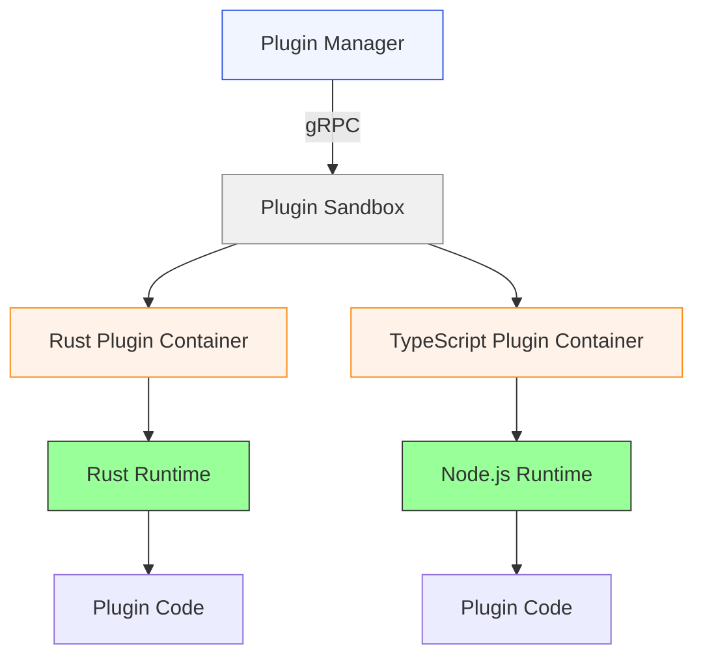
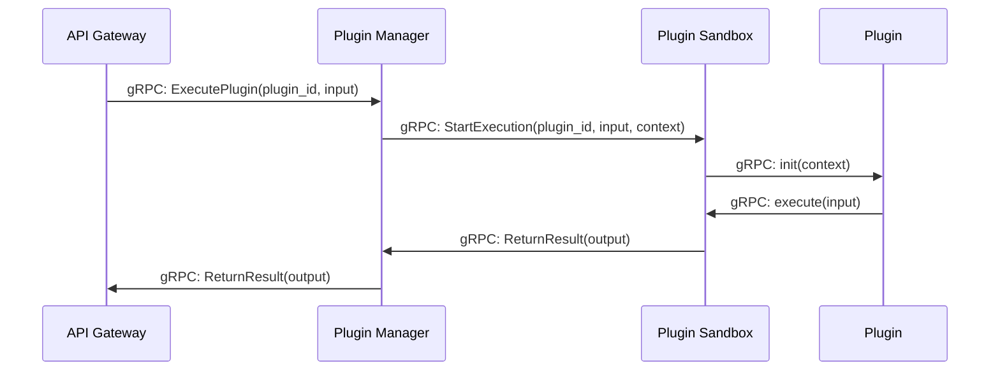
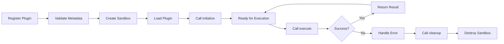

# 🔌 Plugin Development Guide - Tardigrade-CI

**Version :** 1.0  
**Last Updated :** 2026-06-17  
**Status :** Draft  
**Author :** Benzo + Mistral Vibe  

---

## 📋 Table of Contents

1. [Overview](#1-overview)
2. [Plugin Architecture](#2-plugin-architecture)
3. [Development Environment](#3-development-environment)
4. [Creating a Rust Plugin](#4-creating-a-rust-plugin)
5. [Creating a TypeScript Plugin](#5-creating-a-typescript-plugin)
6. [Plugin API Reference](#6-plugin-api-reference)
7. [Plugin Lifecycle](#7-plugin-lifecycle)
8. [Sandboxing & Security](#8-sandboxing--security)
9. [Testing & Debugging](#9-testing--debugging)
10. [Publishing Plugins](#10-publishing-plugins)
11. [Best Practices](#11-best-practices)

---

## 1️⃣ Overview

### What is a Tardigrade-CI Plugin?

A plugin is a self-contained module that extends Tardigrade-CI's functionality. Plugins can:
- Add new CI/CD pipeline steps
- Integrate with external services (Jira, Slack, etc.)
- Provide custom artifact processing
- Add new webhook handlers
- Extend the UI with custom components

### Supported Languages

| Language | Runtime | Use Case | Performance |
|----------|---------|----------|-------------|
| Rust | Native (compiled) | CPU-intensive tasks, high-performance operations | ⭐⭐⭐⭐⭐ |
| TypeScript | Node.js 18+ (in Docker container) | Service integrations, lightweight tasks | ⭐⭐⭐ |

### When to Use Each

**Use Rust when:**
- Performance is critical (e.g., artifact processing, code analysis)
- You need direct access to system resources
- The plugin runs in the CI worker context
- Memory safety and speed are priorities

**Use TypeScript when:**
- Integrating with REST/GraphQL APIs
- Quick prototyping
- The plugin primarily makes HTTP calls
- You want faster development cycles

---

## 2️⃣ Plugin Architecture

### High-Level Design



### Communication Flow



### Plugin Types

| Type | Description | Example |
|------|-------------|---------|
| **Pipeline Step** | Executes as part of CI pipeline | Lint, Test, Build, Deploy |
| **Event Listener** | Reacts to system events | On push, on PR merge |
| **Service Integration** | Connects to external services | Jira, Slack, Discord |
| **Artifact Processor** | Processes stored artifacts | Scan for vulnerabilities |
| **UI Extension** | Adds frontend components | Custom dashboard widgets |

---

## 3️⃣ Development Environment

### Prerequisites

#### For Rust Plugins
```bash
# Install Rust
curl --proto '=https' --tlsv1.2 -sSf https://sh.rustup.rs | sh

# Add targets
rustup target add x86_64-unknown-linux-musl

# Install protobuf compiler
brew install protobuf  # macOS
apt install protobuf-compiler  # Ubuntu

# Install Rust protobuf tools
cargo install tonic-build
```

#### For TypeScript Plugins
```bash
# Install Node.js 18+
nvm install 18

# Install pnpm (recommended)
npm install -g pnpm

# Install TypeScript
npm install -g typescript

# Install protobuf for TypeScript
npm install -g ts-proto
```

### Project Structure

#### Rust Plugin Structure
```
my-rust-plugin/
├── Cargo.toml
├── build.rs
├── proto/
│   └── plugin.proto
├── src/
│   ├── lib.rs          # Plugin implementation
│   ├── main.rs         # Entry point (optional)
│   └── error.rs        # Custom errors
└── README.md
```

#### TypeScript Plugin Structure
```
my-ts-plugin/
├── package.json
├── tsconfig.json
├── proto/
│   └── plugin.proto
├── src/
│   ├── index.ts        # Plugin implementation
│   ├── types.ts        # Type definitions
│   └── client.ts       # gRPC client
├── Dockerfile          # Container definition
└── README.md
```

---

## 4️⃣ Creating a Rust Plugin

### Step 1: Create Plugin Skeleton

```bash
cargo new my-rust-plugin --lib
cd my-rust-plugin
```

### Step 2: Add Dependencies (Cargo.toml)

```toml
[package]
name = "my-rust-plugin"
version = "0.1.0"
edition = "2021"

[lib]
name = "my_rust_plugin"
crate-type = ["cdylib"]  # For dynamic loading

[dependencies]
# Tardigrade-CI SDK
tardigrade-plugin-sdk = "0.1"  # Will be published to crates.io

# Async runtime
tokio = { version = "1.0", features = ["full"] }

# gRPC
tonic = "0.10"
prost = "0.12"
prost-types = "0.12"

# Serialization
serde = { version = "1.0", features = ["derive"] }
serde_json = "1.0"

# Logging
tracing = "0.1"
tracing-subscriber = { version = "0.3", features = ["env-filter"] }

# Error handling
thiserror = "1.0"
anyhow = "1.0"
```

### Step 3: Define Plugin Metadata

Create `src/metadata.rs`:

```rust
use serde::{Serialize, Deserialize};

#[derive(Debug, Serialize, Deserialize, Clone)]
pub struct PluginMetadata {
    pub id: String,
    pub name: String,
    pub version: String,
    pub description: String,
    pub author: String,
    pub plugin_type: PluginType,
    pub supported_events: Vec<String>,
    pub configuration_schema: serde_json::Value,
}

#[derive(Debug, Serialize, Deserialize, Clone)]
pub enum PluginType {
    PipelineStep,
    EventListener,
    ServiceIntegration,
    ArtifactProcessor,
    UIExtension,
}

impl PluginMetadata {
    pub fn new() -> Self {
        Self {
            id: "my-rust-plugin".to_string(),
            name: "My Rust Plugin".to_string(),
            version: "0.1.0".to_string(),
            description: "Example Rust plugin for Tardigrade-CI".to_string(),
            author: "Your Name".to_string(),
            plugin_type: PluginType::PipelineStep,
            supported_events: vec!["push".to_string(), "pull_request".to_string()],
            configuration_schema: serde_json::json!({
                "type": "object",
                "properties": {
                    "api_key": {
                        "type": "string",
                        "description": "API key for external service"
                    },
                    "timeout": {
                        "type": "integer",
                        "default": 30,
                        "description": "Timeout in seconds"
                    }
                },
                "required": ["api_key"]
            }),
        }
    }
}
```

### Step 4: Implement Plugin Trait

Create `src/lib.rs`:

```rust
use tardigrade_plugin_sdk::{Plugin, PluginContext, PluginResult, PluginError};
use serde_json::Value;

pub struct MyRustPlugin {
    metadata: PluginMetadata,
}

#[async_trait::async_trait]
impl Plugin for MyRustPlugin {
    fn metadata(&self) -> &PluginMetadata {
        &self.metadata
    }

    async fn initialize(&mut self, context: PluginContext) -> Result<(), PluginError> {
        tracing::info!("Initializing MyRustPlugin with context: {:?}", context);
        
        // Validate configuration
        let config = context.configuration;
        if !config.contains_key("api_key") {
            return Err(PluginError::ConfigurationError(
                "api_key is required".to_string()
            ));
        }
        
        Ok(())
    }

    async fn execute(
        &self,
        input: Value,
        context: PluginContext,
    ) -> Result<PluginResult, PluginError> {
        tracing::debug!("Executing plugin with input: {:?}", input);
        
        // Extract API key from configuration
        let api_key = context.configuration["api_key"]
            .as_str()
            .ok_or_else(|| PluginError::ConfigurationError("api_key must be a string".to_string()))?;
        
        // Your plugin logic here
        let result = self.process_input(input, api_key).await?;
        
        Ok(PluginResult {
            success: true,
            output: result,
            messages: vec!["Processing completed successfully".to_string()],
            warnings: vec![],
            errors: vec![],
        })
    }

    async fn cleanup(&mut self) -> Result<(), PluginError> {
        tracing::info!("Cleaning up MyRustPlugin");
        Ok(())
    }
}

impl MyRustPlugin {
    pub fn new() -> Self {
        Self {
            metadata: PluginMetadata::new(),
        }
    }

    async fn process_input(&self, input: Value, api_key: &str) -> Result<Value, PluginError> {
        // Implement your business logic
        // Example: Call external API, process data, etc.
        
        let processed = format!("Processed: {}", input);
        
        Ok(serde_json::json!({
            "result": processed,
            "api_key_used": api_key.len() > 0  // Don't log the actual key!
        }))
    }
}

// Export plugin factory function
#[no_mangle]
pub extern "C" fn create_plugin() -> *mut dyn Plugin {
    Box::into_raw(Box::new(MyRustPlugin::new()))
}

#[no_mangle]
pub extern "C" fn destroy_plugin(plugin: *mut dyn Plugin) {
    unsafe { Box::from_raw(plugin) };
}
```

### Step 5: Build the Plugin

```bash
# Build for Linux (used in sandbox)
cargo build --target x86_64-unknown-linux-musl --release

# The compiled plugin will be in:
# target/x86_64-unknown-linux-musl/release/libmy_rust_plugin.so
```

---

## 5️⃣ Creating a TypeScript Plugin

### Step 1: Create Plugin Skeleton

```bash
mkdir my-ts-plugin
cd my-ts-plugin
pnpm init
```

### Step 2: Install Dependencies

```bash
pnpm add @tardigrade-ci/plugin-sdk typescript @types/node
pnpm add -D ts-proto eslint prettier
```

### Step 3: Configure TypeScript (tsconfig.json)

```json
{
  "compilerOptions": {
    "target": "ES2020",
    "module": "NodeNext",
    "moduleResolution": "NodeNext",
    "lib": ["ES2020"],
    "outDir": "./dist",
    "rootDir": "./src",
    "strict": true,
    "esModuleInterop": true,
    "skipLibCheck": true,
    "forceConsistentCasingInFileNames": true,
    "resolveJsonModule": true,
    "declaration": true,
    "declarationMap": true,
    "sourceMap": true
  },
  "include": ["src/**/*"],
  "exclude": ["node_modules", "dist"]
}
```

### Step 4: Create Dockerfile

```dockerfile
FROM node:18-alpine AS builder

WORKDIR /app

# Install dependencies
COPY package.json pnpm-lock.yaml ./
RUN pnpm install --frozen-lockfile

# Build TypeScript
COPY . .
RUN pnpm build

FROM node:18-alpine AS runtime

WORKDIR /app

# Copy built files
COPY --from=builder /app/dist ./dist
COPY --from=builder /app/node_modules ./node_modules
COPY --from=builder /app/package.json ./

# Install protobuf runtime
RUN npm install -g grpc_tools && \
    npm install google-protobuf

# Set entrypoint
CMD ["node", "dist/index.js"]

EXPOSE 50051
```

### Step 5: Implement Plugin (src/index.ts)

```typescript
import { 
  Plugin, 
  PluginContext, 
  PluginResult, 
  PluginError,
  PluginMetadata 
} from '@tardigrade-ci/plugin-sdk';

class MyTsPlugin implements Plugin {
  private metadata: PluginMetadata;

  constructor() {
    this.metadata = {
      id: 'my-ts-plugin',
      name: 'My TypeScript Plugin',
      version: '0.1.0',
      description: 'Example TypeScript plugin for Tardigrade-CI',
      author: 'Your Name',
      pluginType: 'ServiceIntegration',
      supportedEvents: ['push', 'pull_request'],
      configurationSchema: {
        type: 'object',
        properties: {
          apiUrl: {
            type: 'string',
            description: 'Base URL for external API',
            format: 'uri'
          },
          apiKey: {
            type: 'string',
            description: 'API key for authentication'
          },
          timeout: {
            type: 'number',
            default: 30,
            description: 'Request timeout in seconds'
          }
        },
        required: ['apiUrl', 'apiKey']
      }
    };
  }

  getMetadata(): PluginMetadata {
    return this.metadata;
  }

  async initialize(context: PluginContext): Promise<void> {
    console.log('Initializing MyTsPlugin with context:', JSON.stringify(context, null, 2));
    
    // Validate configuration
    if (!context.configuration.apiUrl) {
      throw new PluginError(
        'ConfigurationError',
        'apiUrl is required'
      );
    }
    
    if (!context.configuration.apiKey) {
      throw new PluginError(
        'ConfigurationError',
        'apiKey is required'
      );
    }
  }

  async execute(input: unknown, context: PluginContext): Promise<PluginResult> {
    console.debug('Executing plugin with input:', JSON.stringify(input));
    
    const result = await this.processInput(input, context);
    
    return {
      success: true,
      output: result,
      messages: ['Processing completed successfully'],
      warnings: [],
      errors: []
    };
  }

  async cleanup(): Promise<void> {
    console.log('Cleaning up MyTsPlugin');
  }

  private async processInput(input: unknown, context: PluginContext): Promise<unknown> {
    // Implement your business logic
    const inputObj = input as Record<string, unknown>;
    const config = context.configuration as Record<string, unknown>;
    
    // Example: Call external API
    const response = await fetch(`${config.apiUrl}/api/v1/process`, {
      method: 'POST',
      headers: {
        'Authorization': `Bearer ${config.apiKey}`,
        'Content-Type': 'application/json'
      },
      body: JSON.stringify(inputObj)
    });
    
    if (!response.ok) {
      throw new PluginError(
        'ExecutionError',
        `External API call failed: ${response.statusText}`
      );
    }
    
    const data = await response.json();
    return {
      ...data,
      processedAt: new Date().toISOString()
    };
  }
}

// Export plugin factory
const plugin = new MyTsPlugin();
export default plugin;
```

### Step 6: Build and Test

```bash
# Build TypeScript
pnpm build

# Build Docker image
pnpm docker:build

# Test locally
docker run -p 50051:50051 my-ts-plugin
```

---

## 6️⃣ Plugin API Reference

### Plugin Interface

#### Rust

```rust
#[async_trait::async_trait]
pub trait Plugin: Send + Sync {
    /// Returns plugin metadata
    fn metadata(&self) -> &PluginMetadata;
    
    /// Called when plugin is loaded (once per instance)
    async fn initialize(&mut self, context: PluginContext) -> Result<(), PluginError>;
    
    /// Main execution method
    async fn execute(
        &self,
        input: Value,
        context: PluginContext,
    ) -> Result<PluginResult, PluginError>;
    
    /// Called when plugin is unloaded
    async fn cleanup(&mut self) -> Result<(), PluginError>;
}
```

#### TypeScript

```typescript
interface Plugin {
    getMetadata(): PluginMetadata;
    initialize(context: PluginContext): Promise<void>;
    execute(input: unknown, context: PluginContext): Promise<PluginResult>;
    cleanup(): Promise<void>;
}
```

### PluginContext

```rust
#[derive(Debug, Clone)]
pub struct PluginContext {
    /// Unique execution ID
    pub execution_id: String,
    
    /// Plugin configuration (from user)
    pub configuration: serde_json::Value,
    
    /// Environment variables
    pub environment: HashMap<String, String>,
    
    /// Event that triggered this execution
    pub event: Option<Event>,
    
    /// Pipeline context (if running in pipeline)
    pub pipeline_context: Option<PipelineContext>,
    
    /// Repository context
    pub repository_context: RepositoryContext,
    
    /// User context
    pub user_context: UserContext,
    
    /// Logger
    pub logger: PluginLogger,
}
```

### PluginResult

```rust
#[derive(Debug, Serialize, Deserialize)]
pub struct PluginResult {
    /// Whether execution was successful
    pub success: bool,
    
    /// Output data (must be JSON-serializable)
    pub output: serde_json::Value,
    
    /// Informational messages
    pub messages: Vec<String>,
    
    /// Warnings
    pub warnings: Vec<String>,
    
    /// Errors (execution may still be "success: true" with non-fatal errors)
    pub errors: Vec<String>,
}
```

### Event Types

```rust
#[derive(Debug, Serialize, Deserialize, Clone)]
pub enum Event {
    /// Git push event
    Push(PushEvent),
    /// Pull request created/updated
    PullRequest(PullRequestEvent),
    /// Pipeline completed
    PipelineCompleted(PipelineEvent),
    /// Artifact uploaded
    ArtifactUploaded(ArtifactEvent),
    /// Scheduled trigger
    Scheduled(ScheduledEvent),
    /// Manual trigger
    Manual(ManualEvent),
    /// Custom event
    Custom(CustomEvent),
}
```

### Error Types

```rust
#[derive(Debug, thiserror::Error)]
pub enum PluginError {
    /// Configuration is invalid
    #[error("Configuration error: {0}")]
    ConfigurationError(String),
    
    /// Execution failed
    #[error("Execution error: {0}")]
    ExecutionError(String),
    
    /// External service error
    #[error("External service error: {0}")]
    ExternalServiceError(String),
    
    /// Timeout
    #[error("Timeout after {0}ms")]
    Timeout(u64),
    
    /// Permission denied
    #[error("Permission denied: {0}")]
    PermissionError(String),
    
    /// Not implemented
    #[error("Not implemented: {0}")]
    NotImplemented(String),
}
```

---

## 7️⃣ Plugin Lifecycle

### Complete Lifecycle



### Sandbox Management

Plugins run in isolated Docker containers with:
- **Resource Limits:** CPU, memory, disk I/O
- **Network Isolation:** Controlled network access
- **Filesystem Isolation:** Read-only filesystem (except temp directories)
- **Process Isolation:** Separate PID namespace
- **Security:** Run as non-root user

### Resource Limits (Default)

| Resource | Default Limit | Configurable |
|----------|---------------|--------------|
| CPU | 1 vCPU | Yes |
| Memory | 512 MB | Yes |
| Disk | 1 GB | Yes |
| Network | Full access (with egress filtering) | Yes |
| Timeout | 30 minutes | Yes |

---

## 8️⃣ Sandboxing & Security

### Security Model

1. **Container Isolation**: Each plugin runs in its own Docker container
2. **Resource Limits**: Strict CPU, memory, and disk limits
3. **Network Policies**: Outbound connections are filtered
4. **Filesystem Restrictions**: Read-only except for designated temp directories
5. **User Privileges**: Run as non-root user (UID 1000)
6. **Seccomp Profiles**: System call filtering
7. **AppArmor/SELinux**: Additional OS-level protection (if available)

### Network Security

```yaml
# Default network policy for plugins
apiVersion: networking.k8s.io/v1
kind: NetworkPolicy
metadata:
  name: plugin-network-policy
spec:
  podSelector:
    matchLabels:
      tardigrade-ci/plugin: "true"
  policyTypes:
    - Egress
  egress:
    - to:
        - ipBlock:
            cidr: 0.0.0.0/0
        ports:
          - protocol: TCP
            port: 80
          - protocol: TCP
            port: 443
        # Allow DNS
          - protocol: UDP
            port: 53
```

### Filesystem Layout

```
Plugin Container Filesystem:
├── /app                    # Plugin code and dependencies
├── /data                   # Persistent data (if configured)
├── /tmp                    # Temporary files (writable)
├── /home/plugin            # Plugin user home directory
└── /tardigrade             # Tardigrade-CI shared directory
    ├── config.json         # Plugin configuration
    ├── context.json        # Execution context
    └── secrets              # Mounted secrets (if any)
```

### Secret Management

Secrets are injected as environment variables or mounted files:

```bash
# Example: Injecting secrets
TARDIGRADE_PLUGIN_SECRET_MY_API_KEY=xxx
TARDIGRADE_PLUGIN_SECRET_DB_PASSWORD=yyy
```

In your plugin:

```rust
// Rust: Access secrets from environment
let api_key = std::env::var("TARDIGRADE_PLUGIN_SECRET_MY_API_KEY")
    .map_err(|_| PluginError::ConfigurationError("MY_API_KEY secret not set".into()))?;
```

```typescript
// TypeScript: Access secrets from environment
const apiKey = process.env.TARDIGRADE_PLUGIN_SECRET_MY_API_KEY;
if (!apiKey) {
    throw new PluginError('ConfigurationError', 'MY_API_KEY secret not set');
}
```

### Security Best Practices

1. **Never log secrets** - Filter them from all logs
2. **Validate all inputs** - Don't trust user input
3. **Use HTTPS** - Always encrypt external connections
4. **Set timeouts** - Don't hang indefinitely
5. **Clean up temp files** - Remove sensitive data after use
6. **Use prepared statements** - Prevent SQL injection
7. **Validate SSL certificates** - Don't disable certificate checking

---

## 9️⃣ Testing & Debugging

### Testing Rust Plugins

```rust
#[cfg(test)]
mod tests {
    use super::*;
    use tardigrade_plugin_sdk::test_utils::*;

    #[tokio::test]
    async fn test_plugin_execute() {
        let plugin = MyRustPlugin::new();
        let context = create_test_context().await;
        
        let result = plugin.execute(
            serde_json::json!({"test": "data"}),
            context
        ).await;
        
        assert!(result.is_ok());
        let result = result.unwrap();
        assert!(result.success);
    }

    #[tokio::test]
    async fn test_plugin_initialization() {
        let mut plugin = MyRustPlugin::new();
        let context = create_test_context().await;
        
        let result = plugin.initialize(context).await;
        assert!(result.is_ok());
    }
}
```

### Testing TypeScript Plugins

```typescript
import { describe, it, expect } from 'vitest';
import MyTsPlugin from './src/index';
import { createTestContext } from '@tardigrade-ci/plugin-sdk/test';

describe('MyTsPlugin', () => {
  it('should initialize correctly', async () => {
    const plugin = new MyTsPlugin();
    const context = createTestContext();
    
    await expect(plugin.initialize(context)).resolves.toBeUndefined();
  });

  it('should execute successfully', async () => {
    const plugin = new MyTsPlugin();
    const context = createTestContext({
      configuration: {
        apiUrl: 'https://api.example.com',
        apiKey: 'test-key'
      }
    });
    
    const result = await plugin.execute({ test: 'data' }, context);
    
    expect(result.success).toBe(true);
    expect(result.errors).toHaveLength(0);
  });
});
```

### Debugging

#### Rust Plugin Debugging

```bash
# Build with debug symbols
RUSTFLAGS="-g" cargo build

# Run with logging
RUST_LOG=debug cargo run
```

#### TypeScript Plugin Debugging

```bash
# Run with Node inspector
docker run -p 50051:50051 -p 9229:9229 \
  -e NODE_OPTIONS="--inspect=0.0.0.0:9229" \
  my-ts-plugin

# Attach with Chrome DevTools or VS Code
```

#### Viewing Logs

```bash
# View plugin logs via kubectl (K8s)
kubectl logs <plugin-pod-name> -f

# Or via docker
docker logs <container-id> -f
```

---

## 🔟 Publishing Plugins

### Plugin Manifest (tardigrade-plugin.yaml)

```yaml
apiVersion: tardigrade-ci/v1alpha1
kind: Plugin
metadata:
  name: my-rust-plugin
  version: 0.1.0
  description: Example Rust plugin for Tardigrade-CI
  author: Your Name
  license: MIT
  homepage: https://github.com/your-org/my-rust-plugin
  repository: https://github.com/your-org/my-rust-plugin
spec:
  type: PipelineStep
  language: rust
  supportedEvents:
    - push
    - pull_request
  
  # For Rust plugins
  rust:
    binary: target/x86_64-unknown-linux-musl/release/libmy_rust_plugin.so
    
  # For TypeScript plugins
  typescript:
    dockerImage: ghcr.io/your-org/my-ts-plugin:0.1.0
    entrypoint: dist/index.js
  
  configuration:
    schema:
      type: object
      properties:
        apiKey:
          type: string
          description: API key for external service
        timeout:
          type: integer
          default: 30
          description: Timeout in seconds
    
  resources:
    limits:
      cpu: "1"
      memory: "512Mi"
    requests:
      cpu: "0.5"
      memory: "256Mi"
  
  permissions:
    network:
      egress:
        - host: api.example.com
          port: 443
    filesystem:
      read: ["/data"]
      write: ["/tmp"]
```

### Publishing to Plugin Registry

1. **Package your plugin:**
   ```bash
   # For Rust
   cargo build --release --target x86_64-unknown-linux-musl
   tar -czvf my-rust-plugin.tar.gz \
     tardigrade-plugin.yaml \
     target/x86_64-unknown-linux-musl/release/libmy_rust_plugin.so \
     README.md
   
   # For TypeScript
   docker build -t ghcr.io/your-org/my-ts-plugin:0.1.0 .
   docker push ghcr.io/your-org/my-ts-plugin:0.1.0
   ```

2. **Upload to registry:**
   ```bash
   # Using the Tardigrade CLI
tardigrade plugin publish my-rust-plugin.tar.gz
   
   # Or via API
   curl -X POST \
     -H "Authorization: Bearer $API_TOKEN" \
     -H "Content-Type: multipart/form-data" \
     -F "plugin=@my-rust-plugin.tar.gz" \
     -F "metadata=@tardigrade-plugin.yaml" \
     https://registry.tardigrade-ci.dev/api/v1/plugins
   ```

3. **Verify publication:**
   ```bash
   tardigrade plugin search my-rust-plugin
   tardigrade plugin info my-rust-plugin
   ```

### Versioning

Follow [Semantic Versioning](https://semver.org/):
- **MAJOR**: Breaking changes to the plugin API
- **MINOR**: New features (backwards-compatible)
- **PATCH**: Bug fixes (backwards-compatible)

---

## 1️⃣1️⃣ Best Practices

### Plugin Development

1. **Single Responsibility**: Each plugin should do one thing well
2. **Idempotent Operations**: Plugin executions should be idempotent when possible
3. **Error Handling**: Provide clear, actionable error messages
4. **Logging**: Use appropriate log levels (debug, info, warn, error)
5. **Configuration**: Make plugins configurable but provide sensible defaults
6. **Documentation**: Always include a README with usage examples

### Performance

1. **Minimize Dependencies**: Smaller plugins start faster
2. **Cache Results**: Cache external API calls when possible
3. **Stream Processing**: Process large files in streams, not in memory
4. **Batch Operations**: Combine multiple operations when possible
5. **Resource Cleanup**: Always clean up resources (file handles, connections)

### Security

1. **Principle of Least Privilege**: Request only necessary permissions
2. **Input Validation**: Never trust user input
3. **Secret Management**: Never log or expose secrets
4. **Dependency Security**: Keep dependencies updated, audit for vulnerabilities
5. **Network Security**: Use HTTPS, validate certificates

### Testing

1. **Unit Tests**: Test individual functions
2. **Integration Tests**: Test plugin execution in sandbox
3. **E2E Tests**: Test complete workflows
4. **Performance Tests**: Benchmark resource usage
5. **Security Tests**: Scan for vulnerabilities

### Documentation

Every plugin should include:
- `README.md` - Usage instructions, examples, configuration
- `CHANGELOG.md` - Version history
- `LICENSE` - License file
- `tardigrade-plugin.yaml` - Plugin manifest

---

## 📚 Additional Resources

- [Tardigrade-CI Documentation](https://docs.tardigrade-ci.dev)
- [Plugin SDK Documentation](https://docs.tardigrade-ci.dev/plugins/sdk)
- [Community Plugins](https://registry.tardigrade-ci.dev)
- [Issue Tracker](https://github.com/tardigrade-ci/tardigrade/issues)
- [Discord Community](https://discord.gg/tardigrade-ci)

---

*This document is a work in progress. Last updated: 2026-06-17*
