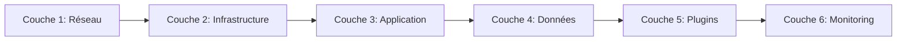
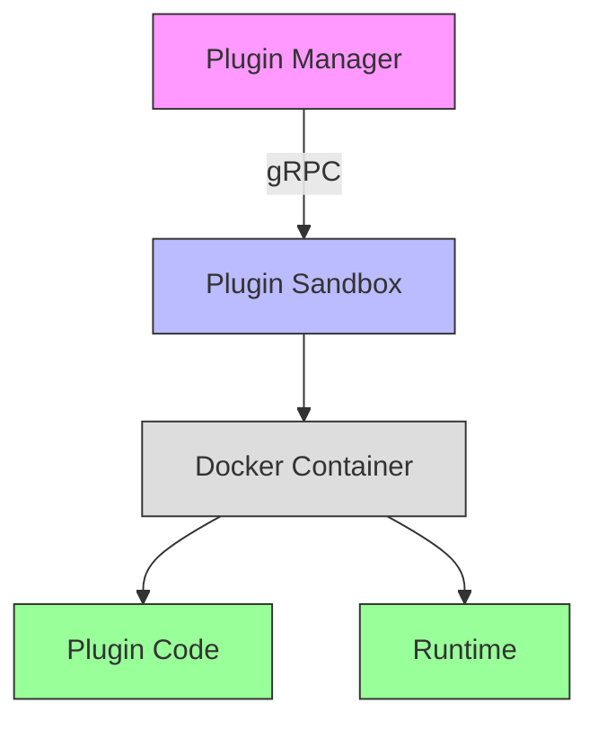

# 🔒 Stratégie de Sécurité - Tardigrade-CI

**Version :** 1.0  
**Dernière mise à jour :** 2026-06-17  
**Statut :** À valider (Atelier technique 20/06/2026)  

---

## 📋 Sommaire

1. [Principes de Sécurité](#1-principes-de-sécurité)
2. [Authentification](#2-authentification)
3. [Autorisation (RBAC)](#3-autorisation-rbac)
4. [Chiffrement](#4-chiffrement)
5. [Sécurité des Plugins](#5-sécurité-des-plugins)
6. [Sécurité du Network](#6-sécurité-du-network)
7. [Sécurité des Données](#7-sécurité-des-données)
8. [Audit & Monitoring](#8-audit--monitoring)
9. [Bonnes Pratiques](#9-bonnes-pratiques)
10. [Checklist de Sécurité](#10-checklist-de-sécurité)

---

## 1️⃣ Principes de Sécurité

### ✅ Philosophy "Defense in Depth"

Notre approche repose sur **plusieurs couches de sécurité** :



| Couche | Composant | Responsabilité |
|--------|-----------|----------------|
| **Réseau** | Firewalls, VPN | Filtrer le trafic malveillant |
| **Infrastructure** | Kubernetes, Docker | Isolation des conteneurs |
| **Application** | Rust, JWT, RBAC | Contrôle d'accès, validation |
| **Données** | PostgreSQL, MinIO | Chiffrement au repos |
| **Plugins** | Sandboxing | Isolation des plugins |
| **Monitoring** | Prometheus, Loki | Détection des anomalies |

### 🎯 Menaces Principales & Mitigations

| Menace | Risque | Impact | Mitigation |
|--------|--------|--------|------------|
| **Injection SQL** | ⭐⭐⭐ | Critique | SQLx (requêtes paramétrées) |
| **XSS** | ⭐⭐⭐ | Moyen | Sanitization, CSP |
| **CSRF** | ⭐⭐ | Moyen | Tokens CSRF, SameSite Cookies |
| **Auth Bypass** | ⭐⭐⭐ | Critique | JWT signé, vérification systématique |
| **Privilege Escalation** | ⭐⭐⭐ | Critique | RBAC strict, principle of least privilege |
| **Data Leak** | ⭐⭐⭐ | Critique | Chiffrement, masking des données sensibles |
| **DDoS** | ⭐⭐ | Moyen | Rate limiting, scaling horizontal |
| **Supply Chain Attack** | ⭐⭐⭐ | Élevé | Vérification des dépendances (cargo-audit) |
| **Malicious Plugins** | ⭐⭐⭐ | Élevé | Sandboxing, signing, permissions |
| **Memory Corruption** | ⭐ | Faible | Rust (sécurité mémoire) |

---

## 2️⃣ Authentification

### 🔐 JWT (JSON Web Tokens)

**Implémentation :** `jsonwebtoken` crate

#### Token Structure
```json
{
  "header": {
    "alg": "HS256",
    "typ": "JWT"
  },
  "payload": {
    "sub": "550e8400-e29b-41d4-a716-446655440000",  // User ID
    "email": "user@example.com",
    "permissions": ["repo:read", "repo:write"],
    "exp": 1718620800,  // Expiration (30 min)
    "iat": 1718619000,  // Issued at
    "jti": "abc123..."  // JWT ID (unique)
  },
  "signature": "..."
}
```

#### Configuration
```rust
// crates/common/auth.rs
use jsonwebtoken::{Algorithm, DecodingKey, EncodingKey, Validation};
use std::time::Duration;

pub struct JwtConfig {
    pub secret: String,
    pub expiration: Duration,
    pub refresh_expiration: Duration,
    pub issuer: String,
    pub audience: String,
}

impl Default for JwtConfig {
    fn default() -> Self {
        Self {
            secret: std::env::var("JWT_SECRET").expect("JWT_SECRET must be set"),
            expiration: Duration::from_mins(30),      // Access token: 30 min
            refresh_expiration: Duration::from_days(7), // Refresh token: 7 jours
            issuer: "tardigrade-ci".to_string(),
            audience: "tardigrade-ci".to_string(),
        }
    }
}
```

#### Middleware Axum
```rust
// crates/common/middleware.rs
use axum::{
    async_trait,
    extract::{FromRequestParts, Request},
    http::{request::Parts, StatusCode},
    middleware::Next,
    response::Response,
    RequestPartsExt, TypedHeader,
};
use headers::Authorization;
use jsonwebtoken::{decode, Validation};

use crate::auth::{JwtConfig, Claims};

pub struct AuthMiddleware {
    config: JwtConfig,
}

impl AuthMiddleware {
    pub fn new(config: JwtConfig) -> Self {
        Self { config }
    }
}

#[async_trait]
impl<S> FromRequestParts<S> for Claims
where
    S: Send + Sync,
{
    type Rejection = AuthError;

    async fn from_request_parts(parts: &mut Parts, state: &S) -> Result<Self, Self::Rejection> {
        // Extraire le token du header Authorization
        let TypedHeader(Authorization(bearer)) = parts
            .extract::<TypedHeader<Authorization<bearer::Bearer>>>()
            .await
            .map_err(|_| AuthError::MissingToken)?;
        
        let token = bearer.token();
        
        // Récupérer la config
        let state = parts.extensions.get::<JwtConfig>();
        let config = state.ok_or(AuthError::ConfigurationError)?;
        
        // Valider le token
        let decoding_key = DecodingKey::from_secret(config.secret.as_ref());
        let validation = Validation::new(Algorithm::HS256);
        
        let token_data = decode::<Claims>(token, &decoding_key, &validation)
            .map_err(|_| AuthError::InvalidToken)?;
        
        Ok(token_data.claims)
    }
}

#[derive(Debug, thiserror::Error)]
pub enum AuthError {
    #[error("Missing authorization token")]
    MissingToken,
    #[error("Invalid authorization token")]
    InvalidToken,
    #[error("Token has expired")]
    ExpiredToken,
    #[error("JWT configuration error")]
    ConfigurationError,
}

impl IntoResponse for AuthError {
    fn into_response(self) -> Response {
        let status = match self {
            AuthError::MissingToken => StatusCode::UNAUTHORIZED,
            AuthError::InvalidToken => StatusCode::UNAUTHORIZED,
            AuthError::ExpiredToken => StatusCode::UNAUTHORIZED,
            AuthError::ConfigurationError => StatusCode::INTERNAL_SERVER_ERROR,
        };
        
        (status, self.to_string()).into_response()
    }
}
```

#### Endpoints d'Authentification

**Login :**
```rust
// Handler pour /api/auth/login
pub async fn login(
    State(jwt_config): State<JwtConfig>,
    Json(credentials): Json<LoginInput>,
) -> Result<Json<AuthResponse>, AuthError> {
    // 1. Vérifier les credentials (user + password)
    let user = verify_credentials(&credentials.email, &credentials.password)
        .await
        .ok_or(AuthError::InvalidCredentials)?;
    
    // 2. Créer les claims
    let claims = Claims {
        sub: user.id.to_string(),
        email: user.email.clone(),
        permissions: get_user_permissions(&user.id).await,
        exp: SystemTime::now()
            .checked_add(jwt_config.expiration)
            .unwrap()
            .duration_since(UNIX_EPOCH)
            .unwrap()
            .as_secs(),
        iat: SystemTime::now()
            .duration_since(UNIX_EPOCH)
            .unwrap()
            .as_secs(),
        jti: Uuid::new_v4().to_string(),
    };
    
    // 3. Générer le token
    let encoding_key = EncodingKey::from_secret(jwt_config.secret.as_ref());
    let access_token = encode(&Header::default(), &claims, &encoding_key)
        .map_err(|_| AuthError::TokenCreationError)?;
    
    // 4. Générer le refresh token
    let refresh_claims = RefreshClaims {
        sub: user.id.to_string(),
        exp: SystemTime::now()
            .checked_add(jwt_config.refresh_expiration)
            .unwrap()
            .duration_since(UNIX_EPOCH)
            .unwrap()
            .as_secs(),
        iat: SystemTime::now()
            .duration_since(UNIX_EPOCH)
            .unwrap()
            .as_secs(),
        jti: Uuid::new_v4().to_string(),
    };
    
    let refresh_token = encode(&Header::default(), &refresh_claims, &encoding_key)
        .map_err(|_| AuthError::TokenCreationError)?;
    
    Ok(Json(AuthResponse {
        user,
        access_token,
        refresh_token,
        expires_in: jwt_config.expiration.as_secs(),
    }))
}
```

### 🔄 Refresh Token

**Endpoint :** `POST /api/auth/refresh`

```rust
pub async fn refresh_token(
    State(jwt_config): State<JwtConfig>,
    Json(request): Json<RefreshTokenRequest>,
) -> Result<Json<RefreshTokenResponse>, AuthError> {
    // 1. Vérifier le refresh token
    let decoding_key = DecodingKey::from_secret(jwt_config.secret.as_ref());
    let validation = Validation::new(Algorithm::HS256);
    
    let token_data = decode::<RefreshClaims>(&request.refresh_token, &decoding_key, &validation)
        .map_err(|_| AuthError::InvalidToken)?;
    
    // 2. Vérifier que le user existe toujours
    let user = get_user_by_id(&token_data.sub)
        .await
        .ok_or(AuthError::UserNotFound)?;
    
    // 3. Générer un nouveau access token
    let claims = Claims {
        sub: user.id.to_string(),
        email: user.email.clone(),
        permissions: get_user_permissions(&user.id).await,
        exp: SystemTime::now()
            .checked_add(jwt_config.expiration)
            .unwrap()
            .duration_since(UNIX_EPOCH)
            .unwrap()
            .as_secs(),
        iat: SystemTime::now()
            .duration_since(UNIX_EPOCH)
            .unwrap()
            .as_secs(),
        jti: Uuid::new_v4().to_string(),
    };
    
    let encoding_key = EncodingKey::from_secret(jwt_config.secret.as_ref());
    let access_token = encode(&Header::default(), &claims, &encoding_key)
        .map_err(|_| AuthError::TokenCreationError)?;
    
    Ok(Json(RefreshTokenResponse {
        access_token,
        expires_in: jwt_config.expiration.as_secs(),
    }))
}
```

### 🔐 OAuth2 / OIDC (Futur)

Pour une intégration avec GitHub, GitLab, Google, etc. :

**Options :**
1. **Intégration directe** avec les fournisseurs
2. **Dex** (https://dexidp.io/) comme fournisseur d'identité
3. **Keycloak** pour une solution complète IAM

**Configuration Dex :**
```yaml
# dex-config.yaml
issuer: https://auth.tardigrade-ci.dev
storage:
  type: postgres
  config:
    host: postgres
    port: 5432
    user: dex
    password: dex
    database: dex
    ssl:
      mode: disable

web:
  http: 0.0.0.0:5556

oauth2:
  skipApprovalScreen: true

connectors:
- type: github
  id: github
  name: GitHub
  config:
    clientID: ${{GITHUB_CLIENT_ID}}
    clientSecret: ${{GITHUB_CLIENT_SECRET}}
    redirectURI: https://auth.tardigrade-ci.dev/callback
    org: tardigrade-ci

staticClients:
- id: tardigrade-ci
  name: Tardigrade-CI
  redirectURIs:
    - https://tardigrade-ci.dev/callback
  secret: ${{TARDIGRADE_CI_SECRET}}
```

---

## 3️⃣ Autorisation (RBAC)

### 🛡️ Modèle RBAC

**3 niveaux d'autorisation :**

1. **Global Permissions** (System-wide)
   - `admin:all` - Accès complet
   - `user:manage` - Gérer les utilisateurs
   - `plugin:manage` - Gérer les plugins
   - `system:settings` - Modifier les paramètres système

2. **Repository Permissions** (Par repository)
   - `repo:read` - Lire le repository
   - `repo:write` - Écrire dans le repository (push, créer branches)
   - `repo:admin` - Administrer le repository (gérer permissions, paramètres)

3. **Resource Permissions** (Granulaire)
   - `ci:run` - Lancer des pipelines
   - `ci:approve` - Approuver des PR
   - `registry:push` - Pousser des artefacts
   - `registry:pull` - Télécharger des artefacts

### 📊 Implémentation avec Casbin

**Configuration :**
```rust
// crates/common/rbac.rs
use casbin::{CoreApi, DefaultModel, FileAdapter, Enforcer};
use std::sync::Arc;

#[derive(Clone)]
pub struct RbacService {
    enforcer: Arc<Enforcer>,
}

impl RbacService {
    pub fn new(model_path: &str, policy_path: &str) -> Result<Self, RbacError> {
        let model = DefaultModel::from_file(model_path)?;
        let adapter = FileAdapter::new(policy_path);
        let enforcer = Enforcer::new(model, adapter)?;
        
        Ok(Self {
            enforcer: Arc::new(enforcer),
        })
    }
    
    /// Vérifie si un utilisateur a la permission
    pub async fn check_permission(
        &self,
        user_id: &str,
        resource: &str,
        action: &str,
    ) -> Result<bool, RbacError> {
        self.enforcer
            .enforce((user_id, resource, action))
            .map_err(|e| RbacError::EnforcementError(e.to_string()))
    }
    
    /// Vérifie si un utilisateur a une permission sur un repository
    pub async fn check_repository_permission(
        &self,
        user_id: &str,
        repository_id: &str,
        action: &str,
    ) -> Result<bool, RbacError> {
        // Vérifier la permission globale
        if self.check_permission(user_id, "*", action).await? {
            return Ok(true);
        }
        
        // Vérifier la permission sur le repository
        self.check_permission(user_id, &format!("repo:{}", repository_id), action)
            .await
    }
}
```

**Modèle Casbin (`model.conf`) :**
```ini
[request_definition]
request = sub, obj, act

[policy_definition]
policy = sub, obj, act

[role_definition]
role = sub, obj

[policy_effect]
effect = allow

[matchers]
matcher = g(sub, obj) || keyMatch2(obj, sub.obj) && keyMatch2(act, sub.act)
```

**Politique (`policy.csv`) :**
```csv
# Admin a tous les droits
admin, *, *

# Utilisateur standard
user1, repo:550e8400-e29b-41d4-a716-446655440000, repo:read
user1, repo:550e8400-e29b-41d4-a716-446655440000, repo:write
user1, repo:550e8400-e29b-41d4-a716-446655440000, ci:run

# Rôle maintainer
maintainer, repo:*, repo:read
maintainer, repo:*, repo:write
maintainer, repo:*, ci:run
maintainer, repo:*, ci:approve

# Rôle viewer
viewer, repo:*, repo:read
```

### 🔧 Middleware RBAC pour Axum

```rust
// crates/common/middleware.rs
use axum::{
    async_trait,
    extract::FromRequestParts,
    http::{request::Parts, StatusCode},
    RequestPartsExt,
};

pub struct RbacMiddleware {
    rbac: RbacService,
}

#[async_trait]
impl<S> FromRequestParts<S> for RbacMiddleware
where
    S: Send + Sync,
{
    type Rejection = AuthError;

    async fn from_request_parts(parts: &mut Parts, state: &S) -> Result<Self, Self::Rejection> {
        // Extraire les claims du user
        let claims = parts.extensions.get::<Claims>()
            .ok_or(AuthError::Unauthorized)?;
        
        // Extraire le rbac service
        let rbac = parts.extensions.get::<RbacService>()
            .ok_or(AuthError::ConfigurationError)?;
        
        // Extraire les paramètres de la requête (resource, action)
        // Ces paramètres peuvent être extraits de la route ou des headers
        let resource = parts.extensions.get::<String>()
            .cloned()
            .unwrap_or_else(|| "global".to_string());
        let action = parts.extensions.get::<String>()
            .cloned()
            .unwrap_or_else(|| "read".to_string());
        
        // Vérifier la permission
        if !rbac.check_permission(&claims.sub, &resource, &action).await? {
            return Err(AuthError::Forbidden);
        }
        
        Ok(Self { rbac: rbac.clone() })
    }
}
```

### 🎯 Exemple d'Utilisation

```rust
// modules/git/handler/repository.rs
use axum::{
    extract::{Path, State},
    Json, Router,
};

use crate::common::middleware::{AuthMiddleware, RbacMiddleware};
use crate::models::{CreateRepositoryInput, Repository};

pub async fn create_repository(
    AuthMiddleware(claims): AuthMiddleware,
    RbacMiddleware(_): RbacMiddleware, // Vérification RBAC déjà faite
    State(service): State<GitService>,
    Json(input): Json<CreateRepositoryInput>,
) -> Result<Json<Repository>, GitError> {
    // Le middleware a déjà vérifié que l'utilisateur a la permission
    // claims.sub contient l'user_id
    let repository = service
        .create_repository(claims.sub, input.into_inner())
        .await?;
    
    Ok(Json(repository))
}

// Configuration du router avec middleware
pub fn repository_router(service: GitService) -> Router {
    Router::new()
        .route("/", axum::routing::post(create_repository))
        .layer(axum::middleware::from_fn(|parts, next| async move {
            // Extraire les paramètres de la route
            let method = parts.method.clone();
            let path = parts.uri.path().to_string();
            
            // Déterminer l'action et la resource
            let (resource, action) = if method == Method::POST {
                ("repo:*", "create")
            } else if method == Method::GET {
                ("repo:*", "read")
            } else if method == Method::PUT || method == Method::PATCH {
                ("repo:*", "update")
            } else if method == Method::DELETE {
                ("repo:*", "delete")
            } else {
                ("*", "*")
            };
            
            // Ajouter au extensions pour le middleware RBAC
            parts.extensions.insert(resource.to_string());
            parts.extensions.insert(action.to_string());
            
            next.run(parts).await
        }))
        .with_state(service)
}
```

---

## 4️⃣ Chiffrement

### 🔐 Chiffrement des Données en Transit

**TLS 1.3** est obligatoire pour toutes les communications :

```rust
// Configuration Axum avec TLS
use axum_server::tls_rustls::RustlsConfig;
use std::net::SocketAddr;

#[tokio::main]
async fn main() {
    let app = create_app();
    
    let addr = SocketAddr::from(([0, 0, 0, 0], 3000));
    
    // Charger la configuration TLS
    let config = RustlsConfig::from_pem_file("cert.pem", "key.pem")
        .await
        .expect("Failed to load TLS certificates");
    
    // Démarrer le serveur avec TLS
    axum_server::bind_rustls(addr, config)
        .serve(app.into_make_service())
        .await
        .expect("Server failed");
}
```

### 🗃️ Chiffrement des Données au Repos

#### PostgreSQL

**TDE (Transparent Data Encryption) :**

1. **Activer pgcrypto :**
```sql
CREATE EXTENSION pgcrypto;
```

2. **Chiffrer des colonnes spécifiques :**
```sql
-- Chiffrer les secrets (ex: webhook secrets)
UPDATE webhooks 
SET secret = pgp_sym_encrypt(secret, 'ma_cle_secrete');

-- Déchiffrer
SELECT pgp_sym_decrypt(secret, 'ma_cle_secrete') FROM webhooks;
```

3. **Utiliser des colonnes chiffrées :**
```rust
// Dans les modèles SQLx
#[derive(sqlx::FromRow)]
struct Webhook {
    id: Uuid,
    url: String,
    // Secret chiffré
    #[sqlx(rename = "secret")]
    encrypted_secret: Option<Vec<u8>>,
}

// Fonction pour déchiffrer
fn decrypt_secret(encrypted: &[u8], key: &str) -> Option<String> {
    // Utiliser pgcrypto ou rust-crypto
    // Exemple simplifié
    use aes_gcm::{
        aead::{Aead, KeyInit, OsRng},
        Aes256Gcm, Nonce
    };
    use aes_gcm::aead::generic_array::GenericArray;
    
    // En pratique, il faudrait stocker le nonce avec le secret
    // et utiliser une clé plus robuste
    let key = GenericArray::from_slice(key.as_bytes());
    let cipher = Aes256Gcm::new(key);
    let nonce = Nonce::from_slice(&encrypted[..12]);
    let ciphertext = &encrypted[12..];
    
    cipher.decrypt(nonce, ciphertext).ok()
}
```

#### MinIO

**Server-Side Encryption (SSE) :**

```bash
# Configurer MinIO avec chiffrement
minio server /data \
    --address :9000 \
    --console-address :9001 \
    --encryption-mode sse-s3
```

**Client Rust (minio-rs) :**
```rust
use minio::s3::Client;
use minio::s3::args::PutObjectArgs;

#[tokio::main]
async fn main() -> Result<(), Box<dyn std::error::Error>> {
    // Créer un client avec chiffrement
    let client = Client::new()
        .with_endpoint("localhost:9000")
        .with_access_key(Some("tardigrade"))
        .with_secret_key(Some("tardigrade123"))
        .with_secure(false) // HTTPS en production
        .build()?;
    
    // Upload avec chiffrement SSE-S3
    let args = PutObjectArgs::new(
        "artefacts",
        "myapp/v1.0.0/myapp",
        "path/to/file",
    )
    .with_content_type("application/octet-stream")
    .with_server_side_encryption(Some("AES256")); // Chiffrement SSE-S3
    
    client.put_object(&args).await?;
    
    Ok(())
}
```

### 🔑 Gestion des Clés

**HSM (Hardware Security Module) recommandé pour la production**

Pour le développement :

```rust
// crates/common/crypto.rs
use aes_gcm::{
    aead::{Aead, KeyInit, OsRng},
    Aes256Gcm, Nonce
};
use base64::{engine::general_purpose, Engine as _};
use std::env;

pub struct CryptoService {
    cipher: Aes256Gcm,
}

impl CryptoService {
    pub fn new() -> Self {
        let key = env::var("ENCRYPTION_KEY")
            .expect("ENCRYPTION_KEY must be 32 bytes");
        
        // Vérifier que la clé fait 32 bytes
        assert_eq!(key.len(), 32, "ENCRYPTION_KEY must be exactly 32 bytes");
        
        let key = GenericArray::from_slice(key.as_bytes());
        Self {
            cipher: Aes256Gcm::new(key),
        }
    }
    
    pub fn encrypt(&self, plaintext: &[u8]) -> Result<String, CryptoError> {
        let nonce = Nonce::generate(&mut OsRng);
        let ciphertext = self.cipher
            .encrypt(&nonce, plaintext)
            .map_err(|e| CryptoError::Encryption(e.to_string()))?;
        
        let mut result = nonce.to_vec();
        result.extend(ciphertext);
        Ok(general_purpose::STANDARD.encode(result))
    }
    
    pub fn decrypt(&self, ciphertext: &str) -> Result<Vec<u8>, CryptoError> {
        let bytes = general_purpose::STANDARD
            .decode(ciphertext)
            .map_err(|e| CryptoError::Decoding(e.to_string()))?;
        
        let nonce = Nonce::from_slice(&bytes[..12]);
        let ciphertext = &bytes[12..];
        
        self.cipher
            .decrypt(nonce, ciphertext)
            .map_err(|e| CryptoError::Decryption(e.to_string()))
    }
}

#[derive(Debug, thiserror::Error)]
pub enum CryptoError {
    #[error("Encryption failed: {0}")]
    Encryption(String),
    #[error("Decryption failed: {0}")]
    Decryption(String),
    #[error("Decoding failed: {0}")]
    Decoding(String),
}
```

**Génération de la clé :**
```bash
# Générer une clé AES-256 (32 bytes)
openssl rand -base64 32
```

---

## 5️⃣ Sécurité des Plugins

### 🔒 Sandboxing

#### Architecture



#### Implémentation Docker

```rust
// crates/plugin/sandbox.rs
use std::path::{Path, PathBuf};
use std::process::{Command, Stdio};
use std::time::Duration;
use uuid::Uuid;

pub struct DockerSandbox {
    image: String,
    timeout: Duration,
    memory_limit: String,
    cpu_limit: f64,
    network_mode: String,
    allowed_paths: Vec<PathBuf>,
}

impl Default for DockerSandbox {
    fn default() -> Self {
        Self {
            image: "ghcr.io/tardigrade-ci/plugin-runtime:latest".to_string(),
            timeout: Duration::from_secs(30),
            memory_limit: "512m".to_string(),
            cpu_limit: 0.5,
            network_mode: "none".to_string(), // Pas d'accès réseau par défaut
            allowed_paths: vec![],
        }
    }
}

impl DockerSandbox {
    pub async fn execute(
        &self,
        plugin_path: &Path,
        input: &[u8],
    ) -> Result<Vec<u8>, SandboxError> {
        let container_name = format!("tardigrade-plugin-{}", Uuid::new_v4());
        
        // Construire la commande Docker
        let mut cmd = Command::new("docker");
        cmd
            .arg("run")
            .arg("--rm")
            .arg("--name").arg(&container_name)
            .arg("--memory").arg(&self.memory_limit)
            .arg("--cpus").arg(self.cpu_limit.to_string())
            .arg("--network").arg(&self.network_mode)
            .arg("--read-only") // Filesystem en lecture seule
            .arg("-v").arg(format!("{}:{}", plugin_path.display(), "/plugin"));
        
        // Monter les chemins autorisés
        for path in &self.allowed_paths {
            cmd.arg("-v").arg(format!("{}:{}", path.display(), path.display()));
        }
        
        // Ajouter des capabilities de sécurité
        cmd
            .arg("--cap-drop=ALL") // Supprimer toutes les capabilities
            .arg("--security-opt=no-new-privileges"); // Empêcher l'escalade
        
        // Configurer le timeout
        cmd.timeout(self.timeout);
        
        // Exécuter avec l'image
        cmd.arg(&self.image);
        cmd.arg("/plugin/plugin"); // Point d'entrée du plugin
        
        // Exécuter et capturer la sortie
        let output = cmd
            .stdin(Stdio::piped())
            .stdout(Stdio::piped())
            .stderr(Stdio::piped())
            .spawn()?;
        
        // Écrire l'input sur stdin
        let mut stdin = output.stdin.take().expect("Failed to open stdin");
        tokio::io::AsyncWriteExt::write_all(&mut stdin, input).await?;
        
        // Attendre la fin
        let output = output.wait_with_output()?;
        
        if !output.status.success() {
            let stderr = String::from_utf8_lossy(&output.stderr);
            return Err(SandboxError::ExecutionFailed(stderr.into_owned()));
        }
        
        Ok(output.stdout)
    }
}

#[derive(Debug, thiserror::Error)]
pub enum SandboxError {
    #[error("IO error: {0}")]
    IoError(#[from] std::io::Error),
    #[error("Execution failed: {0}")]
    ExecutionFailed(String),
    #[error("Timeout")]
    Timeout,
    #[error("Plugin not found")]
    PluginNotFound,
}
```

### 📜 Signing des Plugins

**Processus :**
1. Le plugin est **signé** par son auteur
2. La signature est **vérifiée** avant exécution
3. Le plugin est **exécuté** dans le sandbox

```rust
// crates/plugin/signing.rs
use ed25519_dalek::{Signer, Verifier, Signature, SigningKey, VerifyingKey};
use std::path::Path;
use std::fs;

pub struct PluginSigner {
    signing_key: SigningKey,
}

pub struct PluginVerifier {
    verifying_key: VerifyingKey,
}

impl PluginSigner {
    pub fn new() -> Self {
        // Charger la clé de signature depuis une variable d'environnement
        // En production, utiliser un HSM ou un service de gestion des clés
        let secret_key_bytes = std::env::var("PLUGIN_SIGNING_KEY")
            .expect("PLUGIN_SIGNING_KEY must be set");
        
        let signing_key = SigningKey::from_bytes(&hex::decode(secret_key_bytes).unwrap());
        Self { signing_key }
    }
    
    pub fn sign_plugin(&self, plugin_path: &Path) -> Result<Vec<u8>, SigningError> {
        let content = fs::read(plugin_path)?;
        let signature = self.signing_key.sign(&content);
        Ok(signature.to_bytes().to_vec())
    }
}

impl PluginVerifier {
    pub fn new() -> Self {
        let verifying_key_bytes = std::env::var("PLUGIN_VERIFYING_KEY")
            .expect("PLUGIN_VERIFYING_KEY must be set");
        
        let verifying_key = VerifyingKey::from_bytes(&hex::decode(verifying_key_bytes).unwrap());
        Self { verifying_key }
    }
    
    pub fn verify_plugin(&self, plugin_path: &Path, signature: &[u8]) -> Result<(), SigningError> {
        let content = fs::read(plugin_path)?;
        let signature = Signature::from_bytes(signature);
        
        self.verifying_key
            .verify(&content, &signature)
            .map_err(|_| SigningError::InvalidSignature)?;
        
        Ok(())
    }
}

#[derive(Debug, thiserror::Error)]
pub enum SigningError {
    #[error("IO error: {0}")]
    IoError(#[from] std::io::Error),
    #[error("Invalid signature")]
    InvalidSignature,
    #[error("Plugin file not found")]
    PluginNotFound,
}
```

### 🎯 Permissions des Plugins

Chaque plugin a des **permissions limitées** :

```rust
// crates/plugin/permissions.rs
use std::collections::HashSet;

#[derive(Debug, Clone, PartialEq, Eq, Hash)]
pub enum PluginPermission {
    // Git
    GitReadRepository,
    GitWriteRepository,
    GitCreateBranch,
    GitDeleteBranch,
    GitCreateTag,
    GitDeleteTag,
    
    // CI
    CiReadPipeline,
    CiTriggerPipeline,
    CiCancelPipeline,
    CiReadLogs,
    
    // Registry
    RegistryReadArtefact,
    RegistryWriteArtefact,
    RegistryDeleteArtefact,
    
    // Notifications
    SendNotification,
    SendEmail,
    
    // Système
    ReadConfig,
    WriteConfig,
}

pub struct PluginPermissions {
    allowed: HashSet<PluginPermission>,
    denied: HashSet<PluginPermission>,
}

impl PluginPermissions {
    pub fn new(allowed: Vec<PluginPermission>) -> Self {
        Self {
            allowed: allowed.into_iter().collect(),
            denied: HashSet::new(),
        }
    }
    
    pub fn check(&self, permission: PluginPermission) -> bool {
        if self.denied.contains(&permission) {
            return false;
        }
        self.allowed.contains(&permission)
    }
    
    pub fn with_denied(mut self, denied: Vec<PluginPermission>) -> Self {
        self.denied = denied.into_iter().collect();
        self
    }
}

// Permissions par défaut pour un plugin
pub fn default_plugin_permissions() -> PluginPermissions {
    PluginPermissions::new(vec![
        PluginPermission::GitReadRepository,
        PluginPermission::CiReadPipeline,
        PluginPermission::CiReadLogs,
        PluginPermission::RegistryReadArtefact,
    ])
}
```

### 🔒 Context de Sécurité

```rust
// crates/plugin/context.rs
use std::sync::Arc;

pub struct PluginContext {
    pub plugin_id: String,
    pub repository_id: Option<String>,
    pub permissions: PluginPermissions,
    
    // Services limités
    pub db: Arc<dyn LimitedDbClient>,
    pub storage: Arc<dyn LimitedStorageClient>,
    pub http: Arc<dyn LimitedHttpClient>,
    pub logger: Arc<dyn PluginLogger>,
    
    // Metadata
    pub config: serde_json::Value,
}

pub trait LimitedDbClient: Send + Sync {
    // Seules les opérations autorisées par les permissions
    fn query_repository(&self, id: &str) -> Result<Repository, DbError>;
    fn query_pipeline(&self, id: &str) -> Result<Pipeline, DbError>;
    fn query_artefact(&self, id: &str) -> Result<Artefact, DbError>;
    
    // Pas de mutations sans permission explicite
}

pub trait LimitedStorageClient: Send + Sync {
    fn download(&self, path: &str) -> Result<Vec<u8>, StorageError>;
    // Pas d'upload sans permission
}

pub trait LimitedHttpClient: Send + Sync {
    fn get(&self, url: &str) -> Result<HttpResponse, HttpError>;
    // Pas de POST/PUT/DELETE sans permission
}

pub trait PluginLogger: Send + Sync {
    fn debug(&self, message: &str);
    fn info(&self, message: &str);
    fn warn(&self, message: &str);
    fn error(&self, message: &str);
}
```

---

## 6️⃣ Sécurité du Network

### 🌐 Firewall & Réseau

**Configuration Kubernetes :**

```yaml
# NetworkPolicy pour limiter l'accès
apiVersion: networking.k8s.io/v1
kind: NetworkPolicy
metadata:
  name: tardigrade-network-policy
spec:
  podSelector:
    matchLabels:
      app: tardigrade
  policyTypes:
  - Ingress
  - Egress
  ingress:
  - from:
    - podSelector:
        matchLabels:
          app: tardigrade
    - namespaceSelector:
        matchLabels:
          name: ingress-nginx
    ports:
    - protocol: TCP
      port: 3000  # API Gateway
    - protocol: TCP
      port: 8080  # Web
  egress:
  - to:
    - podSelector:
        matchLabels:
          app: tardigrade
    ports:
    - protocol: TCP
      port: 5432  # PostgreSQL
    - protocol: TCP
      port: 6379  # Redis
    - protocol: TCP
      port: 4222  # NATS
    - protocol: TCP
      port: 9000  # MinIO
```

### 🔒 mTLS (Mutual TLS)

Pour la communication inter-services :

**Certificats :**
```bash
# Générer une CA
openssl genrsa -out ca.key 4096
openssl req -x509 -new -nodes -key ca.key -sha256 -days 3650 -out ca.crt

# Générer un certificat pour un service
openssl genrsa -out service.key 2048
openssl req -new -key service.key -out service.csr
openssl x509 -req -in service.csr -CA ca.crt -CAkey ca.key -CAcreateserial -out service.crt -days 365 -sha256
```

**Configuration Axum avec mTLS :**
```rust
use axum_server::tls_rustls::RustlsConfig;
use rustls_pemfile::{certs, pkcs8_private_keys};

#[tokio::main]
async fn main() {
    let app = create_app();
    
    // Charger les certificats
    let certs = certs(&mut BufReader::new(File::open("service.crt").unwrap()))
        .unwrap()
        .into_iter()
        .map(Certificate)
        .collect();
    
    let key = pkcs8_private_keys(&mut BufReader::new(File::open("service.key").unwrap()))
        .unwrap()
        .into_iter()
        .next()
        .unwrap();
    
    // Charger la CA pour la validation client
    let ca = certs(&mut BufReader::new(File::open("ca.crt").unwrap()))
        .unwrap()
        .into_iter()
        .map(Certificate)
        .collect();
    
    // Configurer TLS avec mTLS
    let config = RustlsConfig::builder()
        .with_safe_defaults()
        .with_client_auth_cert_resolver(Arc::new(ClientAuthCertResolver { ca }))
        .with_single_cert(certs, key)
        .expect("Failed to configure TLS");
    
    axum_server::bind_rustls(([0, 0, 0, 0], 3000), config)
        .serve(app.into_make_service())
        .await
        .expect("Server failed");
}
```

### 🚪 Rate Limiting

**Implémentation avec Axum :**

```rust
// crates/common/rate_limit.rs
use axum::{
    async_trait,
    extract::FromRequestParts,
    http::{request::Parts, StatusCode},
    RequestPartsExt,
};
use std::sync::Arc;
use tokio::sync::Mutex;
use std::collections::HashMap;
use std::time::{Instant, Duration};

pub struct RateLimiter {
    // requests per minute per IP
    requests_per_minute: u32,
    buckets: Arc<Mutex<HashMap<String, TokenBucket>>>,
}

struct TokenBucket {
    tokens: u32,
    last_refill: Instant,
}

impl RateLimiter {
    pub fn new(requests_per_minute: u32) -> Self {
        Self {
            requests_per_minute,
            buckets: Arc::new(Mutex::new(HashMap::new())),
        }
    }
    
    pub async fn check_rate_limit(&self, ip: &str) -> Result<(), RateLimitError> {
        let mut buckets = self.buckets.lock().await;
        let now = Instant::now();
        
        let bucket = buckets.entry(ip.to_string()).or_insert_with(|| TokenBucket {
            tokens: self.requests_per_minute,
            last_refill: now,
        });
        
        // Refill tokens based on elapsed time
        let elapsed = now.duration_since(bucket.last_refill);
        let tokens_to_add = (elapsed.as_secs_f64() / 60.0) * self.requests_per_minute as f64;
        bucket.tokens = bucket.tokens.saturating_add(tokens_to_add as u32);
        bucket.last_refill = now;
        
        // Cap at max
        bucket.tokens = bucket.tokens.min(self.requests_per_minute);
        
        if bucket.tokens > 0 {
            bucket.tokens -= 1;
            Ok(())
        } else {
            Err(RateLimitError::TooManyRequests)
        }
    }
}

#[derive(Debug, thiserror::Error)]
pub enum RateLimitError {
    #[error("Too many requests")]
    TooManyRequests,
}

impl IntoResponse for RateLimitError {
    fn into_response(self) -> Response {
        (StatusCode::TOO_MANY_REQUESTS, "Too many requests").into_response()
    }
}

// Middleware Axum
#[async_trait]
impl<S> FromRequestParts<S> for RateLimiter
where
    S: Send + Sync,
{
    type Rejection = RateLimitError;

    async fn from_request_parts(parts: &mut Parts, state: &S) -> Result<Self, Self::Rejection> {
        // Extraire l'IP du client
        let ip = parts
            .headers
            .get("X-Forwarded-For")
            .and_then(|v| v.to_str().ok())
            .and_then(|s| s.split(',').next())
            .unwrap_or("unknown")
            .trim()
            .to_string();
        
        let rate_limiter = parts.extensions.get::<RateLimiter>()
            .ok_or(RateLimitError::TooManyRequests)?;
        
        rate_limiter.check_rate_limit(&ip).await?;
        
        Ok(rate_limiter.clone())
    }
}
```

**Configuration :**
```rust
// Dans main.rs
let rate_limiter = RateLimiter::new(100); // 100 requêtes/minute

let app = Router::new()
    .layer(Extension(rate_limiter))
    .route("/api/*path", axum::routing::any_service(
        get_router().layer(axum::middleware::from_extractor::<RateLimiter>)
    ));
```

---

## 7️⃣ Sécurité des Données

### 🗃️ Classification des Données

| Type de Donnée | Sensibilité | Chiffrement | Stockage | Accès |
|----------------|-------------|-------------|----------|--------|
| Mots de passe | Critique | bcrypt | PostgreSQL | Admin seulement |
| Tokens JWT | Élevé | Signé | PostgreSQL | Utilisateur seulement |
| Secrets Webhook | Élevé | Chiffré | PostgreSQL | Propriétaire seulement |
| Clés SSH | Élevé | Chiffré | PostgreSQL | Propriétaire seulement |
| Emails | Moyen | - | PostgreSQL | Authentifié |
| Code Source | Moyen | - | PostgreSQL/MinIO | Selon permissions |
| Logs | Faible | - | PostgreSQL | Authentifié |
| Métriques | Faible | - | Prometheus | Monitoring seulement |

### 🔐 Masquage des Données Sensibles

**Middleware pour masquer les secrets dans les logs :**

```rust
// crates/common/middleware.rs
use axum::{
    http::{Request, Response},
    middleware::Next,
};
use regex::Regex;

pub async fn sensitive_data_masking_middleware<B: Send + 'static>(
    request: Request<B>,
    next: Next<B>,
) -> Result<Response, StatusCode> {
    // Exécuter la requête
    let response = next.run(request).await;
    
    // Masquer les données sensibles dans la réponse
    let (parts, body) = response.into_parts();
    
    // Convertir le body en string (pour les JSON)
    // En pratique, il faudrait un middleware plus sophistiqué
    // qui analyse et modifie le JSON
    
    // Pour l'exemple, on retourne la réponse inchangée
    Ok(Response::from_parts(parts, body))
}

// Liste des patterns à masquer
const SENSITIVE_PATTERNS: &[&str] = &[
    r#"(?:password|secret|token|api_key|private_key)[